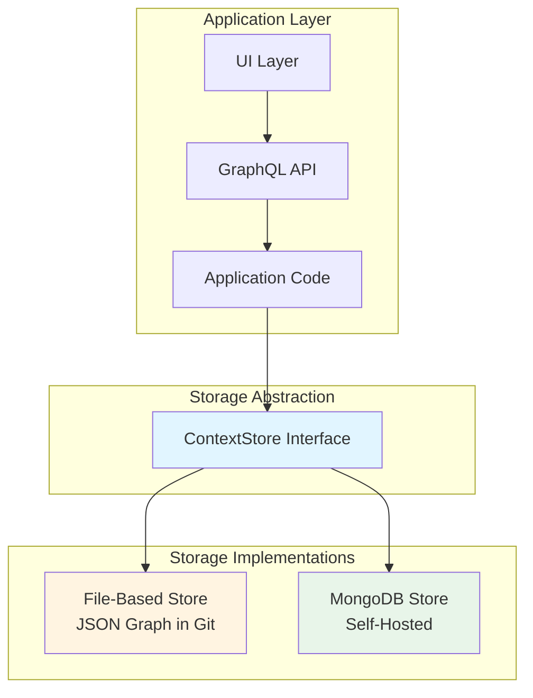
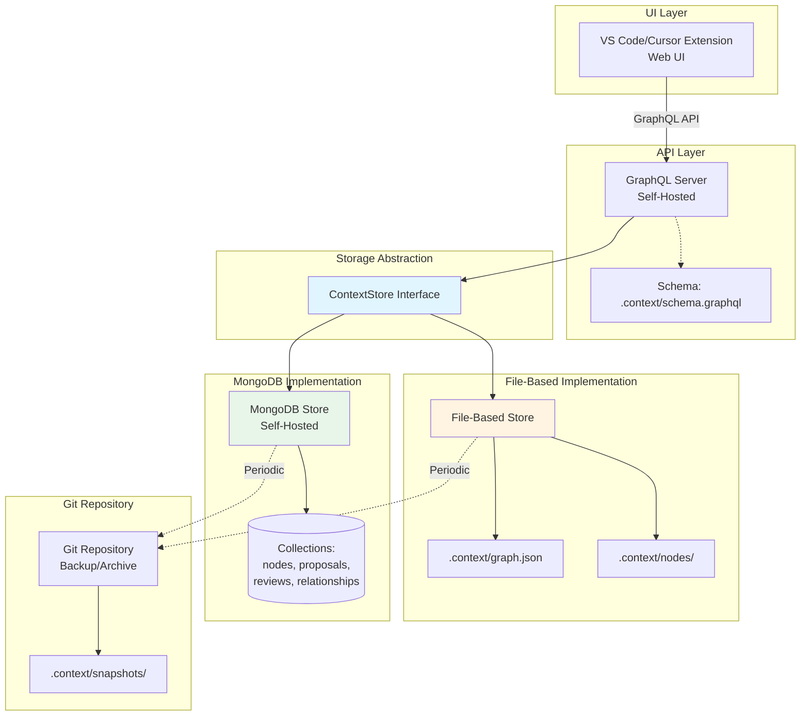

# Architecture Decisions

This document tracks key architectural decisions made during the context-first-docs project.

```ctx
type: decision
id: decision-001
status: accepted
---
**Decision**: Use Markdown as the human interface, not as the source of truth.

**Rationale**: 
- Markdown is familiar to developers and renders well on GitHub/GitLab
- Git workflows work naturally with Markdown files
- However, Markdown alone is not structured enough for agent consumption
- Solution: Markdown is a projection of the canonical context store

**Alternatives Considered**:
- YAML/JSON as the interface (too technical, poor readability)
- Custom format (requires new tooling, harder adoption)
- Database-only (loses Git integration)

**Decided At**: 2026-01-26
```

```ctx
type: decision
id: decision-002
status: accepted
---
**Decision**: Use ctx blocks for semantic sections in Markdown.

**Rationale**:
- Lightweight syntax that doesn't break Markdown rendering
- Stable IDs survive rebases and merges
- Clear separation between system-managed and human-edited content
- Can be ignored by tools that don't understand context blocks

**Alternatives Considered**:
- HTML comments (not visible, harder to work with)
- Frontmatter (only works at file level, not section level)
- Custom Markdown extensions (requires parser modifications)

**Decided At**: 2026-01-26
```

```ctx
type: decision
id: decision-003
status: accepted
---
**Decision**: The project itself must be self-referential and use its own system.

**Rationale**:
- Demonstrates the approach in practice
- Serves as a living example for users
- Validates that the system works for real-world use
- Forces us to "eat our own dog food"

**Alternatives Considered**:
- Separate example project (less authentic, harder to maintain)
- Traditional documentation (defeats the purpose)

**Decided At**: 2026-01-26
```

```ctx
type: decision
id: decision-004
status: accepted
---
**Decision**: Use TypeScript for type safety and better developer experience.

**Rationale**:
- Strong typing helps prevent errors in the context graph
- Better IDE support and autocomplete
- Easier to maintain as the system grows
- Type definitions serve as documentation

**Alternatives Considered**:
- JavaScript (less type safety)
- Rust/Go (higher barrier to entry, overkill for v1)

**Decided At**: 2026-01-26
```

```ctx
type: decision
id: decision-005
status: accepted
---
**Decision**: Support both file-based and MongoDB storage implementations through a storage abstraction layer (`ContextStore` interface). Users can start with file-based storage and scale up to MongoDB as needed.

**Rationale**:
- **Abstraction Layer**: `ContextStore` interface allows multiple storage implementations
- **File-Based Storage**: Simple, Git-friendly, perfect for small projects and development
- **MongoDB Storage**: Production-ready with ACID transactions, concurrency control, and scalability
- **Scalability Path**: Users can start simple and scale up without code changes
- **Graph model** (see `decision-015`) requires graph-native storage format
- **Self-hosted**: Both implementations run within organization (no external cloud services)
- **Proposal-based workflow**: All changes go through proposals/review workflow
- All data stays within organization (see `constraint-005`)

**Storage Abstraction**:


**Workflow**: Changes flow: UI/Agent → Proposal → Review → Approval → Storage Update (via `ContextStore` interface)

**Storage Architecture**:


**File-Based Storage** (Default for Development/Small Projects):
- **Format**: JSON Graph in `.context/graph.json` and individual node files
- **Location**: `.context/` directory in Git repository
- **Benefits**:
  - ✅ Simple, no external dependencies
  - ✅ Fully Git-friendly, reviewable in PRs
  - ✅ Perfect for small projects and development
  - ✅ Easy to understand and debug
  - ✅ All data in Git (versioned, auditable)
- **Limitations**:
  - ⚠️ Concurrency issues with multiple simultaneous edits
  - ⚠️ Scalability concerns with large graphs (thousands of nodes)
  - ⚠️ No ACID transactions

**MongoDB Storage** (Recommended for Production/Large Projects):
- **Database**: Self-hosted MongoDB (within organization)
- **Collections**: `nodes`, `proposals`, `reviews`, `relationships`
- **Benefits**:
  - ✅ **ACID transactions**: Atomic proposal approvals, no partial updates
  - ✅ **Concurrency control**: Built-in optimistic locking, no file conflicts
  - ✅ **Scalability**: Indexed queries, horizontal scaling
  - ✅ **GraphQL integration**: Excellent support via Hasura, Apollo, or custom resolvers
  - ✅ **Self-hostable**: Docker, Kubernetes deployment within organization
  - ✅ **Document model**: Natural fit for graph nodes and relationships
  - ✅ **Query performance**: Indexed relationship queries, aggregation pipeline
  - ✅ **Air-gapped support**: Can deploy without internet
- **Git Integration**: Periodic snapshots to Git for backup, version history, audit trail

**Storage Selection**:
- **Development/Small Projects**: File-based storage (default)
- **Production/Large Projects**: MongoDB storage (recommended)
- **Scaling Path**: Switch from file-based to MongoDB via configuration change (same `ContextStore` interface)

**GraphQL Schema** (`.context/schema.graphql`):
- Type-safe API definition
- Self-documenting (introspection)
- Human-readable schema changes (reviewable in PRs)
- Validation contract
- Works with both storage implementations
- See `docs/STORAGE_ARCHITECTURE.md` for full schema design

**Important**: Both storage implementations use the same `ContextStore` interface, allowing seamless scaling from file-based to MongoDB. All infrastructure is self-hosted within organization.


**Implementation Strategy**:
1. Start with file-based storage (simple, Git-friendly)
2. Implement MongoDB storage (production-ready)
3. Both use same `ContextStore` interface (abstraction layer)
4. Users configure storage backend (file-based or MongoDB)
5. Easy to scale up from file-based to MongoDB

**Decided At**: 2026-01-26
**Updated At**: 2026-01-26 (support both file-based and MongoDB via abstraction layer)
```

```ctx
type: decision
id: decision-006
status: accepted
---
**Decision**: Context persistence is independent of git commits. Git commits only occur when proposals are accepted/implemented.

**Rationale**:
- Authored content (proposals, risks, questions) should persist immediately upon creation
- Authors can work and iterate without requiring git commits
- Git commits represent implementation/completion, not authorship
- Enables asynchronous workflows where context evolves independently of code changes
- Similar to Jira where issues exist independently and commits reference them

**Implementation**:
- Context store persists to file system (JSON/YAML) immediately when proposals/nodes are created
- Git commits are tracked and linked to proposals via checkin semantics
- Commit messages can reference proposals (e.g., "Implements proposal-123")
- System tracks which commits correspond to which proposals/nodes
- Markdown projection happens on commit, but context store is always up-to-date

**Alternatives Considered**:
- Requiring git commits for persistence (too restrictive, breaks async workflows)
- Git as the only persistence mechanism (loses independence, harder to query)

**Decided At**: 2026-01-26
```

```ctx
type: decision
id: decision-016
status: accepted
---
**Decision**: ctx blocks and rendered Markdown are UI-only and NOT committed to Git. Change detection is embedded in whatever UI is being used.

**Rationale**:
- Context store (`.context/graph.json`) is the source of truth committed to Git
- Markdown files with ctx blocks are UI projections for human editing
- Change detection must happen in real-time in the UI layer, not through Git operations
- Keeps Git repository clean - only structured data (context store) is versioned
- Enables real-time collaboration without Git conflicts on Markdown files
- UI can detect changes immediately as user types, not just on commit

**Implementation**:
- **Context Store**: `.context/graph.json` and related files are committed to Git
- **Markdown Files**: Exist only in UI (VS Code/Cursor extension, web UI, etc.), NOT in Git
- **Change Detection**: Embedded in UI layer (extension, web UI, etc.)
  - VS Code/Cursor extension detects changes on save or in real-time
  - Web UI detects changes as user types
  - Changes immediately synced to context store as proposals
- **Git Workflow**: Only context store changes are committed to Git
- **UI Updates**: Markdown files regenerated from context store in UI

**Benefits**:
- Clean Git repository (only structured data)
- Real-time change detection (not dependent on Git operations)
- No Git conflicts on Markdown files
- Faster iteration (changes detected immediately)
- Better UX (changes visible immediately in UI)

**Alternatives Considered**:
- Committing Markdown files to Git (pollutes repository, Git conflicts, slower)
- Git-based change detection (too slow, requires commits, breaks real-time workflow)
- Separate Markdown storage (adds complexity, loses UI integration)

**Decided At**: 2026-01-26
```

```ctx
type: decision
id: decision-007
status: accepted
---
**Decision**: Installation into existing repositories must be clean and non-invasive.

**Rationale**:
- Developers should be able to adopt the system without disrupting existing workflows
- Existing repositories should continue to work normally without the system
- Installation should be opt-in and incremental
- Minimal footprint reduces adoption friction

**Requirements**:
- Only adds `.context/` directory (already in .gitignore)
- No forced changes to existing files
- Context files (CONTEXT.md, DECISIONS.md, etc.) are optional
- Existing Markdown files work unchanged - ctx blocks are additive
- Can be installed incrementally (file by file)
- Can be removed without breaking anything
- Installation CLI should be simple and reversible

**Installation Process**:
1. Run `npx context-first-docs init` (or similar)
2. Creates `.context/` directory structure
3. Installs pre-baked Cursor rules to `.cursor/rules/` directory
4. Optionally creates template context files
5. Updates `.gitignore` if needed (only adds `.context/` entry)
6. No changes to existing files unless explicitly requested

**Alternatives Considered**:
- Requiring changes to existing files (too invasive, breaks adoption)
- Separate repository for context (loses integration, harder to maintain)
- Database/external service (loses git integration, adds dependencies)

**Decided At**: 2026-01-26
```

```ctx
type: decision
id: decision-008
status: accepted
---
**Decision**: VS Code/Cursor extension is required, not optional, for v1.

**Rationale**:
- In-editor review is essential for the "Google Docs review mode" experience
- Context awareness in the IDE enables developers to see proposals, decisions, and risks while coding
- Seamless authoring workflow - create proposals and review without leaving the editor
- Critical for adoption - developers need integrated tooling, not separate CLI tools
- Enables real-time context queries and proposal creation from within the editor
- Makes the system practical for daily use, not just documentation

**Required Features**:
- ctx block syntax highlighting and validation
- In-editor proposal creation and editing
- Review UI for accepting/rejecting proposals
- Context queries (show related decisions, risks, tasks)
- Integration with git for commit tracking
- Visual indicators for proposal status and review state

**Alternatives Considered**:
- Making it optional (loses core value proposition, reduces adoption)
- CLI-only approach (too disconnected from workflow, higher friction)
- Web-based UI only (requires context switching, breaks flow)

**Decided At**: 2026-01-26
```

```ctx
type: decision
id: decision-010
status: accepted
---
**Decision**: Integration must support reverse engineering merge requests/PRs in pre-existing repositories.

**Rationale**:
- Enables reverse engineering of historical context from existing projects
- Captures historical decisions and rationale from PR/MR comments
- Extracts proposals, decisions, and risks from existing code review discussions
- Preserves institutional knowledge that exists only in PR/MR history
- Makes adoption easier for mature projects with extensive PR history
- Allows teams to build context graph retroactively from existing discussions

**Capabilities**:
- Analyze PR/MR titles, descriptions, and commit messages for decision patterns
- Extract decisions and rationale from PR/MR comments and discussions
- Identify rejected alternatives from comment threads
- Convert PR/MR discussions into proposals with proper status (accepted/rejected)
- Link extracted context to commits and code changes
- Handle both merged and closed PRs/MRs
- Support GitHub and GitLab APIs

**Process**:
1. Connect to repository via GitHub/GitLab API
2. Analyze PR/MR history (titles, descriptions, comments, commits)
3. Extract semantic content (decisions, risks, proposals, rationale)
4. Create context nodes and proposals from extracted content
5. Link to commits and code changes
6. Import into context store

**Use Cases**:
- Migrating existing projects to context-first system
- Building context graph from historical PR/MR discussions
- Capturing decisions that were made in PR comments but never documented
- Extracting risks and concerns raised during code review
- Preserving rationale for architectural decisions

**Alternatives Considered**:
- Manual migration only (too time-consuming, loses historical context)
- Starting fresh without historical context (loses valuable institutional knowledge)
- External tools for PR analysis (adds dependencies, less integrated)

**Decided At**: 2026-01-26
```

```ctx
type: decision
id: decision-011
status: accepted
---
**Decision**: The system must support designated contributors and approvers with role-based access control.

**Rationale**:
- Enables proper governance and quality control
- Prevents unauthorized changes to accepted context
- Supports organizational hierarchies and responsibilities
- Allows fine-grained control over who can create vs approve proposals
- Enables multi-approval workflows for critical decisions
- Integrates with GitLab/GitHub permission models

**Role Model**:
- **Contributors**: Can create proposals and nodes, but cannot approve
- **Approvers**: Can review and approve/reject proposals, can also create proposals
- **Admins**: Full access, can manage users and roles

**Capabilities**:
- Configure designated contributors per project/namespace
- Configure designated approvers per project/namespace
- Support per-node-type approvers (e.g., architecture decisions require senior engineers)
- Support multi-approval requirements (e.g., critical risks need 2 approvals)
- Track who approved proposals (for audit trail)
- Validate permissions before allowing actions
- Integrate with GitLab/GitHub user/group permissions

**Implementation**:
- Role configuration stored in `.context/roles.json` (or similar)
- User roles can be synced from GitLab/GitHub groups
- Permission checks before proposal creation, review, and approval
- Review records include reviewer role and approval status
- Proposal metadata tracks required and actual approvers

**Use Cases**:
- Architecture decisions require senior engineer approval
- Risk proposals need security team approval
- Contributors can propose changes but approvers must review
- Multi-approval for critical decisions (e.g., 2 senior engineers)
- Admin-only actions (managing users, changing roles)

**Alternatives Considered**:
- No access control (too permissive, allows unauthorized changes)
- Single approver model (too restrictive, doesn't scale)
- External permission system only (loses integration, harder to manage)

**Decided At**: 2026-01-26
```

```ctx
type: decision
id: decision-012
status: accepted
---
**Decision**: Approval of proposals must trigger automatic creation of issues.

**Rationale**:
- Approved proposals represent decisions that need implementation
- Automatically creating issues ensures nothing falls through the cracks
- Links approval decisions to actionable work items
- Enables tracking of implementation progress
- Supports workflow automation and reduces manual work
- Makes it clear what needs to be done after approval
- "Issues" is familiar terminology (GitHub Issues, Jira Issues, etc.)

**Workflow**:
1. Proposal is reviewed and approved
2. System checks if proposal has issue configuration
3. Issues are automatically created based on templates or custom configuration
4. Issues can be created as task nodes in the context store
5. Issues are linked back to the proposal and approval

**Issue Types**:
- **Implementation tasks**: Work needed to implement the approved proposal
- **Follow-up items**: Related work or next steps
- **Review tasks**: Items that need review or verification
- **Custom issues**: Proposal-specific items

**Configuration**:
- Proposals can specify issue templates to use
- Issue templates define what issues to create based on proposal type/content
- Custom issues can be defined per proposal
- Issues can be created as task nodes in context store
- Issues can have assignees, due dates, dependencies, priorities

**Examples**:
- Approved decision proposal → Creates implementation issue
- Approved risk proposal → Creates mitigation issue
- Approved constraint proposal → Creates compliance verification issue
- Approved plan proposal → Creates issues for each plan step

**Integration**:
- Issues created as task nodes can be queried and tracked
- Issues link back to originating proposal
- Issues can reference related nodes (decisions, risks, etc.)
- Issues can be assigned to contributors
- Issues can have dependencies on other tasks
- Can integrate with external issue trackers (GitHub Issues, Jira, Linear)

**Alternatives Considered**:
- Manual issue creation (too much work, things get forgotten)
- No issue creation (loses connection between approval and implementation)
- External task management only (loses integration, harder to track)
- Using "actions" terminology (less familiar, "issues" is standard)

**Decided At**: 2026-01-26
```

```ctx
type: decision
id: decision-013
status: accepted
---
**Decision**: Markdown files support both read-only and editable modes based on user role. All Markdown edits must sync back to context store and update referencing nodes.

**Rationale**:
- Different roles need different access levels
- Contributors need to edit Markdown files directly
- Approvers/reviewers may only need read access
- Ensures context store stays in sync with Markdown
- Changes must propagate to all nodes that reference edited content

**Role-Based Modes**:
- **Contributors**: Can edit Markdown files (ctx blocks and other content)
- **Approvers**: Can edit Markdown files (for review and changes)
- **Read-only users**: Can view but not edit (if such role exists)
- **Admins**: Full edit access

**Sync Requirements**:
- Markdown edits to ctx blocks → Import as proposals → Sync to context store
- Markdown edits to non-ctx content → Track changes → Update referencing nodes
- Context store changes → Export to Markdown → Update all affected files
- Referencing nodes must be updated when referenced content changes
- Sync must be bidirectional and consistent

**Referencing Context**:
- When a node references another node (via relations), changes to referenced node must update referencer
- When Markdown content is referenced by multiple nodes, all must be updated
- Cross-references between files must be maintained
- Reference integrity must be preserved during sync

**Workflow**:
1. User edits Markdown file (based on role permissions)
2. System detects changes (ctx blocks and other content)
3. Changes imported as proposals (for ctx blocks)
4. Non-ctx content changes tracked and synced
5. Referencing nodes updated if referenced content changed
6. Context store updated with accepted changes
7. All affected Markdown files regenerated

**Alternatives Considered**:
- Read-only only (too restrictive, breaks familiar workflows)
- Editable only (loses control, harder to prevent drift)
- No sync back (loses bidirectional consistency)
- Manual sync only (too much work, error-prone)

**Decided At**: 2026-01-26
```

```ctx
type: decision
id: decision-014
status: accepted
---
**Decision**: Use hybrid reconciliation approach for handling concurrent edits to the same ctx block.

**Rationale**:
- No single strategy fits all use cases
- Need balance between automation and control
- Must prevent data loss while allowing parallel work
- Field-level conflicts are often resolvable automatically
- True conflicts require human judgment

**Hybrid Strategy Components**:

1. **Conflict Detection** (Proposal-Based):
   - Detect conflicts at proposal creation time
   - Check if other open proposals modify the same nodes
   - Mark proposals as "conflicting" if conflicts detected
   - Track conflicting proposal relationships

2. **Field-Level Merging**:
   - Auto-merge non-conflicting fields automatically
   - Detect field-level conflicts (same field changed differently)
   - Preserve all non-conflicting changes
   - Flag conflicting fields for manual resolution

3. **Optimistic Locking**:
   - Track node version numbers (increment on each change)
   - Proposals reference base version they're modifying
   - Reject proposals if node version changed (stale)
   - Require proposal update to latest version before approval

4. **Manual Resolution**:
   - True conflicts require human review
   - Reviewers see all conflicting proposals side-by-side
   - Reviewer creates merged proposal or chooses one
   - System applies reviewer's resolution

5. **Proposal Superseding**:
   - Allow proposals to explicitly supersede others
   - Track proposal relationships and chains
   - When superseding proposal approved, mark superseded as superseded
   - Preserve full proposal history

**Workflow**:
1. User creates proposal → System checks for conflicts with open proposals
2. System records base versions of nodes being modified
3. If no conflicts → Normal review workflow
4. If field-level conflicts → Auto-merge non-conflicting fields, flag conflicts
5. If true conflicts → Mark proposal as "hasConflicts", require resolution
6. When applying proposal → Check node versions match base versions
7. If versions changed → Reject as stale, require update
8. Reviewer resolves conflicts → Creates merged proposal or chooses one
9. System applies resolution with version validation

**Configuration**:
- Per-node-type conflict strategies (can override default)
- Per-namespace conflict strategies
- Global default strategy
- Configurable auto-merge behavior

**Examples**:
- Proposal A changes `content` field, Proposal B changes `status` → Auto-merge (no conflict)
- Proposal A changes `content` to "X", Proposal B changes `content` to "Y" → Conflict, manual resolution
- Proposal created when node version is 5, but node is now version 7 → Reject as stale

**Alternatives Considered**:
- Single strategy only (too rigid, doesn't fit all cases)
- No conflict detection (allows data corruption)
- Always manual resolution (too slow, blocks workflow)
- Always auto-merge (risky, may lose important changes)
- Lock-based only (blocks parallel work unnecessarily)

**Decided At**: 2026-01-26
```

```ctx
type: decision
id: decision-015
status: accepted
---
**Decision**: Use a graph model with typed relationships instead of strict hierarchical nesting.

**Rationale**:
- More flexible than rigid parent-child hierarchies
- Can represent multiple relationship types (hierarchical, dependencies, references, etc.)
- Enables powerful graph queries and traversal
- Supports complex multi-dimensional relationships
- Can evolve relationship types without schema changes
- Better for AI agents to understand context and relationships
- Hierarchical views can be projected from graph when needed

**Graph Model Structure**:
- **Nodes**: Vertices in the graph (goals, decisions, tasks, etc.)
- **Edges**: Typed relationships between nodes
- **Edge Types**: Support multiple relationship types:
  - `parent-child`: Hierarchical relationships (sub-decisions, subtasks)
  - `depends-on`: Dependencies (task dependencies, decision dependencies)
  - `references`: References (decisions referencing goals, tasks referencing decisions)
  - `supersedes`: Replacement relationships (new decision supersedes old)
  - `related-to`: General relationships
  - `implements`: Implementation relationships (task implements decision)
  - `blocks`: Blocking relationships (risk blocks task)
  - `mitigates`: Mitigation relationships (task mitigates risk)

**Implementation Approach**:
- Replace simple `relations?: NodeId[]` with typed edge structure
- Store edges as separate entities or embedded in nodes (both approaches viable)
- Support graph queries: "find all descendants", "find all dependencies", "find path between nodes"
- Provide hierarchical projection APIs for UI/display purposes
- Maintain reverse index (`referencedBy`) for efficient traversal

**Benefits Over Strict Nesting**:
- No rigid parent-child constraints
- Can represent complex relationships (e.g., task depends on decision AND references goal)
- Enables relationship analysis and traversal
- Supports both hierarchical and non-hierarchical structures
- Extensible - can add new relationship types without breaking changes

**Alternatives Considered**:
- Strict hierarchical nesting (too rigid, limits flexibility)
- Simple untyped relations array (loses semantic meaning, harder to query)
- Separate relationship tables (more complex, but could be considered for very large graphs)
- Property graph with edge properties (more powerful but more complex, may be overkill)

**Decided At**: 2026-01-26
```

```ctx
type: decision
id: decision-017
status: accepted
---
**Decision**: Extract provider-agnostic store logic into `src/store/core/*` and treat it as the canonical implementation for proposal application, querying/traversal, and conflict/stale/merge behavior.

**Rationale**:
- Avoid duplicating complex business logic across storage providers (in-memory, file-based, MongoDB).
- Ensure deterministic behavior and consistent semantics across backends.
- Improve testability: pure functions are easier to cover and reason about.
- Make future providers mostly responsible for I/O + indexing, not domain logic.

**Scope**:
- Node keying (`nodeKey`)
- Proposal application (`applyAcceptedProposalToNodeMap`)
- Querying/filtering/sorting/pagination + graph traversal (`queryNodesInMemory`, `graph` helpers)
- Conflict detection + stale checks + merge (`detectConflictsForProposal`, `isProposalStale`, `mergeProposals`)

**Decided At**: 2026-01-27
```

```ctx
type: decision
id: decision-018
status: accepted
---
**Decision**: Centralize runtime type guards and polymorphic cast/assert helpers in `src/utils/type-guards.ts`, and prefer explicit narrowing over broad type assertions.

**Rationale**:
- Reduce `as any` / `as unknown as` patterns that hide bugs.
- Make validation reusable across parsing (Markdown ctx blocks), store operations, and future API layers.
- Improve maintainability: shared guards prevent drift across modules.

**Decided At**: 2026-01-27
```

```ctx
type: decision
id: decision-019
status: accepted
---
**Decision**: Make ctx-block parsing strict for `type` and `status` by using the `NodeType` and `NodeStatus` unions; invalid values cause the block to be rejected (import returns `null` for that block).

**Rationale**:
- Prevent invalid node types/statuses from entering the system.
- Align the UI Markdown layer with the canonical type system.
- Fail closed so that downstream logic can rely on discriminated unions safely.

**Implementation Note**:
- The UI should surface validation feedback so “dropped blocks” don’t feel silent.

**Decided At**: 2026-01-27
```
