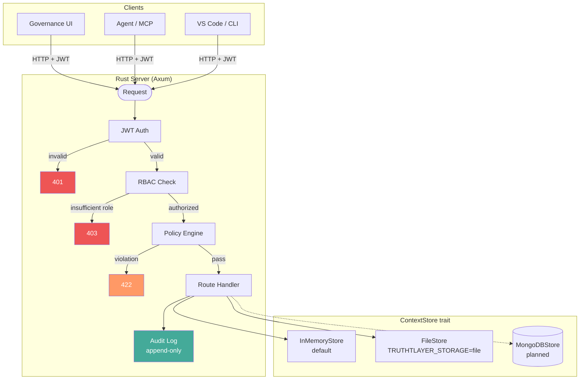

# TruthLayer — Collaborator Guide

**Governed truth, guarded AI.**

_For contributors, open-source collaborators, integration partners, and technology evaluators._

---

## What is TruthLayer?

TruthLayer is a **governance-first truth system** — a structured, auditable ledger of accepted decisions, policies, and rationale. It provides:

- A **canonical truth store** with typed nodes (goals, decisions, risks, policies, tasks) and relationships
- A **governed change process** (ACAL: Accepted → Candidate → Accepted → Ledger) where every change is a proposal reviewed by authorized humans
- **Enterprise security** enforced at runtime: JWT authentication, RBAC, policy engine, audit log, sensitivity labels, and IP protection
- An **agent-safe API** where AI agents read truth and propose changes but cannot review or apply

The project is self-referential — it uses its own ACAL system to govern its own documentation and decisions.

## Repository structure

```
context-first-docs/
├── docs/                     # Canonical product and architecture documentation
│   ├── WHITEPAPER.md         # Vision, design, and positioning
│   ├── core/                 # Architecture, Review Mode, Agent API, UI Spec
│   ├── reference/            # Data Model, Security, Privacy, Operations
│   ├── appendix/             # Change Detection, Integrations, AI Model
│   ├── scenarios/            # Hello World, Conflict & Merge, Business Policy
│   └── engineering/          # Storage Architecture, Implementation Plan
├── server/                   # Rust server (Axum HTTP API, ContextStore)
│   ├── src/
│   │   ├── api/routes.rs     # HTTP route handlers (30+ tests)
│   │   ├── auth.rs           # JWT authentication (6 tests)
│   │   ├── rbac.rs           # Role-based access control
│   │   ├── policy.rs         # Policy engine, 6 rule types (7 tests)
│   │   ├── sensitivity.rs    # Sensitivity labels, content hash (8 tests)
│   │   ├── retention.rs      # Retention engine (config + background task)
│   │   └── store/            # ContextStore trait, InMemoryStore, FileStore
│   ├── Cargo.toml
│   └── README.md
├── src/                      # TypeScript client, store core, playground
│   ├── api-client.ts         # RustServerClient (auth + OTEL)
│   ├── store/core/           # apply-proposal, graph, node-key
│   ├── markdown/             # Markdown projection + ctx block parsing
│   ├── playground/           # Web UI for proposal review and apply
│   └── types/                # TypeScript type definitions
├── tests/                    # Unit and integration tests
├── scripts/                  # Build, install, DOCX generation, CI
├── PLAN.md                   # Development roadmap (7 phases, 84 tasks)
├── QUESTIONS.md              # Open and resolved design questions (51 tracked)
├── RISKS.md                  # Project risks and mitigations (24 tracked)
├── DECISIONS.md              # Key design decisions
└── CONTEXT.md                # Self-referential context nodes
```

## Technology stack

| Layer             | Technology                  | Notes                                                                 |
| ----------------- | --------------------------- | --------------------------------------------------------------------- |
| **Server**        | Rust + Axum                 | High-performance HTTP API; ContextStore trait with pluggable backends |
| **Storage**       | InMemoryStore, FileStore    | MongoDB planned. File-based uses JSON with atomic writes              |
| **Auth**          | JWT (HS256)                 | Configurable via `AUTH_SECRET` / `AUTH_DISABLED` env vars             |
| **Client**        | TypeScript                  | RustServerClient with auth token injection and OTEL trace headers     |
| **Playground**    | HTML + JS                   | Web UI for scenarios and governance; runs via `npm run playground`    |
| **Observability** | OpenTelemetry               | W3C trace context, OTLP export, correlated client-server traces       |
| **DOCX build**    | Pandoc + Mermaid CLI        | Markdown → DOCX with rendered diagrams and cross-document links       |
| **Tests**         | Rust `#[tokio::test]`, Jest | 54 Rust tests; Jest unit + integration tests for TypeScript           |

## Getting started

### Prerequisites

- **Node.js 18+** and npm
- **Rust** (latest stable) with Cargo
- **Pandoc** (for DOCX generation only)

### Quick start

```bash
# Install dependencies
node scripts/install.js

# Start the playground (Rust server + web UI)
npm run playground

# Open http://localhost:4317
```

### Run tests

```bash
# TypeScript unit tests
npm test

# Integration tests (starts Rust server automatically)
npm run test:integration

# Rust server tests
cd server && cargo test
```

### Build DOCX document set

```bash
# Full build with confidential watermark (requires Pandoc)
node scripts/build-whitepaper-docx.js --watermark CONFIDENTIAL

# Skip Mermaid rendering if Chrome/Puppeteer not available
node scripts/build-whitepaper-docx.js --watermark CONFIDENTIAL --skip-mermaid
```

## Architecture overview



The server enforces governance at every layer:

1. **JWT Auth**: Validates token, extracts actor identity and roles
2. **RBAC**: Checks role hierarchy; agents hard-blocked from review/apply
3. **Policy Engine**: Evaluates 6 rule types from `policies.json`
4. **Handler**: Executes the operation
5. **Audit Log**: Records the action (immutable, append-only)

## Key concepts for contributors

### ACAL (Accepted → Candidate → Accepted → Ledger)

The core invariant. Every change to truth follows this path:

1. A human or agent **creates a proposal** (set of operations)
2. Authorized humans **review** the proposal (approve/reject)
3. An authorized human **applies** the accepted proposal
4. A new **revision** is created; the audit log records the event

No direct mutation of accepted truth. No exceptions.

### ContextStore trait

The storage interface that all backends implement:

- **Read**: `get_node`, `query_nodes`, `get_proposal`, `query_proposals`, `get_review`
- **Write**: `create_proposal`, `update_proposal`, `submit_review`, `apply_proposal`
- **Audit**: `append_audit`, `query_audit`
- **Conflict**: `detect_conflicts`, `is_proposal_stale`, `merge_proposals`
- **Traversal**: `traverse_reasoning_chain`, `build_context_chain`

New storage backends implement this trait. Currently: InMemoryStore and FileStore.

### Sensitivity labels

Nodes carry a sensitivity level: `public`, `internal`, `confidential`, `restricted`. The server enforces:

- Agents cannot read nodes above their allowed sensitivity level (via `egress_control` policy)
- Reads above the allowed level return redacted responses and are audited
- Content is fingerprinted with SHA-256 on apply

### Policy engine

Six rule types loaded from `policies.json`:

| Rule                   | Evaluated at             |
| ---------------------- | ------------------------ |
| `MinApprovals`         | Apply time               |
| `RequiredReviewerRole` | Apply time               |
| `ChangeWindow`         | Create, apply            |
| `AgentRestriction`     | Create                   |
| `AgentProposalLimit`   | Create                   |
| `EgressControl`        | Read (agent sensitivity) |

## Areas open for contribution

The [Development Plan](../PLAN.md) tracks 7 phases and 84+ tasks. Key areas where contributions are welcome:

### High priority

- **MongoDB backend** (task-049): Implement `MongoDBStore` with the `ContextStore` trait. Schema, indexing, and transaction design in [Storage Implementation Plan](engineering/storage/STORAGE_IMPLEMENTATION_PLAN.md).
- **MCP server** (task-082): Expose TruthLayer as an MCP server for AI assistants. Tools for query, propose, traverse; resources for read-only context.
- **Full NodeQuery on HTTP API** (task-073): Extend `GET /nodes` with full-text search, date range, relationship queries, namespace, tags.
- **Projection engine** (task-071): Server-side Markdown/DOCX/HTML projection with anchor maps for change detection.

### Medium priority

- **Conflict detection on HTTP routes** (task-074): Expose `detect_conflicts`, `is_proposal_stale`, `merge_proposals` via REST API.
- **Retention engine enforcement** (task-075): Implement actual deletion/archiving (currently stub that logs events).
- **DSAR erase** (task-076): Implement actor anonymization across stored entities.
- **Multi-workspace support** (task-077): Enforce workspace scoping on all read/write paths.
- **SSO/OIDC integration** (task-078): Accept tokens from enterprise identity providers.

### Exploratory

- **The Agent** (task-068): In-process LLM + store tools loop (query truth, create proposals).
- **Change detection** (task-072): Parse edited projections into structured proposal operations.
- **VS Code extension** (task-022): In-editor review, proposal authoring, context awareness.
- **Load testing** (task-081): Benchmark storage backends under production workloads.

## Open questions and risks

The project tracks design questions and risks systematically:

- **[QUESTIONS.md](../QUESTIONS.md)**: 51 tracked questions (27 resolved, 24 open). Key open areas: MCP authentication (question-047), multi-tenant model (question-050), projection engine language (question-049).
- **[RISKS.md](../RISKS.md)**: 24 tracked risks with mitigations. Key concerns: MongoDB critical path (risk-021), projection engine dependency chain (risk-023), retention/DSAR compliance gap (risk-019).
- **[DECISIONS.md](../DECISIONS.md)**: Key design decisions and rationale.

## Development workflow

1. **Read the relevant docs** — Start with [Architecture](core/ARCHITECTURE.md) and [Review Mode](core/REVIEW_MODE.md) for core concepts.
2. **Check the plan** — [PLAN.md](../PLAN.md) for the task you want to work on and its dependencies.
3. **Check open questions** — [QUESTIONS.md](../QUESTIONS.md) for any unresolved design decisions that affect your area.
4. **Write tests** — Rust tests in `server/src/`, TypeScript tests in `tests/`. 54 existing Rust tests and Jest suites provide patterns.
5. **Follow the invariant** — No direct mutation of accepted truth. All changes via proposals. Agent-safe means agent-safe.

## Useful links

| Resource                    | Path                                                                                                          |
| --------------------------- | ------------------------------------------------------------------------------------------------------------- |
| Whitepaper                  | [docs/WHITEPAPER.md](WHITEPAPER.md)                                                                           |
| Architecture                | [docs/core/ARCHITECTURE.md](core/ARCHITECTURE.md)                                                             |
| Agent API                   | [docs/core/AGENT_API.md](core/AGENT_API.md)                                                                   |
| Review Mode (ACAL)          | [docs/core/REVIEW_MODE.md](core/REVIEW_MODE.md)                                                               |
| Security & Governance       | [docs/reference/SECURITY_GOVERNANCE.md](reference/SECURITY_GOVERNANCE.md)                                     |
| Privacy & Data Protection   | [docs/reference/PRIVACY_AND_DATA_PROTECTION.md](reference/PRIVACY_AND_DATA_PROTECTION.md)                     |
| Storage Implementation Plan | [docs/engineering/storage/STORAGE_IMPLEMENTATION_PLAN.md](engineering/storage/STORAGE_IMPLEMENTATION_PLAN.md) |
| Data Model Reference        | [docs/reference/DATA_MODEL_REFERENCE.md](reference/DATA_MODEL_REFERENCE.md)                                   |
| Server README               | [server/README.md](../server/README.md)                                                                       |
| Development Plan            | [PLAN.md](../PLAN.md)                                                                                         |
| Open Questions              | [QUESTIONS.md](../QUESTIONS.md)                                                                               |
| Risks                       | [RISKS.md](../RISKS.md)                                                                                       |

---

_TruthLayer is governance-first: the invariant is the product. Contributions that preserve and strengthen the ACAL invariant, agent safety, and auditability are the most valuable._
