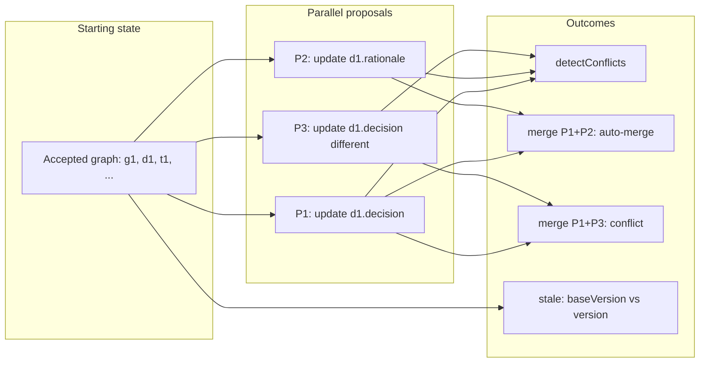

# Conflict and Merge: Day in the Life (Concurrency)

This is the **canonical walkthrough** for concurrency in Context-First Docs: one coherent path from accepted graph → parallel open proposals → **conflict detection**, **field-level merge** (mergeable vs conflicting), and **stale proposal** (optimistic locking). All artifacts below match the shapes used by the system; you can reproduce them by running the **`conflicts-and-merge`** and **`stale-proposal`** scenarios in the playground (`npm run playground` → Scenario Runner).

## Flow overview



---

## 1. Starting state: accepted graph

The store holds the same minimal **accepted** graph used by the Hello World scenario: one goal (g1), one decision (d1), one or more tasks and risks, with relationships. Node **d1** (decision) is the target for the following proposals.

**d1 (abbreviated):**

| Field       | Value |
|------------|--------|
| id         | d1     |
| type       | decision |
| status     | accepted |
| decision   | Extract store semantics to src/store/core |
| rationale  | Reuse across providers and improve testability |
| metadata.version | 1 (after seed) |

Truth is only what has been applied; there are no open proposals yet.

---

## 2. Three open proposals (parallel edits on d1)

Three users create **open** proposals that all touch node **d1**, with `metadata.baseVersions: { d1: 1 }` (or current d1 version at creation time).

**P1 — update `decision` (Alice):**

```json
{
  "id": "p-update-decision",
  "status": "open",
  "operations": [
    {
      "id": "op",
      "type": "update",
      "order": 1,
      "nodeId": { "id": "d1" },
      "changes": { "decision": "Extract core store modules" }
    }
  ],
  "metadata": {
    "createdAt": "2026-01-01T00:10:00.000Z",
    "createdBy": "alice",
    "baseVersions": { "d1": 1 }
  }
}
```

**P2 — update `rationale` (Bob):**

```json
{
  "id": "p-update-rationale",
  "status": "open",
  "operations": [
    {
      "id": "op",
      "type": "update",
      "order": 1,
      "nodeId": { "id": "d1" },
      "changes": { "rationale": "Reuse semantics across providers" }
    }
  ],
  "metadata": {
    "createdAt": "2026-01-01T00:11:00.000Z",
    "createdBy": "bob",
    "baseVersions": { "d1": 1 }
  }
}
```

**P3 — update `decision` to a different value (Carol):**

```json
{
  "id": "p-conflict-decision",
  "status": "open",
  "operations": [
    {
      "id": "op",
      "type": "update",
      "order": 1,
      "nodeId": { "id": "d1" },
      "changes": { "decision": "Keep everything in InMemoryStore" }
    }
  ],
  "metadata": {
    "createdAt": "2026-01-01T00:12:00.000Z",
    "createdBy": "carol",
    "baseVersions": { "d1": 1 }
  }
}
```

After `createProposal` for each, the store has three open proposals; **accepted truth is unchanged**.

---

## 3. Conflict detection: same field vs different fields

**Call:** `store.detectConflicts("p-update-decision")`

**Outcome:** The implementation (`src/store/core/conflicts.ts`) compares P1 against every other **open** proposal:

- **P1 vs P2:** Both touch **d1**, but P1 touches `decision`, P2 touches `rationale` — **different fields** → no conflict. P2 is in `mergeable`.
- **P1 vs P3:** Both touch **d1** and the **same field** `decision` → **field conflict**. P3 is in `conflicts` and `needsResolution`.

**Representative result shape:**

```json
{
  "conflicts": [
    {
      "proposals": ["p-update-decision", "p-conflict-decision"],
      "conflictingNodes": [{ "id": "d1" }],
      "conflictingFields": { "d1": ["decision"] },
      "severity": "field",
      "autoResolvable": false
    }
  ],
  "mergeable": ["p-update-rationale"],
  "needsResolution": ["p-conflict-decision"]
}
```

So: **same field, two values** → classified as conflict; **different fields** → mergeable. No line-diff “merge wars” — the system surfaces the conflict for human choice (accept one, combine, or reject both).

---

## 4. Merge (mergeable pair): auto-merge

**Call:** `store.mergeProposals(["p-update-decision", "p-update-rationale"])`

**Outcome:** P1 and P2 edit **different fields** on d1. The merge logic combines both updates; there is no overlapping field.

**Representative result shape:**

```json
{
  "merged": [
    { "nodeId": { "id": "d1" }, "field": "decision", "oldValue": "...", "newValue": "Extract core store modules" },
    { "nodeId": { "id": "d1" }, "field": "rationale", "oldValue": "...", "newValue": "Reuse semantics across providers" }
  ],
  "conflicts": [],
  "autoMerged": [
    { "nodeId": { "id": "d1" }, "field": "decision", "oldValue": "...", "newValue": "Extract core store modules" },
    { "nodeId": { "id": "d1" }, "field": "rationale", "oldValue": "...", "newValue": "Reuse semantics across providers" }
  ]
}
```

**Takeaway:** Parallel edits on different fields are **not** treated as conflicts. The workflow can produce a single merged proposal (or apply one then the other) without manual resolution.

---

## 5. Merge (conflicting pair): human resolution required

**Call:** `store.mergeProposals(["p-update-decision", "p-conflict-decision"])`

**Outcome:** P1 and P3 both edit **the same field** `decision` with different values. The merge result reports a **conflict** for that field.

**Representative result shape:**

```json
{
  "merged": [ ... ],
  "conflicts": [
    {
      "field": "decision",
      "nodeId": { "id": "d1" },
      "proposal1Value": "Extract core store modules",
      "proposal2Value": "Keep everything in InMemoryStore"
    }
  ],
  "autoMerged": [ ... ]
}
```

A UI or workflow must ask a human to choose: accept P1’s value, P3’s value, or type a combined value. The system **classifies** the conflict; it does not silently overwrite.

---

## 6. Stale proposal (optimistic locking)

**Setup:** After the accepted graph exists, another proposal is **applied** first (e.g. an accepted update that changes d1). That apply bumps **d1**’s `metadata.version` (e.g. from 1 to 2). Then an **open** proposal P was authored when d1 was at version 1: it has `metadata.baseVersions: { d1: 1 }`, but the store’s d1 is now at version 2.

**Call:** `store.isProposalStale("p-stale")`

**Outcome:** The implementation compares each operation’s node to `proposal.metadata.baseVersions`. For any update targeting d1, it checks `getNode(d1).metadata.version === baseVersions.d1`. Here, current version is 2 and baseVersion is 1 → **stale**.

**Result:** `true`.

**Implication:** The store (or apply workflow) can **block apply** until P is updated. The author (or a rebase step) must refresh P’s view of d1 (re-fetch current node, adjust operations or baseVersions, and optionally merge with the intervening change). So: **optimistic locking** — stale proposals are detected and must be rebased/merged through an explicit workflow, not silently overwriting.

---

## 7. Takeaway

| Case | System behavior |
|------|------------------|
| **Same field, two proposals** | Conflict; `detectConflicts` and `mergeProposals` report it; human resolution. |
| **Different fields, same node** | Mergeable; `mergeProposals` can auto-merge; no conflict. |
| **Stale baseVersion** | `isProposalStale` returns true; apply blocked until rebase/refresh. |

This is why the model avoids “merge wars”: conflicts are **classified** at proposal/field level, merges are **field-level** when there is no overlap, and staleness is **explicit** (rebase, don’t overwrite).

---

## Reproducing this walkthrough

- **Playground:** Run the **conflicts-and-merge** scenario (`npm run playground` → Scenario Runner → **conflicts-and-merge**). It seeds the graph, creates P1/P2/P3, runs `detectConflicts("p-update-decision")`, `mergeProposals(["p-update-decision", "p-update-rationale"])`, and `mergeProposals(["p-update-decision", "p-conflict-decision"])`, and returns the result objects. Run the **stale-proposal** scenario to see `isProposalStale` after bumping d1 and creating a proposal with stale baseVersions.
- **Code:** See `src/playground/scenarios.ts` (scenarios `conflicts-and-merge` and `stale-proposal`) and `src/store/core/conflicts.ts` (`detectConflictsForProposal`, `mergeProposals`, `isProposalStale`). Types: `src/types/conflicts.ts`.

This walkthrough is the **canonical “conflict and merge” day in the life** referenced from the whitepaper (§5.3.4), WHITEPAPER_APPENDIX, and RECONCILIATION_STRATEGIES.
