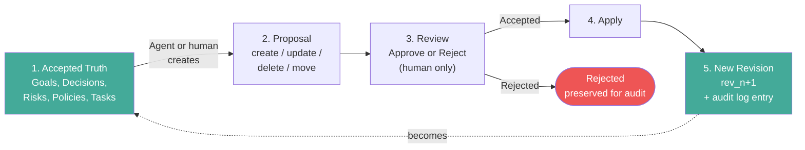

# TruthLayer — Customer Overview

**Governed truth, guarded AI.**

_For enterprise architects, security teams, and technology leaders evaluating TruthLayer._

---

## The challenge

Your organization makes thousands of decisions — about architecture, security, operations, compliance, product direction, and risk. These decisions live in documents, chat threads, wikis, and people's heads. When teams need to act on them, they search, ask around, and hope they have the latest version.

Now add AI agents to this environment. They inherit the same fragmented, ungoverned context — and act on it at machine speed, without the judgment to question whether what they found is current, approved, or appropriate.

**TruthLayer gives your organization a single, governed source of truth that humans control and agents respect.**

## What TruthLayer is

TruthLayer is a **governance-first truth system**: a structured ledger of accepted decisions, policies, and rationale, with enterprise security and compliance controls enforced at runtime.

- **Typed truth store**: Decisions, goals, risks, policies, tasks, constraints, and their relationships — structured, queryable, and versioned.
- **Governed change process**: Every change is a proposal. Authorized humans review and apply. No direct mutation of accepted truth — ever.
- **Agent-safe by design**: AI agents read accepted truth and create proposals. They cannot review, approve, or apply changes. The server enforces this with role-based access control and policy rules.
- **Self-hosted, zero egress**: All infrastructure runs within your perimeter. No data leaves unless you explicitly configure external integrations.

## How it works

This is the **ACAL invariant**: Accepted → Candidate → Accepted → Ledger. Every applied change produces a new immutable revision. History is retained. The audit log records every action.

## Enterprise security and compliance

TruthLayer enforces governance at runtime — these are not configuration options that can be disabled:

| Control                | What it does                                                                                                                                                              |
| ---------------------- | ------------------------------------------------------------------------------------------------------------------------------------------------------------------------- |
| **JWT Authentication** | Every request is authenticated with a signed token. Actor identity is attributed in the audit log.                                                                        |
| **RBAC**               | Five-level role hierarchy (Reader, Contributor, Reviewer, Applier, Admin). Agents are hard-blocked from review and apply — the server rejects the request.                |
| **Policy Engine**      | Six configurable rule types: minimum approvals, required reviewer role, change windows, agent restrictions, agent proposal limits, egress control. Violations return 422. |
| **Audit Log**          | Immutable, append-only. Every state-changing action recorded. Queryable via API, exportable as JSON or CSV. Survives store reset.                                         |
| **Sensitivity Labels** | Nodes classified as public, internal, confidential, or restricted. Agent reads above their allowed level are redacted and audited.                                        |
| **IP Protection**      | SHA-256 content fingerprinting, source attribution, IP classification, and a provenance endpoint for tracking content lineage.                                            |
| **DSAR Support**       | Export endpoint queries audit log by data subject. Erasure endpoint anonymizes actor references across stored entities.                                                   |

## Deployment model

TruthLayer is **self-hosted** — it runs within your infrastructure:

- **Rust server**: Single binary, minimal dependencies. Runs on bare metal, VMs, containers, or Kubernetes.
- **Docker**: `docker compose up --build` for a single-container deployment.
- **Azure Container Apps**: GitHub Actions workflow included for automated deployment.
- **Storage**: File-based (JSON with atomic writes) for development and small teams. MongoDB for production scale.
- **Configuration**: Server-centric config root — storage backend, RBAC, policies, and retention rules in one location.
- **Observability**: OpenTelemetry tracing (OTLP export to Azure Monitor, Grafana, or any OTLP-compatible backend).

**Air-gapped deployment** is supported: the server never initiates outbound connections unless explicitly configured (OTEL export, external integrations).

## Use cases

TruthLayer is not limited to software engineering:

| Domain                         | Example                                                                                                                                |
| ------------------------------ | -------------------------------------------------------------------------------------------------------------------------------------- |
| **Architecture governance**    | Architecture decisions, constraints, and dependencies — typed, linked, and auditable. Agents draft ADRs; architects review and accept. |
| **Security policy**            | Security policies, risk registers, and mitigation plans. Changes go through review. Agents cannot modify accepted policy.              |
| **Compliance and audit**       | Regulatory requirements, control mappings, and evidence. Full audit trail for every change. DSAR export for data subject requests.     |
| **Incident management**        | Postmortem facts, decisions, and follow-up tasks — structured and linked. Agents summarize; humans ratify.                             |
| **Product management**         | Requirements, goals, trade-offs, and rationale. Agents propose based on accepted context; PMs review.                                  |
| **Procurement and operations** | Standards, exceptions, and approval chains. Change windows enforced by policy engine.                                                  |

## AI agent integration

TruthLayer is designed for a world where AI agents are part of every team:

- **MCP server**: AI assistants (Cursor, Claude Desktop) use TruthLayer as a native tool — query truth, create proposals, traverse reasoning chains — without custom integration.
- **Agent-safe contract**: Agents read accepted truth (default). They create proposals. They cannot review, approve, or apply. The server enforces this at the API level.
- **Sensitivity-gated reads**: Agents see only what their sensitivity level allows. Confidential and restricted content is redacted; the read is audited.
- **Provenance chains**: Agents can traverse decision rationale (goal → decision → risk → task) to understand why truth exists, not just what it says.

## AI Compliance Gateway

TruthLayer extends from governing internal truth to acting as a **compliance front-end for external AI models** — OpenAI, Anthropic, Google, Azure OpenAI, or self-hosted models:

| Capability                   | What it does for your organization                                                                                                           |
| ---------------------------- | -------------------------------------------------------------------------------------------------------------------------------------------- |
| **Model allowlists**         | Only admin-approved models and providers can receive your data. Default: no external egress.                                                 |
| **Prompt inspection**        | Before any prompt leaves your perimeter, TruthLayer scans it against sensitivity labels and redacts Confidential/Restricted content.         |
| **Response filtering**       | Model responses are inspected for policy violations and injection indicators before reaching your users.                                     |
| **Full audit trail**         | Every external model interaction is logged: provider, model, sensitivity of egressed content, cost, latency. Queryable and exportable.       |
| **Cost and rate governance** | Per-workspace and per-user limits on token usage and spend. Budget controls enforced before the call.                                        |
| **MCP gateway**              | AI assistants connect to TruthLayer's MCP server and route all model calls through the compliance layer — no direct model API access needed. |

**Why it matters**: Your compliance, security, and legal teams get a **single enforcement point** for all AI model usage. No more relying on each team or tool to enforce its own egress rules. TruthLayer's existing policy engine, sensitivity labels, and audit infrastructure extend to every external model interaction.

The gateway uses the same JWT auth, RBAC, policy engine (with EgressControl and sensitivity gates), sensitivity labels, and audit log that govern all internal operations.

## How TruthLayer compares

|                      | TruthLayer                         | Document suite (Office/Google) | Wiki (Confluence/Notion) | GRC tools           |
| -------------------- | ---------------------------------- | ------------------------------ | ------------------------ | ------------------- |
| **Structured truth** | Typed nodes + relationships        | Unstructured documents         | Semi-structured pages    | Compliance-specific |
| **Governed changes** | Proposal → Review → Apply          | Track changes (no enforcement) | Page history             | Workflow-based      |
| **Agent safety**     | Server-enforced, sensitivity-gated | No agent model                 | No agent model           | Limited             |
| **Audit trail**      | Immutable, append-only, exportable | Document version history       | Page history             | Audit logs          |
| **Self-hosted**      | Yes, by design                     | Cloud or hybrid                | Cloud or server          | Varies              |
| **RBAC + Policy**    | 5 roles, 6 policy rules, enforced  | Share permissions              | Space permissions        | Role-based          |

TruthLayer is **complementary** to document suites — not a replacement. Use Office/Google Docs for document-centric workflows (drafting, discussion, distribution). Use TruthLayer for **structured, governed, agent-safe truth**.

## Getting started

1. **Try the playground**: `docker compose up --build` and open http://localhost:4317
2. **Read the whitepaper**: [Whitepaper](WHITEPAPER.md) for the full design and rationale
3. **Review the architecture**: [Architecture](core/ARCHITECTURE.md) for system design
4. **Explore the API**: [Agent API](core/AGENT_API.md) for the agent-safe contract
5. **Evaluate security**: [Security & Governance](reference/SECURITY_GOVERNANCE.md) for the full security model
6. **Assess privacy**: [Privacy and Data Protection](reference/PRIVACY_AND_DATA_PROTECTION.md) for GDPR/DPIA readiness

## Contact

For enterprise evaluation, proof-of-concept engagement, or technical deep-dive, contact the TruthLayer team.

---

_See the full [Whitepaper](WHITEPAPER.md) and [Security & Governance](reference/SECURITY_GOVERNANCE.md) for detailed technical documentation._
