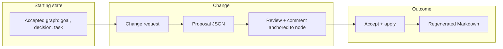

# Hello World: End-to-End Day in the Life

This is the **canonical walkthrough** for Context-First Docs: one coherent path from accepted graph → change request → proposal → review (with comments anchored to nodes) → accept/apply → regenerated Markdown. All artifacts below are real shapes used by the system; you can reproduce them by running the **`hello-world`** scenario in the playground (`npm run playground` → Scenario Runner → **hello-world**).

## Flow overview



---

## 1. Starting state: accepted graph

The store holds **accepted** nodes only (truth). A minimal graph: one goal, one decision, one task, with relationships.

**Accepted nodes (conceptual):**

| Node | Type   | Title/Content summary                    | Relationships   |
|------|--------|------------------------------------------|-----------------|
| g1   | goal   | Ship a small demo                        | —               |
| d1   | decision | Use a single create proposal for seed  | references g1   |
| t1   | task   | Build playground UI                      | implements d1   |

**Representative JSON for the goal and decision (abbreviated):**

```json
{
  "id": { "id": "g1" },
  "type": "goal",
  "status": "accepted",
  "title": "Ship a small demo",
  "description": "Ship a minimal end-to-end demo: goal → decision → task.",
  "content": "Goal: ship a small demo",
  "metadata": { "createdAt": "2026-01-01T00:00:00.000Z", "createdBy": "demo", "version": 1 },
  "relationships": []
}
```

```json
{
  "id": { "id": "d1" },
  "type": "decision",
  "status": "accepted",
  "title": "Use single create proposal for seed",
  "description": "We seed the graph with one accepted proposal containing create operations.",
  "content": "Decision: use single create proposal for seed",
  "decision": "Use single create proposal for seed",
  "rationale": "Simplest way to get deterministic accepted state.",
  "metadata": { "createdAt": "2026-01-01T00:01:00.000Z", "createdBy": "demo", "version": 1 },
  "relationships": [{ "type": "references", "target": { "id": "g1" } }]
}
```

Truth is **only** what has been applied from an accepted proposal; there are no open proposals yet.

---

## 2. Change request

**Request:** Update the decision’s rationale and add a risk that blocks the task.

- **Update d1:** Set `rationale` (and thus derived `description`/`content`) to mention “hello world” and auditability.
- **Create r1:** New risk node “Documentation drift” with mitigation, linked to t1 via `blocks`.

No direct edit to the store: the change is expressed as a **proposal**.

---

## 3. Proposal JSON (open)

The proposal contains two operations: one **update** (d1), one **create** (r1). Status is `open` until a review accepts it. Node status in proposal operations is the status that will be written on apply; until apply, it is not part of accepted truth (so the create for r1 uses `"status": "accepted"` as the post-apply intent).

```json
{
  "id": "p-hello-world",
  "status": "open",
  "operations": [
    {
      "id": "op-update-d1",
      "type": "update",
      "order": 1,
      "nodeId": { "id": "d1" },
      "changes": {
        "rationale": "Simplest way to get deterministic accepted state; also serves as the canonical hello-world for auditability.",
        "description": "We seed the graph with one accepted proposal containing create operations. Rationale: simplest path to deterministic state and canonical hello-world auditability.",
        "content": "Decision: use single create proposal for seed; canonical hello-world for auditability."
      }
    },
    {
      "id": "op-create-r1",
      "type": "create",
      "order": 2,
      "node": {
        "id": { "id": "r1" },
        "type": "risk",
        "status": "accepted",
        "title": "Documentation drift",
        "description": "Docs can drift from the graph if not re-projected after apply.",
        "content": "Risk: documentation drift",
        "severity": "medium",
        "likelihood": "possible",
        "mitigation": "Run projectToMarkdown after apply and commit.",
        "metadata": { "createdAt": "2026-01-01T00:10:00.000Z", "createdBy": "demo", "version": 1 },
        "relationships": [{ "type": "blocks", "target": { "id": "t1" } }]
      }
    }
  ],
  "metadata": {
    "createdAt": "2026-01-01T00:10:00.000Z",
    "createdBy": "demo",
    "modifiedAt": "2026-01-01T00:10:00.000Z",
    "modifiedBy": "demo",
    "rationale": "Hello-world: update decision rationale and add risk for doc drift."
  }
}
```

After `createProposal(store, p-hello-world)`, the proposal exists as **open**; accepted truth is still the original graph.

---

## 4. Review with comment anchored to node

A reviewer accepts the proposal and adds a **comment anchored to the decision node** (Google-Docs-style), so the feedback is tied to semantic context, not a line number.

**Review (accept):**

```json
{
  "id": "review-p-hello-world",
  "proposalId": "p-hello-world",
  "reviewer": "reviewer@example.com",
  "reviewedAt": "2026-01-01T00:15:00.000Z",
  "action": "accept",
  "isApproval": true
}
```

**Comment anchored to node d1, field `rationale`:**

```json
{
  "id": "comment-r1",
  "content": "Good to call out auditability here; we can point new contributors to this scenario.",
  "author": "reviewer@example.com",
  "createdAt": "2026-01-01T00:15:00.000Z",
  "status": "open",
  "anchor": {
    "nodeId": { "id": "d1" },
    "field": "rationale",
    "quote": "canonical hello-world for auditability"
  }
}
```

Calls: `submitReview(review)`, then `addProposalComment(proposalId, comment)`. The proposal’s status becomes **accepted**; truth is still unchanged until apply.

---

## 5. Accept and apply

- **Accept:** Already done via `submitReview` with `action: "accept"`.
- **Apply:** `applyProposal("p-hello-world")` applies the proposal’s operations to the store:
  - Update d1’s fields (rationale, description, content).
  - Create r1 and add it to the graph.

After apply, the **accepted graph** includes g1, d1 (updated), t1, and r1. Open proposals are empty for this graph.

---

## 6. Regenerated Markdown and what changed

**Markdown is a projection** of the accepted graph (`projectToMarkdown(store)`). Same graph ⇒ same Markdown; after apply, the graph changes, so the projection changes.

**Before apply (only g1, d1, t1):**

- Sections: **Goals**, **Decisions**, **Tasks**.
- Decision d1 block contains the original rationale (no “hello-world” or “auditability”).

**After apply (g1, d1, t1, r1):**

- Sections: **Goals**, **Decisions**, **Risks**, **Tasks** (type order depends on projection).
- Decision d1 block now includes the updated rationale and description (e.g. “canonical hello-world for auditability”).
- A new **Risks** section appears with one block for r1 (Documentation drift, mitigation, relationship to t1).

**Example snippet of projected Markdown after apply (decision d1 and risk r1):**

```markdown
## Decisions

~~~ctx
type: decision
id: d1
status: accepted
title: Use single create proposal for seed
---
We seed the graph with one accepted proposal containing create operations. Rationale: simplest path to deterministic state and canonical hello-world auditability.
~~~

## Risks

~~~ctx
type: risk
id: r1
status: accepted
title: Documentation drift
---
Docs can drift from the graph if not re-projected after apply.
~~~
```

So the **concrete “what changed”** in the projection is:

1. **d1** block: content updated to the new rationale/description.
2. **New r1** block: new Risks section and one ctx block for the new node.

---

## Reproducing this walkthrough

- **Playground:** Run the **hello-world** scenario (`npm run playground` → Scenario Runner → **hello-world**). It seeds the minimal graph, creates the proposal, adds an anchored comment, accepts, applies, and returns `markdownBefore` and `markdownAfter` (and related IDs).
- **Code:** See `src/playground/scenarios.ts` (scenario `hello-world`) and `src/markdown/projection.ts` (`projectToMarkdown`). Proposal and comment shapes are in `src/types/proposal.ts`; node shapes in `src/types/node.ts`.

This single end-to-end flow is the **canonical “hello world”** referenced from the whitepaper, REVIEW_MODE, and USAGE.
