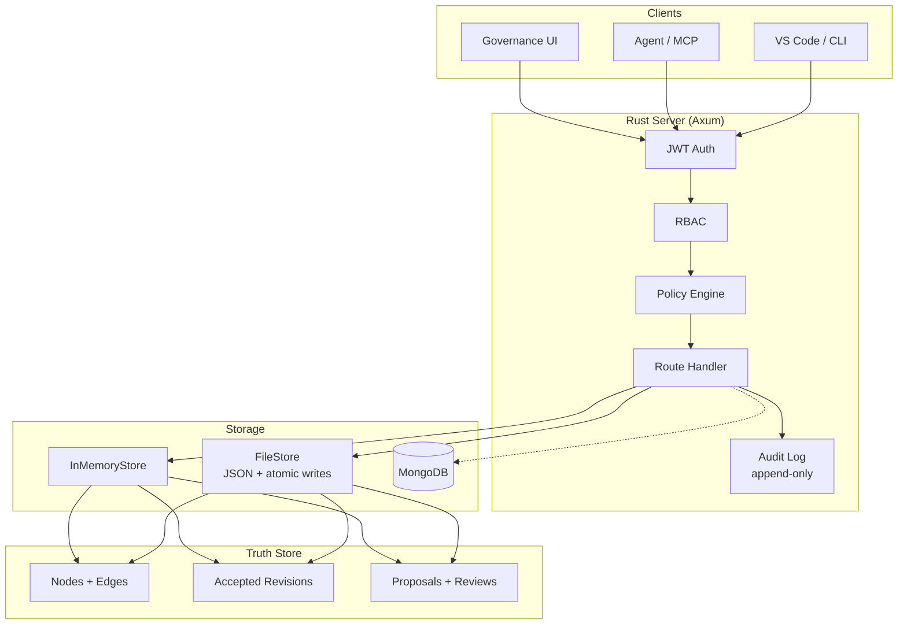

# TruthLayer — Investor Brief

**Governed truth, guarded AI.**

---

## The opportunity

Every enterprise runs on decisions — pricing rules, security policies, architecture constraints, compliance requirements, operational processes. Today these decisions are scattered across Confluence pages, Slack threads, SharePoint folders, and people's heads. When AI agents enter this environment, they inherit the chaos: ingesting stale context, contradicting accepted policy, and operating without governance.

**The market is moving to agentic AI. But there is no governance layer for the truth agents consume.**

TruthLayer fills this gap. It is a **governance-first truth system** — a structured, auditable, agent-safe ledger of accepted decisions and rationale, with enterprise controls built in from day one.

## What TruthLayer does

TruthLayer replaces fragmented, unstructured truth with a **canonical truth store** and a **governed change process**:

| Problem today                           | TruthLayer                                                                                 |
| --------------------------------------- | ------------------------------------------------------------------------------------------ |
| Decisions live in docs, chat, and heads | Typed, structured nodes (goals, decisions, risks, policies, tasks) with relationships      |
| No governance over changes              | Every change is a proposal, reviewed and approved by authorized humans                     |
| No audit trail                          | Immutable, append-only audit log of every action — queryable and exportable                |
| Agents ingest anything                  | Agents read only accepted truth; proposals are isolated; sensitivity labels control egress |
| Compliance is retrofitted               | RBAC, policy engine, sensitivity labels, IP protection, and DSAR support built in          |

The core invariant — **ACAL** (Accepted → Candidate → Accepted → Ledger) — ensures that accepted truth is always stable, auditable, and safe for automation.

## Key differentiators

1. **Governance-first, not docs-first.** TruthLayer is not a document editor with governance bolted on. Governance, auditability, and agent safety are the foundation. Projections to Markdown, DOCX, and HTML are derived artifacts.

2. **Agent-safe by design.** Agents read accepted truth and create proposals. They cannot review or apply changes. The server enforces this at runtime — not by convention, but by rejecting unauthorized actions. Sensitivity labels control what agents can see; IP protection fingerprints content.

3. **Self-hosted, zero egress by default.** All infrastructure runs within the customer's perimeter. No data leaves unless the customer explicitly configures external integrations. Designed for regulated industries, government, and defense.

4. **MCP-native.** TruthLayer ships an MCP (Model Context Protocol) server so AI assistants — Cursor, Claude Desktop, and others — can query truth, create proposals, and traverse reasoning chains as native tools. No custom integration required.

5. **Enterprise controls implemented, not designed.** JWT authentication, hierarchical RBAC, a 6-rule policy engine, immutable audit logging, sensitivity labels, IP protection, and DSAR endpoints are implemented in the Rust server today — not on a roadmap.

## Architecture at a glance

- **Rust server**: High-performance, compiled. JWT auth, RBAC, policy engine, audit log, sensitivity labels, IP protection. 54 tests.
- **Three storage backends**: In-memory (dev/test), file-based (JSON, atomic writes), and MongoDB for production scale.
- **TypeScript client + playground**: Web-based governance UI for proposal review and apply.
- **MCP server**: AI assistant integration out of the box.

## Current state

| Area                                          | Status          |
| --------------------------------------------- | --------------- |
| Core ACAL workflow (propose → review → apply) | **Implemented** |
| JWT authentication (HS256)                    | **Implemented** |
| Hierarchical RBAC (5 roles, agent blocking)   | **Implemented** |
| Policy engine (6 rule types)                  | **Implemented** |
| Immutable audit log (query + export)          | **Implemented** |
| Sensitivity labels + agent egress control     | **Implemented** |
| IP protection (SHA-256, provenance)           | **Implemented** |
| File-based storage with atomic writes         | **Implemented** |
| OpenTelemetry tracing (client + server)       | **Implemented** |
| DSAR endpoints (export + erasure)             | **Included**    |
| Retention engine (configurable rules)         | **Included**    |
| MongoDB backend                               | **Included**    |
| MCP server                                    | **Included**    |
| Minimal governance UI                         | **Included**    |
| The Agent (LLM + store tools)                 | **Included**    |
| AI Compliance Gateway                         | **Included**    |

## Market context

- **Agentic AI adoption is accelerating.** Enterprises are deploying AI agents for operations, engineering, compliance, and customer support. These agents need governed, structured context — not unstructured doc dumps.
- **Governance and compliance are non-negotiable.** Regulated industries (finance, healthcare, defense, government) require audit trails, access control, data residency, and DSAR support. Bolting these onto existing tools is expensive and fragile.
- **No incumbent owns this space.** Document suites (Office, Google Docs) manage documents, not structured truth. Knowledge bases (Confluence, Notion) lack governance, agent safety, and auditability. GRC tools manage compliance, not operational truth. TruthLayer sits at the intersection.

## Business model considerations

- **Self-hosted**: Core value proposition for regulated enterprises. Revenue via enterprise license, support, and professional services.
- **Managed service**: Optional hosted offering for teams that don't want to operate infrastructure. Per-workspace or per-seat pricing.
- **Open core**: Core governance engine is open. Enterprise features (SSO/OIDC, advanced retention, SCIM provisioning, MongoDB backend, SLA support) are commercial.

## AI Compliance Gateway

TruthLayer's governance infrastructure extends beyond internal truth operations to act as a **compliance front-end for frontier and external AI models**:

- **Every prompt to an external model** (OpenAI, Anthropic, Google, Azure OpenAI, self-hosted) passes through TruthLayer's governance pipeline: authentication, RBAC, policy evaluation, sensitivity-based prompt inspection, and response filtering
- **Every interaction is audited**: provider, model, prompt hash, response hash, sensitivity classification, cost, latency — immutable, queryable, exportable
- **Model allowlists** per workspace: only admin-approved models and providers can receive data. Default: no egress
- **Cost and rate governance**: per-workspace and per-actor limits on token usage and spend
- **MCP gateway**: AI assistants connect to TruthLayer's MCP server; TruthLayer mediates all model interactions transparently — the assistant never needs direct model API access

This positions TruthLayer as a **governance-aware AI gateway** — the single compliance enforcement point for all AI model usage in the enterprise. Compliance teams get one audit trail, security teams get one enforcement point, legal teams get sensitivity-gated egress control.

The gateway uses the same JWT auth, RBAC, policy engine (including EgressControl with sensitivity gate and destination allowlist), sensitivity labels, and audit log that govern internal operations — extended to outbound model calls.

## Vision

TruthLayer becomes the **governance substrate** for enterprise AI — the layer between organizational truth and the agents that consume it. Every decision, policy, and constraint flows through a governed, auditable pipeline before reaching any human or machine consumer. The AI Compliance Gateway extends this to govern how external AI models interact with organizational knowledge — making TruthLayer the single enforcement point for all AI-related compliance.

The roadmap extends through:

- **AI Compliance Gateway** — compliance front-end for frontier models: prompt inspection, response filtering, model allowlists, cost governance, full audit trail
- **MongoDB backend** and multi-workspace support for enterprise scale
- **The Agent** — an LLM-powered agent that reads truth and proposes changes, with full governance guardrails
- **Projection engine** — deterministic Markdown/DOCX/HTML generation from truth, with change detection for bidirectional authoring
- **MCP server + gateway mode** — AI assistants use TruthLayer as a native tool and compliance proxy for external models
- **Enterprise integrations** — SSO/OIDC, SCIM, VS Code extension, GitHub/GitLab, Word/Excel review surfaces

## Contact

For investment inquiries, partnership discussions, or enterprise evaluation, contact the TruthLayer team.

---

_See the full [Whitepaper](WHITEPAPER.md) for the complete technical and strategic narrative._
