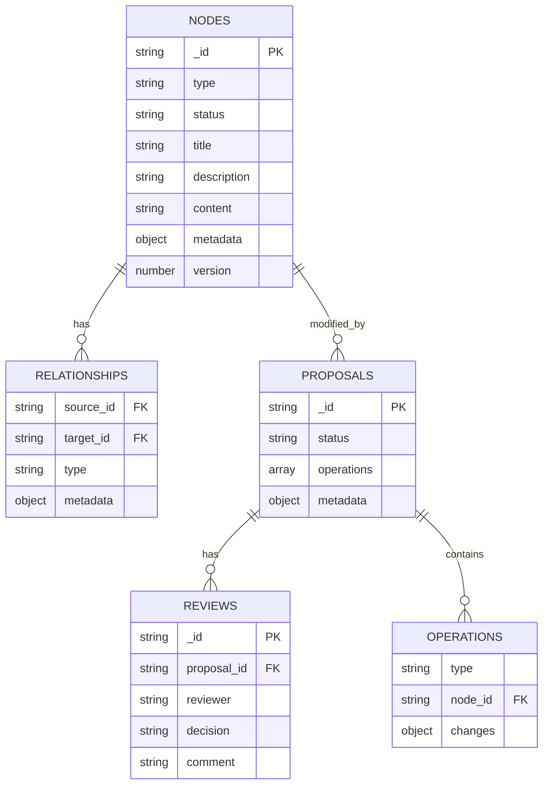
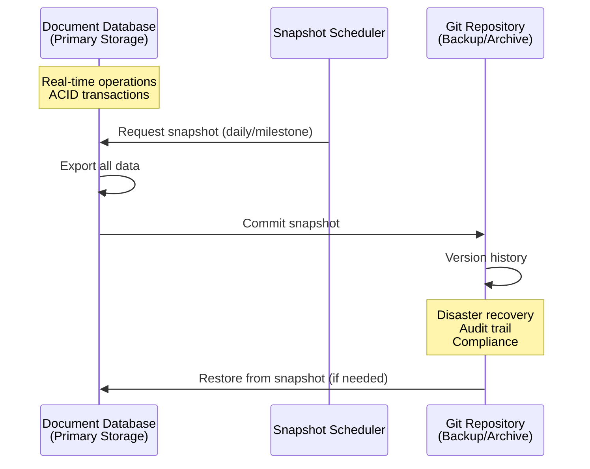
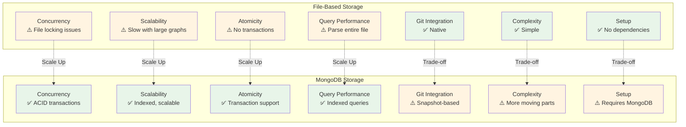

# Storage Architecture: Dual Storage Options with Abstraction Layer

## Overview

The system supports **two storage implementations** through a storage abstraction layer (`ContextStore` interface):

1. **File-Based Storage** (planned): JSON graph format in a repo - simple, Git-friendly, good for small projects/dev
2. **MongoDB Storage** (planned): Self-hosted document database - production-ready scaling and concurrency

Both implementations satisfy the same `ContextStore` interface, allowing users to start simple and scale up seamlessly.

## Node Text Fields (Normalized)

Nodes now support normalized, UI-friendly text fields:

- `title` (optional): short label for display/search
- `description` (optional): canonical long-form Markdown body used for projections
- `content` (required today): deterministic derived plain-text index used for search/similarity/snippets (computed from `description` + key typed fields)

Storage backends must persist `title` + `description`. `content` may be stored for performance, but should be treated as derived and safe to recompute.

## File-Based Storage Limitations

The file-based storage approach (JSON Graph files in Git) has limitations that MongoDB addresses:

### Concurrency Issues
- **File locking**: No native file locking mechanism for concurrent access
- **Race conditions**: Multiple proposals approved simultaneously can cause conflicts
- **Atomicity**: No transaction support - partial updates possible
- **Merge conflicts**: Git-level merge conflicts on context store files are complex to resolve

### Scalability Issues
- **Large file parsing**: Loading entire `graph.json` becomes slow with thousands of nodes
- **Index maintenance**: Manual index files can become inconsistent
- **Query performance**: No indexing for relationship queries - must scan entire graph
- **Memory usage**: Must load entire graph into memory for queries

### Operational Issues
- **Backup/restore**: File-based backups don't guarantee consistency
- **Corruption recovery**: No built-in corruption detection or recovery
- **Schema evolution**: Format changes require careful schema evolution scripts
- **Performance**: No caching layer, every query parses files

## Storage Abstraction Layer

```mermaid
graph TB
    subgraph "Application Layer"
        UI[UI Layer]
        GraphQL[GraphQL API]
        App[Application Code]
    end
    
    subgraph "Storage Abstraction"
        Interface[ContextStore Interface<br/>Abstraction Layer]
    end
    
    subgraph "File-Based Implementation"
        FileStore[File-Based Store]
        GraphJSON[graph.json (example path)]
        NodeFiles[.context/nodes/]
        FileStore --> GraphJSON
        FileStore --> NodeFiles
    end
    
    subgraph "MongoDB Implementation"
        MongoStore[MongoDB Store]
        Collections[(MongoDB Collections)]
        MongoStore --> Collections
    end
    
    UI --> GraphQL
    GraphQL --> App
    App --> Interface
    Interface --> FileStore
    Interface --> MongoStore
    
    style Interface fill:#e1f5ff
    style FileStore fill:#fff4e1
    style MongoStore fill:#e8f5e9
```

## Storage Options

### Option 1: File-Based Storage (planned)

**Best for**: Development, small projects, teams wanting Git-native storage

**Implementation**: JSON graph format (path/config is implementation-defined; `.context/graph.json` is an example) plus optional per-node files

**Benefits**:
- ✅ Simple, no external dependencies
- ✅ Fully Git-friendly, reviewable in PRs
- ✅ Perfect for small projects and development
- ✅ Easy to understand and debug
- ✅ All data in Git (versioned, auditable)

**Limitations**:
- ⚠️ Concurrency issues with multiple simultaneous edits
- ⚠️ Scalability concerns with large graphs (thousands of nodes)
- ⚠️ No ACID transactions

### Option 2: MongoDB Storage (Production)

**Best for**: Production, large projects, teams needing concurrency and scalability

**Implementation**: Self-hosted MongoDB document database with GraphQL API

**Benefits**:
- ✅ **ACID transactions**: Atomic proposal approvals, no partial updates
- ✅ **Concurrency control**: Built-in optimistic locking, no file conflicts
- ✅ **Scalability**: Indexed queries, horizontal scaling
- ✅ **GraphQL integration**: Excellent support via Hasura, Apollo, or custom resolvers
- ✅ **Self-hostable**: Docker, Kubernetes deployment within organization
- ✅ **Document model**: Natural fit for graph nodes and relationships
- ✅ **Query performance**: Indexed relationship queries, aggregation pipeline
- ✅ **Air-gapped support**: Can deploy without internet

**Git Integration**: Periodic snapshots to Git repository for backup, version history, audit trail

### Architecture Overview

```mermaid
graph TB
    UI[UI Layer<br/>VS Code/Cursor Extension]
    UI -->|GraphQL API| GraphQL[GraphQL Server<br/>Self-Hosted]
    GraphQL -->|Queries/Mutations| DB[Document Database<br/>Self-Hosted]
    DB -->|Periodic Snapshots| Git[Git Repository<br/>Backup/Archive]
    
    subgraph "UI Layer"
        UI
        Markdown[Markdown (optional projection)<br/>may be in repo or client]
        Suggest[Suggesting mode → proposals]
        UI -.-> Markdown
        UI -.-> Suggest
    end
    
    subgraph "GraphQL Layer"
        GraphQL
        Schema[Schema Definition<br/>.graphql files]
        Resolvers[Query/Mutation Resolvers]
        Auth[Authentication/Authorization]
        GraphQL -.-> Schema
        GraphQL -.-> Resolvers
        GraphQL -.-> Auth
    end
    
    subgraph "Database Layer"
        DB
        MongoDB[(MongoDB<br/>Recommended)]
        CouchDB[(CouchDB)]
        ArangoDB[(ArangoDB<br/>Graph + Document)]
        DB -.-> MongoDB
        DB -.-> CouchDB
        DB -.-> ArangoDB
    end
    
    subgraph "Backup Layer"
        Git
        Snapshots[Periodic Snapshots]
        History[Version History]
        Recovery[Disaster Recovery]
        Git -.-> Snapshots
        Git -.-> History
        Git -.-> Recovery
    end
    
    style UI fill:#e1f5ff
    style GraphQL fill:#fff4e1
    style DB fill:#e8f5e9
    style Git fill:#fce4ec
```

### Key Components

#### 1. GraphQL Schema (planned)

**Location**: versioned in your repo (path is an implementation choice; e.g. `schema.graphql`)

**Purpose**: 
- Type-safe API definition
- Self-documenting
- Human-readable schema changes (reviewable in PRs)
- Validation contract

**Example**:
```graphql
type Node {
  id: ID!
  type: NodeType!
  status: NodeStatus!
  title: String
  description: String
  content: String!
  metadata: NodeMetadata!
  relationships: [Relationship!]!
}

type Relationship {
  type: RelationshipType!
  target: ID!
  reverseType: RelationshipType
  metadata: RelationshipMetadata
}

type Proposal {
  id: ID!
  operations: [Operation!]!
  status: ProposalStatus!
  metadata: ProposalMetadata!
}

type Query {
  node(id: ID!): Node
  nodes(filter: NodeFilter, pagination: Pagination): NodeConnection!
  proposals(filter: ProposalFilter): [Proposal!]!
  traverseReasoningChain(startNodeId: ID!, options: TraversalOptions): ReasoningChain!
}

type Mutation {
  createProposal(input: ProposalInput!): Proposal!
  approveProposal(id: ID!): Proposal!
  rejectProposal(id: ID!, reason: String): Proposal!
}
```

#### 2. Document Database (Self-Hosted)

**Options**:

**MongoDB** (Recommended):
- ✅ Mature, widely used
- ✅ Excellent GraphQL integration (via Hasura, Apollo, or custom resolvers)
- ✅ ACID transactions (v4.0+)
- ✅ Native indexing for relationships
- ✅ Horizontal scaling
- ✅ Self-hostable (Docker, Kubernetes)
- ✅ Air-gapped deployment support
- ✅ Document model matches graph structure naturally

**CouchDB**:
- ✅ Multi-master replication
- ✅ Built-in conflict resolution
- ✅ REST API (can add GraphQL layer)
- ✅ Self-hostable
- ⚠️ Less common for GraphQL

**ArangoDB**:
- ✅ Native graph database + document store
- ✅ GraphQL support
- ✅ AQL (ArangoDB Query Language) for complex queries
- ✅ Self-hostable
- ✅ Excellent for graph traversal queries

**File-Based Storage Structure**:
```
.context/
├── graph.json                 # Primary graph storage (nodes + edges)
├── nodes/
│   ├── decision-001.json     # Individual node files
│   └── task-002.json
├── proposals/
│   └── proposal-001.json     # Proposal files
└── reviews/
    └── review-001.json       # Review files
```

**MongoDB Storage Structure**:
```javascript
// MongoDB Collections
{
  nodes: [
    {
      _id: "decision-001",
      type: "decision",
      status: "accepted",
      title: "Use TypeScript",
      description: "**Decision**: Use TypeScript for type safety.",
      content: "Use TypeScript Decision: Use TypeScript for type safety.", // derived plain text index
      metadata: { ... },
      relationships: [
        { type: "implements", target: "goal-001" }
      ],
      version: 1
    }
  ],
  proposals: [
    {
      _id: "proposal-001",
      operations: [...],
      status: "open",
      metadata: { ... }
    }
  ],
  reviews: [...]
}
```

**Database Schema Visualization**:


#### 3. Git Integration (Backup/Archive)

**Purpose**: 
- Periodic snapshots for disaster recovery
- Version history and audit trail
- Reviewable changes (for compliance/audit)
- Not primary storage - database is source of truth

**Workflow**:


**Detailed Workflow**:
1. Database is primary storage (real-time, transactional)
2. Periodic snapshots exported to Git (e.g., daily, or on major milestones)
3. Git provides version history and backup
4. Can restore from Git snapshot if needed

**Snapshot Format**:
```json
// .context/snapshots/2026-01-26.json
{
  "snapshotDate": "2026-01-26T00:00:00Z",
  "nodes": [...],
  "proposals": [...],
  "reviews": [...]
}
```

### Benefits by Storage Option

#### File-Based Storage Benefits
- ✅ **Simple setup**: No external dependencies, works out of the box
- ✅ **Git-native**: Direct Git integration, reviewable in PRs
- ✅ **Easy debugging**: Human-readable JSON files
- ✅ **Version history**: Full Git history for all changes
- ✅ **Zero infrastructure**: No database to manage

#### MongoDB Storage Benefits

**Concurrency & Consistency**:
- ✅ **ACID transactions**: Atomic proposal approvals
- ✅ **Optimistic locking**: Built-in version control
- ✅ **No file conflicts**: Database handles concurrency
- ✅ **Consistency guarantees**: Database enforces constraints

**Scalability**:
- ✅ **Indexed queries**: Fast relationship traversal
- ✅ **Horizontal scaling**: Can scale database independently
- ✅ **Caching**: Database-level caching
- ✅ **Query optimization**: Database query planner

**Operational**:
- ✅ **Backup/restore**: Database-native backup tools
- ✅ **Monitoring**: Database metrics and health checks
- ✅ **Schema evolution**: GraphQL schema versioning and database schema evolution
- ✅ **Corruption recovery**: Database-level recovery

**Developer Experience** (Both Options):
- ✅ **Type-safe API**: GraphQL schema provides types
- ✅ **Self-documenting**: GraphQL introspection
- ✅ **Tooling**: GraphQL playground, code generation
- ✅ **Flexible queries**: Clients request only needed fields

### Security & Privacy

**Maintains Zero IP Leakage**:
- ✅ **Self-hosted**: Database runs within organization
- ✅ **No external services**: All infrastructure self-hosted
- ✅ **Air-gapped support**: Can deploy without internet
- ✅ **Full control**: Organization controls all data and access

**Access Control**:
- GraphQL layer enforces RBAC
- Database-level authentication
- Network isolation possible
- Audit logging built-in


### Implementation Considerations

#### Deployment
- **Docker Compose**: Simple self-hosted setup
- **Kubernetes**: For production/scalability
- **Single binary**: Could embed database (SQLite-style) for small deployments

#### Schema Evolution
- GraphQL schema versioning
- Database schema evolution scripts
- Backward compatibility

#### Performance
- Database connection pooling
- Query result caching
- Index optimization for common queries

#### Monitoring
- Database health checks
- Query performance metrics
- Storage usage monitoring

## Comparison: File-Based vs MongoDB Storage



| Aspect | File-Based (planned) | MongoDB (planned) |
|--------|---------------------|----------------------|
| **Best For** | Development, small projects | Production, large projects |
| **Concurrency** | ⚠️ File locking issues | ✅ ACID transactions |
| **Scalability** | ⚠️ Slow with large graphs | ✅ Indexed, scalable |
| **Atomicity** | ⚠️ No transactions | ✅ Transaction support |
| **Query Performance** | ⚠️ Parse entire file | ✅ Indexed queries |
| **Conflict Resolution** | ⚠️ Git merge conflicts | ✅ Database-level |
| **Backup/Recovery** | ✅ Git native | ✅ Database tools + Git snapshots |
| **Type Safety** | ⚠️ TypeScript types only | ✅ GraphQL schema |
| **Self-Hosted** | ✅ Files in Git | ✅ Self-hosted DB |
| **Zero IP Leakage** | ✅ All in Git | ✅ All self-hosted |
| **Git Integration** | ✅ Native | ⚠️ Snapshot-based |
| **Complexity** | ✅ Simple | ⚠️ More moving parts |
| **Dependencies** | ✅ None | ⚠️ Requires MongoDB |
| **Setup Time** | ✅ Minutes | ⚠️ Hours (MongoDB setup) |

## Recommendation

**Support Both Storage Options via Abstraction Layer**:

1. **Start Simple**: In-memory for demos/tests today; file-based is the intended default once implemented
2. **Scale Up**: MongoDB storage (production) - when you need concurrency and scalability
3. **Seamless Transition**: Same `ContextStore` interface - switch via configuration
4. **Maintains security requirements** - both options self-hosted, zero IP leakage
5. **Production-ready** - MongoDB provides transactions, indexing, scaling when needed

**When to Use Each**:

**File-Based Storage** (planned):
- ✅ Starting a new project
- ✅ Small teams (< 10 people)
- ✅ Small context graphs (< 1000 nodes)
- ✅ Development/testing environments
- ✅ Teams wanting Git-native workflow
- ✅ Projects with minimal concurrent edits

**MongoDB Storage** (Production):
- ✅ Production deployments
- ✅ Large teams (> 10 people)
- ✅ Large context graphs (> 1000 nodes)
- ✅ High concurrent edit scenarios
- ✅ Need for ACID transactions
- ✅ Need for horizontal scaling

**Implementation Strategy**:
1. Implement file-based storage first (simple, Git-friendly) - **Phase 2**
2. Implement MongoDB storage (production-ready) - **Phase 2**
3. Ensure both satisfy `ContextStore` interface (abstraction layer) - **Phase 2**
4. Add configuration to select storage backend - **Phase 2**
5. Design GraphQL schema (`.context/schema.graphql`) - works with both - **Phase 2**
6. Implement Git snapshot/backup system for MongoDB - **Phase 2**
7. Build MongoDB collections and indexes - **Phase 2**
8. Implement ACID transaction support for MongoDB proposal approvals - **Phase 2**
