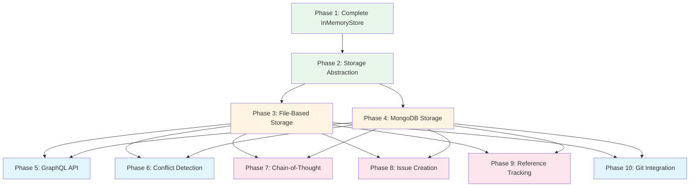

# Storage Implementation Plan

## Gap Analysis

### Current State

**What Exists:**
- ✅ `ContextStore` interface - fully defined with all method signatures
- ✅ `InMemoryStore` - feature-complete baseline implementation for development/testing
- ✅ Reusable store core logic extracted to `src/store/core/*` for reuse by future providers
- ✅ Type definitions - comprehensive types for queries, reasoning chains, etc.
- ✅ Project structure - organized codebase with types, store directories
- ✅ Test coverage work - targeted suites covering core store behavior (apply/query/conflicts) and runtime type guards

**What's Missing:**

#### 1. InMemoryStore Completeness
- ✅ `queryNodes()` returns `NodeQueryResult` (with pagination metadata, including `hasMore`)
- ✅ Relationship traversal in queries (relatedTo/depth/direction, ancestors/descendants, dependencies/dependents, relationship filters)
- ✅ Advanced search options (fields/operator/fuzzy)
- ✅ Sorting and pagination metadata
- ✅ `getReferencingNodes()` implemented
- ✅ `updateReferencingNodes()` implemented (no-op for in-memory; required by interface for persistent stores)
- ✅ `detectConflicts()` implemented (proposal overlap classification)
- ✅ `isProposalStale()` implemented (baseVersions + modifiedAt fallback)
- ✅ `mergeProposals()` implemented (field-level auto-merge + conflict reporting)
- ✅ `createIssuesFromProposal()` implemented (basic implementation; will evolve with templates/integrations)
- ✅ Chain-of-thought traversal methods implemented (baseline behavior suitable for dev/testing; will evolve)

#### 2. File-Based Storage Implementation
- ❌ No `FileBasedStore` class
- ❌ No JSON Graph file reading/writing
- ❌ No individual node file management
- ❌ No index file management
- ❌ No Git integration (automatic commits)
- ❌ No file locking/concurrency handling
- ❌ No relationship graph structure management
- ❌ No proposal/review file management

#### 3. MongoDB Storage Implementation
- ❌ No `MongoDBStore` class
- ❌ No MongoDB connection management
- ❌ No collections setup (nodes, proposals, reviews, relationships)
- ❌ No database indexes
- ❌ No ACID transaction support
- ❌ No GraphQL resolver integration
- ❌ No connection pooling
- ❌ No error handling/recovery

#### 4. Storage Abstraction Layer
- ❌ No storage factory/selector
- ❌ No configuration system
- ❌ No storage backend selection mechanism
- ❌ No initialization/teardown lifecycle

#### 5. GraphQL API Layer
- ❌ No GraphQL schema file (`.context/schema.graphql`)
- ❌ No GraphQL server setup
- ❌ No resolvers implementation
- ❌ No type validation
- ❌ No authentication/authorization integration
- ❌ No query/mutation handlers

#### 6. Conflict Detection & Resolution
- ✅ Conflict detection + merge logic exists in `src/store/core/conflicts.ts` (baseline, in-memory)
- ✅ Optimistic locking support exists via `baseVersions` + node metadata version checks (baseline)
- ❌ No proposal superseding logic
- ❌ No manual conflict resolution workflow

#### 7. Chain-of-Thought Traversal
- ❌ No reasoning chain traversal algorithm
- ❌ No context chain building
- ❌ No decision reasoning following
- ❌ No semantic similarity detection
- ❌ No progressive context accumulation

#### 8. Issue Creation System
- ❌ No issue creation from proposals
- ❌ No issue templates
- ❌ No issue configuration
- ❌ No issue lifecycle management

#### 9. Git Integration
- ❌ No automatic Git commits for file-based storage
- ❌ No Git snapshot system for MongoDB
- ❌ No commit message generation
- ❌ No commit tracking (Jira-style checkin semantics)
- ❌ No Git conflict handling

#### 10. Reference Tracking
- ❌ No bidirectional reference tracking
- ❌ No automatic reference updates when nodes change
- ❌ No reference validation

## Implementation Plan

### Phase 1: InMemoryStore + Core Store Extraction (Foundation)

**Priority**: High - Baseline for testing and as reference implementation

**Tasks**:
1. ✅ Complete `InMemoryStore` behavior for all `ContextStore` methods (development/testing baseline)
2. ✅ Extract reusable, provider-agnostic logic to `src/store/core/*`:
   - apply proposal operations
   - query/filter/sort/paginate + traversal helpers
   - conflict detection / stale checks / merge
   - canonical node keying
3. ✅ Add targeted test suites to lock in behavior and maintain coverage
4. ⏳ Harden and document **issue creation** semantics (currently basic) and how it maps to future templates/integrations
5. ⏳ Clarify and document **conflict severity semantics** and expected UI workflows (manual resolution / superseding)
6. ⏳ Add a few more edge-case tests (graph traversal + conflicts) to keep branch coverage healthy as logic evolves

**Estimated Effort**: Completed for baseline; remaining hardening items are incremental

### Phase 2: Storage Abstraction & Configuration

**Priority**: High - Needed before implementing storage backends

**Tasks**:
1. Create storage configuration interface
2. Create storage factory/selector
3. Create configuration file format (`.context/config.json` or `context.config.json`)
4. Implement storage initialization lifecycle
5. Add storage backend detection/validation
6. Create storage adapter pattern
7. Add error handling for storage operations
8. Add logging/monitoring hooks

**Configuration Format**:
```json
{
  "storage": {
    "backend": "file-based" | "mongodb" | "memory",
    "file-based": {
      "path": ".context",
      "graphFile": "graph.json",
      "autoCommit": true,
      "commitMessageTemplate": "Update context: {proposalId}"
    },
    "mongodb": {
      "connectionString": "mongodb://localhost:27017",
      "database": "context-store",
      "collections": {
        "nodes": "nodes",
        "proposals": "proposals",
        "reviews": "reviews",
        "relationships": "relationships"
      },
      "snapshot": {
        "enabled": true,
        "frequency": "daily",
        "gitPath": ".context/snapshots"
      }
    }
  }
}
```

**Estimated Effort**: 1 week

### Phase 3: File-Based Storage Implementation

**Priority**: High - Default storage, needed for development

**Tasks**:
1. Create `FileBasedStore` class implementing `ContextStore`
2. Implement JSON Graph file reading/writing
   - Read/write `graph.json` (nodes + edges)
   - Read/write individual node files
   - Maintain consistency between graph.json and node files
3. Implement index file management
   - Create/update `index.json`
   - Maintain node/proposal/review indexes
   - Handle index corruption recovery
4. Implement proposal/review file management
   - Store proposals in `proposals/` directory
   - Store reviews in `reviews/` directory
5. Implement relationship graph management
   - Maintain edge list in graph.json
   - Update relationships when nodes change
   - Query relationships efficiently
6. Implement Git integration
   - Automatic Git commits on proposal approval
   - Commit message generation
   - Handle Git errors gracefully
7. Implement file locking/concurrency
   - File-based locking for concurrent access
   - Optimistic locking with version numbers
   - Conflict detection on writes
8. Implement all `ContextStore` methods
   - Complete query implementation with relationship traversal
   - Conflict detection
   - Chain-of-thought traversal
   - Reference tracking
9. Add comprehensive error handling
10. Add tests

**File Structure**:
```
.context/
├── graph.json              # Primary graph (nodes + edges)
├── index.json              # Metadata and indexes
├── nodes/
│   ├── decision-001.json
│   └── task-002.json
├── proposals/
│   └── proposal-001.json
└── reviews/
    └── review-001.json
```

**Estimated Effort**: 4-5 weeks

### Phase 4: MongoDB Storage Implementation

**Priority**: Medium - Production storage, can follow file-based

**Tasks**:
1. Create `MongoDBStore` class implementing `ContextStore`
2. Set up MongoDB connection
   - Connection string parsing
   - Connection pooling
   - Error handling and retry logic
   - Health checks
3. Create database schema
   - Define collections structure
   - Create indexes (type, status, relationships, dates)
   - Create validation rules
4. Implement CRUD operations
   - Node CRUD with relationships
   - Proposal CRUD
   - Review CRUD
5. Implement ACID transactions
   - Transaction wrapper for proposal approval
   - Optimistic locking with version field
   - Rollback on errors
6. Implement query operations
   - Basic queries with filters
   - Relationship traversal queries
   - Full-text search (MongoDB text indexes)
   - Aggregation pipeline for complex queries
7. Implement indexing strategy
   - Index on: type, status, createdAt, modifiedAt
   - Compound indexes for common queries
   - Relationship indexes (source, target, type)
8. Implement Git snapshot system
   - Periodic export to JSON
   - Commit to Git repository
   - Snapshot scheduling
   - Restore from snapshot
9. Implement all `ContextStore` methods
   - Complete query implementation
   - Conflict detection
   - Chain-of-thought traversal
   - Reference tracking
10. Add comprehensive error handling
11. Add tests

**MongoDB Schema**:
```javascript
// nodes collection
{
  _id: "decision-001",
  type: "decision",
  status: "accepted",
  content: "...",
  metadata: { ... },
  relationships: [
    { type: "implements", target: "goal-001", metadata: {...} }
  ],
  version: 1,
  createdAt: ISODate("..."),
  modifiedAt: ISODate("...")
}

// Indexes
db.nodes.createIndex({ type: 1, status: 1 })
db.nodes.createIndex({ "relationships.target": 1 })
db.nodes.createIndex({ createdAt: -1 })
db.nodes.createIndex({ content: "text" })
```

**Estimated Effort**: 5-6 weeks

### Phase 5: GraphQL API Layer

**Priority**: Medium - Needed for type-safe API

**Tasks**:
1. Design GraphQL schema (`.context/schema.graphql`)
   - Node types and relationships
   - Query types
   - Mutation types
   - Input types
2. Set up GraphQL server
   - Choose framework (Apollo, GraphQL.js, etc.)
   - Server configuration
   - Error handling
3. Implement resolvers
   - Query resolvers (nodes, proposals, etc.)
   - Mutation resolvers (createProposal, approveProposal, etc.)
   - Relationship resolvers
   - Chain-of-thought traversal resolvers
4. Implement type validation
   - Input validation
   - Output validation
   - Schema validation
5. Integrate with storage abstraction
   - Resolvers use `ContextStore` interface
   - Works with both file-based and MongoDB
6. Add authentication/authorization
   - RBAC integration
   - Query/mutation permissions
7. Add GraphQL playground/documentation
8. Add tests

**Estimated Effort**: 3-4 weeks

### Phase 6: Conflict Detection & Resolution

**Priority**: High - Critical for collaboration

**Tasks**:
1. Implement conflict detection algorithm
   - Compare proposal operations
   - Detect field-level conflicts
   - Detect relationship conflicts
   - Check for stale proposals
2. Implement field-level merging
   - Auto-merge non-conflicting fields
   - Flag conflicting fields
   - Merge strategies per field type
3. Implement optimistic locking
   - Version tracking
   - Version validation on updates
   - Stale proposal detection
4. Implement proposal superseding
   - Mark superseded proposals
   - Track superseding relationships
   - Handle cascading supersedes
5. Implement manual conflict resolution
   - Conflict resolution UI/workflow
   - Manual merge creation
   - Conflict resolution tracking
6. Add tests

**Estimated Effort**: 2-3 weeks

### Phase 7: Chain-of-Thought Traversal

**Priority**: Medium - Advanced agent feature

**Tasks**:
1. Implement reasoning chain traversal
   - Follow relationship paths
   - Accumulate context progressively
   - Build reasoning steps
2. Implement context chain building
   - Follow relationship sequences
   - Stop conditions
   - Context accumulation
3. Implement decision reasoning following
   - Find goals, alternatives, implementations
   - Find risks and constraints
   - Build decision rationale chain
4. Implement semantic similarity detection
   - Content similarity (basic version)
   - Type-based similarity
   - Relationship-based similarity
5. Implement progressive context accumulation
   - Build context map by type
   - Track reasoning path
   - Include rationale at each step
6. Optimize for performance
   - Caching of traversal results
   - Depth limiting
   - Early termination
7. Add tests

**Estimated Effort**: 3-4 weeks

### Phase 8: Issue Creation System

**Priority**: Medium - Feature enhancement

**Tasks**:
1. Implement issue creation from proposals
   - Parse proposal operations
   - Generate issue nodes
   - Link issues to proposals
2. Implement issue templates
   - Template system
   - Variable substitution
   - Template configuration
3. Implement issue configuration
   - Per-node-type issue creation rules
   - Issue type mapping
   - Issue metadata mapping
4. Implement issue lifecycle
   - Issue status tracking
   - Issue-proposal linking
   - Issue updates from proposals
5. Add tests

**Estimated Effort**: 2 weeks

### Phase 9: Reference Tracking

**Priority**: Medium - Important for consistency

**Tasks**:
1. Implement bidirectional reference tracking
   - Track node references
   - Update references on node changes
   - Validate references
2. Implement reference updates
   - Update referencing nodes when referenced node changes
   - Handle reference deletions
   - Handle reference updates
3. Implement reference validation
   - Check reference existence
   - Validate reference types
   - Handle broken references
4. Add tests

**Estimated Effort**: 1-2 weeks

### Phase 10: Git Integration

**Priority**: High - Needed for both storage backends

**Tasks**:
1. Implement Git commit system for file-based storage
   - Automatic commits on proposal approval
   - Commit message generation
   - Commit metadata (proposal ID, reviewer, etc.)
2. Implement Git snapshot system for MongoDB
   - Export MongoDB data to JSON
   - Commit snapshots to Git
   - Snapshot scheduling (daily, milestone-based)
   - Snapshot restore functionality
3. Implement commit tracking
   - Parse commit messages for proposal references
   - Link code commits to proposals/nodes
   - Jira-style checkin semantics
4. Implement Git conflict handling
   - Detect Git merge conflicts
   - Handle conflicts in file-based storage
   - Conflict resolution workflow
5. Add tests

**Estimated Effort**: 2-3 weeks

## Implementation Order



**Recommended Sequence**:
1. **Phase 1** (Complete InMemoryStore) - Foundation for testing
2. **Phase 2** (Storage Abstraction) - Enables multiple backends
3. **Phase 3** (File-Based Storage) - Default implementation, enables development
4. **Phase 6** (Conflict Detection) - Critical for collaboration
5. **Phase 10** (Git Integration) - Needed for file-based storage
6. **Phase 5** (GraphQL API) - Type-safe API layer
7. **Phase 4** (MongoDB Storage) - Production scaling
8. **Phase 7** (Chain-of-Thought) - Advanced features
9. **Phase 9** (Reference Tracking) - Consistency features
10. **Phase 8** (Issue Creation) - Feature enhancement

## Key Design Decisions

### Storage Abstraction Pattern

```typescript
// Storage factory
export function createStore(config: StorageConfig): ContextStore {
  switch (config.backend) {
    case "file-based":
      return new FileBasedStore(config.fileBased);
    case "mongodb":
      return new MongoDBStore(config.mongodb);
    case "memory":
      return new InMemoryStore();
    default:
      throw new Error(`Unknown storage backend: ${config.backend}`);
  }
}

// Configuration loading
export function loadStorageConfig(): StorageConfig {
  // Try .context/config.json first
  // Fall back to context.config.json
  // Fall back to environment variables
  // Default to file-based
}
```

### File-Based Storage Concurrency

- Use file locking (fs-extra, proper-lockfile)
- Optimistic locking with version numbers
- Retry logic for concurrent writes
- Conflict detection before writes

### MongoDB Storage Transactions

- Use MongoDB transactions (v4.0+) for proposal approval
- Wrap entire proposal application in transaction
- Rollback on any error
- Optimistic locking with version field

### GraphQL Schema Location

- Store in `.context/schema.graphql` (committed to Git)
- Versioned with code
- Reviewable in PRs
- Used for validation and code generation

## Testing Strategy

### Unit Tests
- Test each storage implementation independently
- Mock dependencies (Git, MongoDB)
- Test all `ContextStore` methods
- Test error cases

### Integration Tests
- Test storage abstraction layer
- Test GraphQL API with both backends
- Test Git integration
- Test conflict detection/resolution

### Performance Tests
- Test query performance with large datasets
- Test concurrent access scenarios
- Test MongoDB indexing effectiveness
- Test file-based storage with large graphs

## Success Criteria

- ✅ Both file-based and MongoDB storage fully implement `ContextStore` interface
- ✅ Storage abstraction allows seamless switching via configuration
- ✅ File-based storage works for development/small projects
- ✅ MongoDB storage scales to production/large projects
- ✅ GraphQL API works with both storage backends
- ✅ All conflict detection/resolution features work
- ✅ Chain-of-thought traversal works efficiently
- ✅ Git integration works for both storage types
- ✅ Comprehensive test coverage (>80%)
- ✅ Documentation complete

## Estimated Total Effort

- **Phase 1**: 2-3 weeks
- **Phase 2**: 1 week
- **Phase 3**: 4-5 weeks
- **Phase 4**: 5-6 weeks
- **Phase 5**: 3-4 weeks
- **Phase 6**: 2-3 weeks
- **Phase 7**: 3-4 weeks
- **Phase 8**: 2 weeks
- **Phase 9**: 1-2 weeks
- **Phase 10**: 2-3 weeks

**Total**: ~25-35 weeks (6-9 months for one developer)

**With Parallel Work**:
- Phases 3 & 4 can be done in parallel (different developers)
- Phases 6, 7, 8, 9 can be done in parallel after Phase 3/4
- Phase 5 can start after Phase 2

**Optimistic Timeline**: 4-5 months with 2-3 developers
