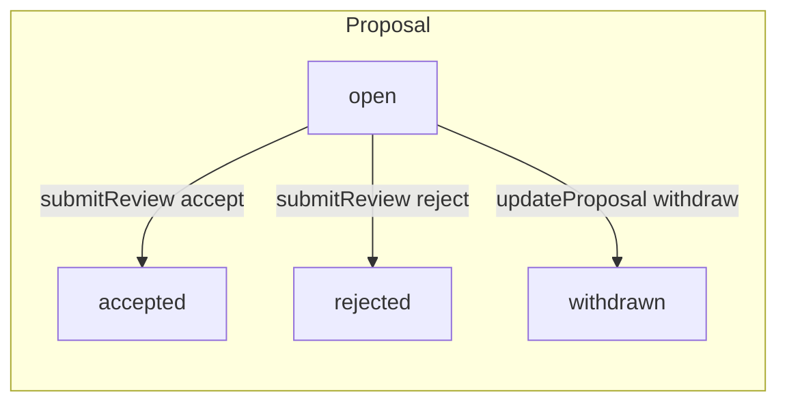
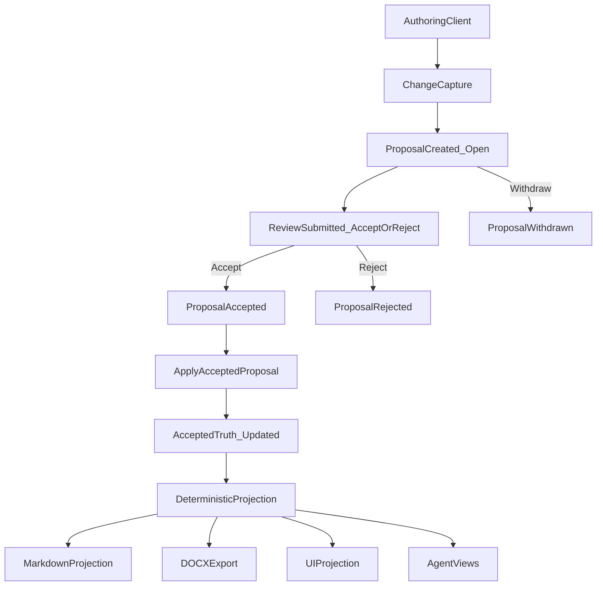
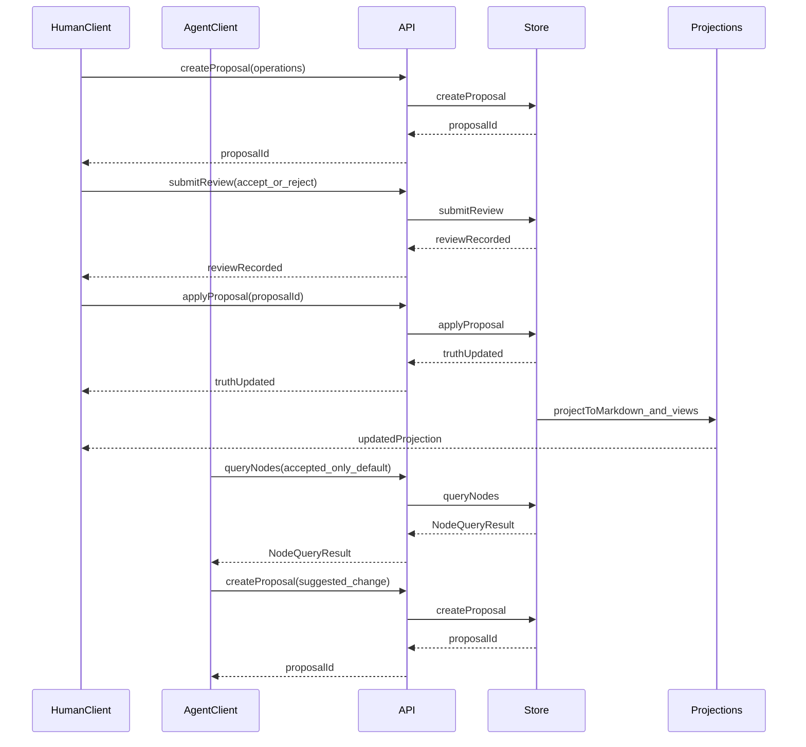

# TruthLayer
## Agentic Collaboration Approval Layer (ACAL): review‑mode solution modeling for human + agent collaboration

**Version**: v1  
**Audience**: leadership, security/compliance, and builders across domains (mixed)  

---

## 1. Executive summary

Organizations do not have a stable substrate for **durable, reviewable solution modeling**:

- **Why** decisions were made (and what was rejected) is scattered across chat, docs, tickets, meeting notes, email, and review threads.
- **Truth status** is ambiguous: drafts, proposals, outdated decisions, and open questions are often indistinguishable.
- As AI agents become participants in knowledge work, this ambiguity becomes operational risk: agents can **hallucinate** or apply outdated context because the system cannot reliably distinguish **accepted truth** from **suggestions**.

**TruthLayer** proposes a different primitive: an **Agentic Collaboration Approval Layer (ACAL)** — a review‑mode store that behaves like Google Docs “Suggesting” mode, but with explicit structure and agent‑safe semantics.

**The product wedge — why this is different from ADRs, Notion, or "docs + RAG":**  
If you want to understand in one glance why this must exist, it is this combination: **(1) Truth semantics are enforceable** — the proposal/review/apply invariant: no direct edits to accepted context; all change flows through proposals → review → apply; truth is what has been explicitly accepted and applied. **(2) Agent-safe defaults** — reads default to **accepted-only**; agents do not see proposals or rejected content as truth unless they opt in, so they cannot treat drafts or rejected ideas as fact. **(3) Deterministic projection** — same context state yields the same Markdown; stable diffs, CI reproducibility. **(4) Provenance of rejected ideas** — rejected proposals and alternatives are preserved; you don't re-litigate because "what was considered" is first-class and queryable. That combination is the **"why this must exist"** kernel. ADRs are static snapshots; Notion has no enforceable truth semantics or accepted-only reads; "docs + RAG" has no proposal/review/apply invariant or deterministic projection. This system provides all four.

**What is distinct:**

- **Review-mode invariant**: no direct edits to accepted context; all change flows through proposals → review → apply (see `docs/REVIEW_MODE.md`).
- **Structured truth**: the canonical source of truth is a **typed solution graph** (nodes and relationships), not unstructured documents (see `src/types/node.ts`, `src/store/core/graph.ts`).

In the architecture (implemented and planned):

- The canonical source of truth is a **typed solution graph**, not unstructured documents.
- The system enforces the **review-mode invariant**: all changes are captured as **proposals** and move into truth only via **review** (accept/reject) and **apply**.
- Markdown is an **optional projection** and authoring surface (e.g., via lightweight `ctx` blocks), never the authoritative store (see `src/markdown/ctx-block.ts`, `src/markdown/projection.ts`). DOCX is an **export-only projection** for distribution (see `scripts/build-whitepaper-docx.js`, `scripts/README.md`).
- Agents (and humans) read a **queryable API** that defaults to accepted truth for safety, and they write only by creating proposals (see `src/store/core/query-nodes.ts`: `query.status || ["accepted"]`).
- Storage is designed for self-hosting: **Implemented**: in-memory store; **Planned**: file-based backend (Git-friendly) and database backend (MongoDB) behind the same `ContextStore` interface (see `docs/STORAGE_IMPLEMENTATION_PLAN.md`).
- **Enterprise IP and contextualized AI:** The context store is the substrate for a **contextualized AI model** — one that reasons using your organization's approved goals, decisions, constraints, and risks — while keeping that IP inside your infrastructure. This is packaged as a first-class **Contextualize** module (retrieval, prompt building, export; **prompt-leakage policy layer** = policy-as-code). Retrieval (RAG), export for fine-tuning, and structured prompting run against the store; training and inference can stay on-prem or in a private cloud. See `docs/CONTEXTUALIZED_AI_MODEL.md` and section 7.1.

This paper explains what distinguishes this approach from “hodgepodge” workflows and from existing tools (Git+Markdown, wikis, issue trackers, knowledge graphs, RAG/vector stores, and agent memory tools).

---

## 2. Problem statement: why "hodgepodge" fails

Teams already “document.” The problem is that context:

- is **distributed** (chat threads, PRs, wikis, tickets, calendar meetings),
- is **time-sensitive** (truth changes as the code and constraints change),
- is **reviewed inconsistently** (some changes are code-reviewed, others are not),
- and is **not machine-verifiable** as truth.

### 2.1 Why this becomes critical with AI agents

Agents can execute work at high speed, but they need a reliable contract:

- what is **accepted truth**,
- what is **proposed/suggested**,
- what is **rejected** (and why),
- what is **open** (unresolved questions, risks, pending decisions),
- and how context relates (goal → decision → task → risk).

Without explicit truth semantics, agents will:

- treat drafts as truth,
- resurrect rejected alternatives,
- miss constraints,
- or conflate unrelated decisions.

### 2.2 Benefits without agents

Adoption often starts with humans. Even without AI agents, a structured, review-mode context layer delivers:

- **Less decision churn** — Explicit accepted vs proposed vs rejected state reduces re-litigation of settled decisions.
- **Faster onboarding** — New joiners get one place to see goals, decisions, risks, and rationale instead of hunting across chat, wikis, and tickets.
- **Auditable rationale** — Why something was decided (and what was rejected) is first-class, queryable, and preserved with review history.
- **Fewer rediscoveries of rejected alternatives** — Rejected ideas are stored and linked; teams don't repeatedly rediscover and re-debate the same options.
- **Stable source of truth independent of ticket lifecycles** — Truth lives in the context graph; when Jira issues close or PRs merge, rationale and relationships remain in one place.

### 2.3 Why existing “tracked changes” systems do not solve this

Google Docs / Word solve human review ergonomics, but they are:

- opaque to agents (no stable semantic graph),
- not deterministic (hard to generate stable projections),
- often cloud-bound (problematic for sensitive repos),
- and not integrated as a first-class layer in domain workflows (engineering, policy, operations, procurement, etc.).

### 2.4 Use cases where Office and Google Docs (with Copilot and Gemini) establish and consume truth

**Microsoft Office (Word, etc.) with Copilot** and **Google Docs with Gemini** can be used for both **establishing truth** (human review, suggest mode, accept/reject changes) and **consuming it**. Truth consumption applies to the **entire document suite** (all Office or Google Workspace documents) as well as **messaging apps** (e.g. Microsoft Teams, Outlook; Google Chat, Gmail; Slack): Copilot and Gemini read across that surface to answer questions, summarize, suggest edits, and **use truth to draft discussions, emails, and similar artifacts**. The following use cases are a good fit for Office/Docs + AI:

| Use case | Establishing truth | Consuming truth (Copilot / Gemini) |
|----------|---------------------|-------------------------------------|
| **Policy and HR docs** | Authors and reviewers use suggest mode; approved text is "truth." Version history and comments capture who changed what. | Copilot/Gemini consume across the **document suite** and **messaging** (Teams, Chat, Slack, email) to answer ("What is our leave policy?"), draft updates, **draft discussions or emails** grounded in approved content, or summarize. |
| **Contract and legal drafting** | Tracked changes and review workflows establish agreed wording; final accepted version is the truth. | AI surfaces clauses, compares to templates, or suggests edits; truth can be used to **draft emails, discussion threads, or follow-up docs**; consumption spans the full doc set and relevant threads. |
| **Marketing and comms** | Copy is reviewed in Docs/Word; approved messaging is the source of truth. | AI generates variants, checks tone, or reuses approved phrases from the suite and from messaging context. |
| **Standard operating procedures (SOPs)** | SOPs are written and reviewed in Office/Docs; the published document is the truth. | Copilot/Gemini answer "How do we do X?" from the **entire document suite** and, where integrated, from **messaging apps**. |
| **Cross-functional narratives** | Long-form docs (strategy, playbooks) where human review defines truth; no need for a typed graph or agent API. | AI consumes the **document suite** and **messaging** for Q&A, summarization, or **drafting discussions, emails, and similar artifacts** from truth. |

**When Office/Docs + Copilot/Gemini is enough:**

- Truth is **document-centric** (the approved document *is* the truth), not a graph of typed nodes (goals, decisions, risks, tasks) with explicit status and relationships.
- You are **comfortable with vendor AI** reading and generating from that content (Microsoft/Google DPAs and data residency apply).
- You do **not** need an **agent-safe API** that returns only accepted truth by default, deterministic projection for CI/Git, or first-class **provenance of rejected ideas** (rejected suggestions are in history but not queryable as structured context).
- Workflows are **human-led**; agents assist by reading/writing across the **document suite** and **messaging apps** (Teams, Chat, Slack, email), not by querying a structured store with accepted-only defaults.

**When to add TruthLayer (or use it instead):**

- You need **enforceable truth semantics** (proposal → review → apply; no direct edits to accepted context) and **agent-safe defaults** (reads default to accepted-only so agents cannot treat drafts or rejected ideas as fact).
- You need a **typed solution graph** (goal → decision → task → risk) with explicit status and relationships, deterministic projection, and **provenance of rejected ideas** as first-class, queryable context.
- You need **self-hosted** storage and optional **contextualized AI** (RAG/fine-tuning/prompting) that keeps IP in your perimeter, with a **prompt-leakage policy layer** when using vendor LLMs.

In practice, many organizations use **both**: Office/Docs + Copilot/Gemini for narrative and policy documents (and messaging) where document-as-truth and vendor AI consumption across the **entire suite and messaging apps** are acceptable; TruthLayer (or a similar ACAL) for solution modeling, technical decisions, and agent-heavy workflows where structured truth and agent-safe consumption matter.

---

## 3. Design principles and non-goals

**Design principles** (see `DECISIONS.md`, `docs/REVIEW_MODE.md`):

- **Review-mode semantics**: Accepted context cannot be directly edited; all writes are proposals; only reviews can accept/reject; accepted proposals become truth only when applied. Enforced in code: `updateProposal` cannot set `status: "accepted" | "rejected"`; acceptance/rejection is via `submitReview`; `applyProposal` applies only accepted proposals (`src/store/in-memory-store.ts`).
- **Determinism**: Same context state yields the same projection output; projection order and normalization are part of the contract (`src/markdown/projection.ts`, `src/utils/node-text.ts`).
- **Self-hosting constraint**: All context data stays within the organization; no external cloud services for core functionality (`CONTEXT.md` constraint-005, `DECISIONS.md` decision-005).
- **Provenance preservation**: Rejected proposals and alternatives are preserved; the system does not discard "what was considered" (`src/types/proposal.ts`, store keeps reviews and proposal history).

**Non-goals:**

- Markdown as canonical truth (Markdown is a projection only).
- Replacing code review (PRs remain the place for code review).
- Replacing execution systems (issue trackers remain for delivery workflow).
- Real-time multi-user co-editing as the primary UX (review mode is the invariant; sync and conflict resolution support parallel work but are not "Google Docs realtime" as the core model).

---

## 4. System overview

TruthLayer is not “a better document editor.”

It is an **Agentic Collaboration Approval Layer (ACAL)** with:

- a canonical **solution model store** (typed graph),
- a proposal and review workflow (review mode),
- deterministic projections into human-friendly formats (Markdown, DOCX),
- and agent-safe consumption via an explicit query API.

### 4.1 Status model (node vs proposal)

Readers often mix **node status** and **proposal status**; they refer to different entities and lifecycles. The following table and diagram fix the vocabulary early.

| Entity | Statuses | Meaning |
|--------|----------|---------|
| **Proposal** | `open` \| `accepted` \| `rejected` \| `withdrawn` | Lifecycle of a *suggested change*. Only an **open** proposal can be reviewed; **accepted** proposals can be applied; **rejected** and **withdrawn** are terminal. |
| **Node** | `accepted` \| `proposed` \| `rejected` \| `superseded` | Lifecycle of a *piece of context* in the graph. **Accepted** = current truth (default for query). **Proposed** = from an open proposal, not yet applied. **Rejected** / **superseded** = provenance (rejected or replaced). |

**Allowed transitions:**

- **Proposal:** `open` → `accepted` (via `submitReview` with action accept), `open` → `rejected` (via `submitReview` with action reject), `open` → `withdrawn` (via `updateProposal`; author withdraws). The store does not allow setting `accepted` or `rejected` via `updateProposal`; only `submitReview` changes those.
- **Node:** Updated only when an **accepted** proposal is **applied**. New or updated nodes from that proposal get the status specified by the applied operations (e.g. create → node enters as `accepted`; status-change can set `accepted` / `proposed` / `rejected` / `superseded`). Query API defaults to `status: ["accepted"]` so agents see only current truth unless they explicitly request proposed/rejected/superseded. **Node status in proposal operations is the status that will be written on apply; until apply, it is not part of accepted truth.**



*(Node status changes only when a proposal is applied; no direct edits to accepted nodes.)*

**Status in proposals (callout):** Many readers ask: *why is `status: accepted` inside an open proposal?* The semantics are:

- **Proposal open = not truth yet.** Until a proposal is accepted and applied, nothing in it is part of accepted truth; the query API does not surface it as truth (default `status: ["accepted"]`).
- **Operation node status = intended post-apply status.** The `status` on a node inside a create/update operation is the status that **will be written** when the proposal is applied. So a create with `"status": "accepted"` means “when this proposal is applied, the new node enters as accepted.”
- **If you want preview semantics,** treat nodes in open proposals as a **“proposed overlay”** regardless of the status field: i.e. “this is proposed content, not yet truth,” and only after apply does the operation’s status take effect in the store.

### 4.2 Core invariant: review mode (Google Docs-style)

The solution enforces (implemented in `InMemoryStore`; see `docs/REVIEW_MODE.md`):

- **No direct edits to accepted context.**
- All writes are captured as **proposals**.
- Only **reviews** can accept/reject proposals into truth.
- Accepted proposals become truth only when they are **applied**.

This yields a strong contract: if a node is accepted, it is accepted because an explicit review accepted a proposal and that proposal was applied.

### 4.3 Canonical model: a typed context graph

Context is modeled as nodes and relationships, not pages and paragraphs.

Nodes represent semantic concepts such as:

- goals
- decisions (including rationale and alternatives)
- constraints
- tasks and plans
- risks and mitigations
- questions and answers

Relationships are typed (e.g., `implements`, `depends-on`, `blocks`, `references`, `parent-child`) so the system can support robust **decision/rationale traversal** (provenance chains: goal → decision → risk → task) — typed relationship traversal, not LLM chain-of-thought.

### 4.4 Markdown and DOCX are projections, not truth

Markdown is the **primary projection format** (convenient for humans, compatible with repo habits, easy to review) and **ctx blocks** are an **authoring surface** — but Markdown is not the canonical store. **DOCX** is an **export-only projection** for distribution (e.g. whitepapers, reports): generated from Markdown (Mermaid diagrams rendered to images, then Pandoc); build script: `scripts/build-whitepaper-docx.js` (see `scripts/README.md`). The contract is explicit: **(1)** Edits inside ctx blocks are **suggestions**; they are captured as **proposals** and enter truth only after review and apply. **(2)** Projection from the store back into Markdown rewrites **only system-owned blocks** (the ctx blocks the system manages) **deterministically**; same context state yields the same output. **(3)** Prose outside ctx blocks (headings, paragraphs, lists between blocks) remains **human narrative** and is not canonical — the system does not claim it as truth, does not overwrite it on projection, and does not treat it as part of the graph. So: ctx blocks = authoring that flows into proposals and (when applied) into truth; projection = deterministic overwrite of those blocks only; everything else in the file stays as-is.

#### 4.4.1 Example: prose + two ctx blocks, before/after projection

A concrete snippet shows how only the ctx blocks change when the store is projected back; prose and unchanged blocks stay as-is.

**1. Markdown file (before)** — prose plus two ctx blocks:

```markdown
# Project Alpha

This section records our goals and the decision that followed. *(Human narrative; not in the graph.)*

~~~ctx
type: goal
id: g1
status: accepted
title: Ship a small demo
---
Ship a minimal end-to-end demo: goal → decision → task.
~~~

~~~ctx
type: decision
id: d1
status: accepted
title: Use single create proposal for seed
---
We seed the graph with one accepted proposal containing create operations. Rationale: simplest way to get deterministic state.
~~~
```

**2. A proposal** updates the decision node `d1`: change `description` (and derived `content`) to add “and canonical hello-world for auditability.” The proposal is created, reviewed (accept), and applied. The store now holds the updated description for `d1`; `g1` is unchanged.

**3. Regenerated Markdown (after projection)** — e.g. via `mergeMarkdownWithContext(markdown, store)` or equivalent: only the **d1** ctx block is rewritten; the heading, the narrative paragraph, and the **g1** block are **unchanged**.

```markdown
# Project Alpha

This section records our goals and the decision that followed. *(Human narrative; not in the graph.)*

~~~ctx
type: goal
id: g1
status: accepted
title: Ship a small demo
---
Ship a minimal end-to-end demo: goal → decision → task.
~~~

~~~ctx
type: decision
id: d1
status: accepted
title: Use single create proposal for seed
---
We seed the graph with one accepted proposal containing create operations. Rationale: simplest path to deterministic state and canonical hello-world for auditability.
~~~
```

**Takeaway:** Prose and the goal block did not change. Only the decision block (the one whose node was updated in the store) was overwritten deterministically. That is the projection contract in practice.

---

### 4.5 Components

- **ContextStore (canonical truth)**: stores nodes, proposals, reviews, issues, and relationships.
- **Clients**: VS Code/Cursor extension, web UI, CLI, agents. Clients capture changes and submit proposals.
- **API layer**: optional HTTP/GraphQL endpoints that expose ContextStore operations.
- **Projection layer**: deterministic projection to Markdown and DOCX (and other views).
- **Reconciliation layer**: conflict detection, staleness checks, and merging strategies for parallel work.

### 4.6 End-to-end lifecycle (proposal → review → apply → projection)



(DOCX is export-only, generated from Markdown via `scripts/build-whitepaper-docx.js`.)

For a **concrete end-to-end walkthrough** with starting state, proposal JSON, review comments anchored to nodes, accept/apply, and before/after Markdown projection, see [Hello World scenario](HELLO_WORLD_SCENARIO.md). The **hello-world** scenario in the playground (`npm run playground` → Scenario Runner) runs this flow and returns the artifacts.

**Canonical scenarios for builders (doc set):** The doc set is complete with two standalone scenario files: **(1)** [Hello World](HELLO_WORLD_SCENARIO.md) — basic lifecycle (accepted graph → proposal → review → accept/apply → Markdown); **(2)** [Conflict and Merge](CONFLICT_AND_MERGE_SCENARIO.md) — parallel authoring (conflict detection, field-level merge, stale proposal). Run **hello-world**, **conflicts-and-merge**, and **stale-proposal** in Scenario Runner to reproduce.

### 4.7 Data model: node text fields (human-authored vs derived)

To support both human authoring and agent-safe retrieval, nodes separate:

- `title` (optional): short label for display/search.
- `description` (optional): canonical long-form **Markdown** body.
- `content` (required): deterministic derived **plain-text index** for search/similarity/snippets.

In the target state:

- storage backends persist `title` and `description`,
- `content` is derived deterministically from `description` plus key typed fields (e.g., decision rationale, alternatives, risk mitigation).

This prevents silent drift and reduces the chance that a search index becomes treated as truth.

---

## 5. Core differentiators (what you don't get from alternatives)

The **product wedge** (why this must exist) is the combination of four properties that ADRs, Notion, and "docs + RAG" do not provide together: enforceable truth semantics, agent-safe defaults, deterministic projection, and provenance of rejected ideas. This section expands on those and related differentiators.

- **Review-mode invariant**: Accepted context cannot be directly edited; all change is proposals → review → apply (see `docs/REVIEW_MODE.md`, `src/store/in-memory-store.ts`: `updateProposal` vs `submitReview`).
- **Canonical structured truth vs Markdown-as-truth**: The canonical model is a typed graph of nodes and relationships; Markdown is a projection only (see `src/types/node.ts`, `src/markdown/projection.ts`).
- **Agent-safe querying defaults (accepted-only)**: Query API defaults to `status: ["accepted"]` so agents do not treat proposals as truth (see `src/store/core/query-nodes.ts`: `query.status || ["accepted"]`).
- **Deterministic projection**: Same context state yields the same Markdown/output (see `src/markdown/projection.ts`, `src/utils/node-text.ts`).
- **Provenance of rejected ideas**: Rejected proposals and review history are preserved (see `src/types/proposal.ts`, store keeps reviews).
- **Conflict detection + optimistic locking**: Proposal-level conflict detection and base-version staleness checks (see `src/store/core/conflicts.ts`, `src/store/core/apply-proposal.ts`).
- **Dual storage abstraction**: **Implemented**: in-memory store (`InMemoryStore`). **Planned**: file-based backend (Git-friendly) and MongoDB backend behind the same `ContextStore` interface (see `docs/STORAGE_IMPLEMENTATION_PLAN.md`, `DECISIONS.md` decision-005).

### 5.1 Proposals and reviews (not diffs)

Traditional systems treat change as a text diff.
TruthLayer treats change as a **proposal** with explicit operations:

- create node
- update fields (`title`, `description`, typed fields, relationships)
- status-change (node status)
- insert/delete text operations (optional fine-grained edits)
- move nodes in hierarchical projections

### 5.1.1 Why proposals beat diffs for durable context

Proposals preserve intent:

- why the change is proposed (rationale),
- who proposed it,
- what was reviewed,
- what was accepted,
- what was rejected (and why),
- and how changes relate to issues and code.

This is fundamentally different from “a patch applied to a file.”

### 5.1.2 Proposals enable policy

Because the system has a structured notion of change, it can enforce:

- role-based permissions (who can propose, who can approve),
- required approvals for specific node types (e.g., architecture decisions),
- staleness checks (optimistic locking),
- conflict detection and resolution workflows,
- and auditability across the entire context layer.

### 5.1.3 Reviewer comments are anchored to nodes (Docs-style)

In the target state, review does not rely on “line comments” tied to file positions.
Reviewer feedback is modeled as **comments anchored to semantic nodes**, much like Google Docs:

- comments attach to a specific **node id** and a specific **field** (e.g., `description`, `title`, or a typed field like `decision.rationale`)
- for long-form text fields, comments can optionally include a **text range** anchor (character offsets) inside `description`
- comment threads remain stable as projections change (Markdown can be regenerated without “losing” review discussion)

This makes reviewer recommendations first-class context: they can be queried, triaged, and linked to the exact place in the semantic model they refer to.

---

### 5.2 Deterministic projections (views), not canonical documents

The system can generate one or more projections:

- Markdown projections (e.g., `DECISIONS.md`, `PLAN.md`)
- UI projections (review panels, diff overlays, graph visualizations)
- agent-oriented projections (context chains, summaries, risk dashboards)
- codebase projections (PR/branch/patch/plan artifacts tied to implementation work)

#### 5.2.1 Why determinism matters

Deterministic projection means:

- same context state → same projection output,
- stable diffs when projections are stored in Git,
- reproducible context generation in CI,
- and reduced agent ambiguity.

Determinism is an operational requirement, not a cosmetic preference.

---

### 5.3 Safe concurrency: reconciliation without “text merge wars”

Parallel work is normal. The target system supports concurrency without reverting to line-level merges as the primary mechanism.

#### 5.3.1 Conflict detection and classification

Conflicts are detected at the proposal level:

- node-level conflicts (e.g., delete/move/status-change)
- field-level conflicts (two proposals changing the same field)
- non-conflicting parallel edits (mergeable)

#### 5.3.2 Staleness and optimistic locking

Proposals can include base versions of the nodes they modify.

When applying a proposal:

- if the node has changed since the proposal was authored, the proposal is stale,
- and must be rebased/merged through an explicit workflow.

#### 5.3.3 Field-level merging

Where safe, non-overlapping changes are merged:

- Proposal A changes `description`
- Proposal B changes a typed field (e.g., `risk.mitigation`)
- Both can be merged without conflict

In the normalized model, `description` is the primary textual field; `content` is derived and should not be treated as the merge target.

#### 5.3.4 Examples: conflict vs merge vs staleness

Without concrete examples, "conflicts and merges" can sound like "merge wars 2.0." The following three cases show how the system classifies and what you get.

**A. Two proposals edit the same node field → conflict**

- **Setup:** Node `d1` (decision). Proposal **P1** updates `d1.decision` to "Extract core store modules." Proposal **P2** updates `d1.decision` to "Keep everything in InMemoryStore." Both touch the **same node** and the **same field**.
- **Outcome:** `detectConflicts(P1)` reports a conflict with P2 (e.g. `conflicts: [{ proposals: [P1, P2], conflictingNodes: [d1], conflictingFields: { d1: ["decision"] }, severity: "field" }]`). `mergeProposals([P1, P2])` returns a merge result with **conflicts** (e.g. `conflicts: [{ field: "decision", nodeId: d1, proposal1Value: "...", proposal2Value: "..." }]`) — the field needs manual resolution. So: not line-diff merge wars; the system **classifies** "same field, two values" and surfaces it for human choice (accept one, combine, or reject both).

**B. Two proposals edit different fields → mergeable**

- **Setup:** Same node `d1`. Proposal **P1** updates `d1.decision` (short summary). Proposal **P2** updates `d1.rationale` (reasoning). **Different fields** on the same node.
- **Outcome:** `mergeProposals([P1, P2])` can **auto-merge**: `merged` or `autoMerged` contain both changes; `conflicts` is empty. Both edits apply to different fields, so there is no overlap. The workflow can produce a single merged proposal (or apply one then the other) without manual conflict resolution. So: parallel edits on different fields are **not** treated as conflicts.

**C. Stale baseVersion → requires rebase**

- **Setup:** Node `d1` in the store has `metadata.version: 3`. Proposal **P** was authored when `d1` was at version 2 (`metadata.baseVersions: { d1: 2 }`). In the meantime, another proposal was applied, so `d1` is now version 3.
- **Outcome:** `isProposalStale(P)` returns **true**. The store (or the apply workflow) can block apply until P is updated: the author (or a rebase step) must refresh P's view of `d1` (e.g. re-fetch current node, adjust operations or baseVersions, and optionally merge with the intervening change). So: **optimistic locking** — stale proposals are detected and must be rebased/merged through an explicit workflow, not silently overwriting.

**Takeaway:** Same field → conflict (human resolution). Different fields → mergeable (auto-merge). Stale baseVersion → rebase required. This is why the model avoids "merge wars": conflicts are **classified** at proposal/field level, merges are **field-level** when there is no overlap, and staleness is **explicit** (rebase, don't overwrite). For a **full canonical walkthrough** in the same style as Hello World (starting state, proposal JSON, detectConflicts/mergeProposals/isProposalStale outcomes, and how to reproduce), see `docs/CONFLICT_AND_MERGE_SCENARIO.md`. Run the **conflicts-and-merge** and **stale-proposal** scenarios in the playground (`npm run playground` → Scenario Runner) to see these outcomes. See also `src/store/core/conflicts.ts`, `docs/RECONCILIATION_STRATEGIES.md`.

---

### 5.4 Agent-safe consumption (and why “RAG alone” is insufficient)

#### 5.4.1 The safety contract

Agents consume:

- accepted truth (default),
- optionally open proposals (explicit opt-in),
- and explicit node metadata (creator, timestamps, versions, status).

Agents produce:

- proposals (never direct edits to accepted truth).

#### 5.4.2 Why vector search / RAG is not a truth system

Vector search excels at “find semantically similar text.”
It does not provide:

- explicit acceptance status,
- deterministic provenance chains (typed relationship paths),
- provenance of rejected ideas,
- or policy enforcement for writes.

RAG can be a discovery layer, but the canonical truth layer needs explicit semantics and review mode.

#### 5.4.3 Typical agentic flow: prompts → proposals → linked context

This section describes a **target-state** workflow where an agent helps authors create context *by producing proposals*, and also auto-creates supporting nodes (questions, risks, tasks, plans) and links them together.

At a high level, the agent runs a loop:

1. **Read** accepted truth (and optionally open proposals) via the query API.
2. **Propose** changes as structured proposal operations (create/update/link).
3. **Generate** supporting context nodes (questions/risks/tasks) as additional proposals.
4. **Link** everything with typed relationships so reviewers and agents can traverse: goal → decision → task → risk/question/constraint.
5. Humans **review** and accept/reject; accepted proposals are applied; projections update.

#### 7.3.1 Example scenario

Assume a team is about to implement **single sign-on (SSO)**. The agent’s job is to translate intent into reviewable context changes.

#### 7.3.2 Example agent prompts (authoring)

The workflows below show the **literal prompts** you would send to an agent. Copy/paste them as-is; the only “variables” are placeholders like `<project>`.

Prompt A — discover current accepted context:

```text
SYSTEM:
You are a context-first assistant operating under review-mode semantics.

Non-negotiable rules:
- Treat accepted nodes as truth.
- Do not directly edit accepted truth.
- When writing, produce proposals only (structured operations).
- If context is missing or uncertain, prefer creating question nodes rather than inventing facts.
- Link created nodes using typed relationships so reviewers can traverse goal -> decision -> task -> risk/question/constraint.

Output requirements (when asked to write):
- Prefer small, reviewable proposals (avoid giant dumps).
- Use stable ids (kebab-case).
- Put human-authored Markdown in description; treat content as derived.

USER:
You are helping with SSO planning for <project>.

Query accepted context for anything related to:
- authentication, identity, SSO, user sessions
- compliance constraints

Return:
- relevant accepted goals/decisions/constraints/risks/questions
- a list of missing context that should be proposed next (questions/risks/decisions/tasks)
Do not propose changes yet; discovery only.
```

Prompt B — draft a proposal set (decision + supporting nodes):

```text
SYSTEM:
You are a context-first assistant operating under review-mode semantics.

Non-negotiable rules:
- Treat accepted nodes as truth.
- Do not directly edit accepted truth.
- Produce proposals only (structured operations).
- If context is missing or uncertain, create question nodes.
- Link nodes using typed relationships so the chain goal -> decision -> task -> risk/question is traversable.

USER:
Create proposals to introduce SSO safely for <project>.

Requirements:
- Create or update a goal describing the business objective.
- Create a decision for the chosen SSO approach (include rationale and alternatives).
- Create questions that must be answered before implementation.
- Create risks with mitigations.
- Create implementation tasks and a plan outline.
- Link nodes using typed relationships so the chain goal→decision→task→risk/question is traversable.

Output must be structured as proposal operations (create/update/status-change/relationships).
Do not apply changes; proposals only.
```

#### 7.3.3 What the agent produces (structured proposal operations)

In the target-state system, an agent can emit one proposal containing multiple operations, or several smaller proposals (often preferred for review granularity). A representative output looks like:

```json
{
  "proposalId": "proposal-sso-bootstrap",
  "status": "open",
  "metadata": {
    "createdBy": "agent",
    "rationale": "Introduce SSO with clear decision provenance, risks, and open questions before implementation."
  },
  "operations": [
    {
      "type": "create",
      "node": {
        "id": { "id": "goal-sso" },
        "type": "goal",
        "status": "proposed",
        "title": "Enable SSO for enterprise customers",
        "description": "Provide SSO to reduce onboarding friction and meet enterprise security requirements.",
        "relationships": []
      }
    },
    {
      "type": "create",
      "node": {
        "id": { "id": "decision-sso-protocol" },
        "type": "decision",
        "status": "proposed",
        "title": "Adopt OIDC as the SSO protocol",
        "description": "Decision: Use OpenID Connect (OIDC) for SSO.\n\nRationale: widely supported; good fit with modern identity providers.\n\nAlternatives: SAML; vendor-specific auth.",
        "relationships": [
          { "type": "references", "target": { "id": "goal-sso" } }
        ]
      }
    },
    {
      "type": "create",
      "node": {
        "id": { "id": "question-sso-idp-matrix" },
        "type": "question",
        "status": "proposed",
        "title": "Which IdPs must be supported in v1?",
        "description": "List required identity providers (Okta, Azure AD, Google Workspace, etc.) and any enterprise constraints.",
        "relationships": [
          { "type": "references", "target": { "id": "decision-sso-protocol" } }
        ]
      }
    },
    {
      "type": "create",
      "node": {
        "id": { "id": "risk-sso-account-takeover" },
        "type": "risk",
        "status": "proposed",
        "title": "Account takeover via misconfigured SSO",
        "description": "SSO misconfiguration or weak linking could allow unintended account access.",
        "relationships": [
          { "type": "blocks", "target": { "id": "task-sso-implementation" } }
        ]
      }
    },
    {
      "type": "create",
      "node": {
        "id": { "id": "task-sso-implementation" },
        "type": "task",
        "status": "proposed",
        "title": "Implement OIDC SSO login flow",
        "description": "Build login initiation, callback handling, token validation, and account linking.\n\nInclude logging, metrics, and rollback plan.",
        "relationships": [
          { "type": "implements", "target": { "id": "decision-sso-protocol" } },
          { "type": "depends-on", "target": { "id": "question-sso-idp-matrix" } }
        ]
      }
    }
  ]
}
```

Notes on the structure:

- The agent **does not edit accepted truth**; it emits `status: open` proposals with nodes marked `status: proposed` until reviewed.
- The nodes are **linked** immediately so reviewers can evaluate the full provenance chain (typed relationship path: goal → decision → task, plus blocking risks and open questions).
- Additional proposals can be generated automatically as new information arrives (e.g., after a reviewer rejects an alternative or requests more detail).

#### 7.3.4 Auto-generating follow-on context (questions, risks, constraints)

In the target-state system, agents can also generate “supporting context” proposals automatically:

- **Questions** when required inputs are missing (IdPs, compliance constraints, rollout strategy).
- **Risks** when changes touch sensitive domains (auth, data handling, permissions).
- **Constraints** when requirements are non-negotiable (e.g., “must support offline mode”, “must pass SOC2 controls”).
- **Plans** when there is a multi-step implementation requiring coordination and sequencing.

This turns what is usually implicit (and trapped in chat threads) into explicit, reviewable, linkable context.

#### 7.3.5 Keeping proposals reviewable

To avoid “agent spam,” the target workflow typically uses:

- small proposals (one decision, one risk cluster, one question set),
- explicit linking so reviewers see why a node exists,
- and reviewer feedback loops (“add a mitigation” / “split this decision” / “reject this alternative”).

#### 5.4.4 Typical agentic flow: ship a feature or fix a bug in an existing codebase

This section describes a common target-state workflow where the agent is asked to **implement** (or help implement) a feature/bugfix in an existing codebase, while keeping context clean and reviewable.

The key idea is that “work in the codebase” and “work in context” are linked but distinct:

- The agent proposes **context changes** (decisions, tasks, risks, questions) via proposals.
- The agent proposes or produces **codebase changes** as a *codebase projection* (PR/branch/patch/plan).
- Reviewers can accept/reject context proposals and independently review the code changes via normal code review workflows.

#### 7.4.1 Example scenario

“Add a feature flag to enable SSO only for specific tenants,” or “Fix a bug where token refresh intermittently fails.”

#### 7.4.2 Example agent prompt (implementation request)

```text
SYSTEM:
You are a context-first assistant working against an existing codebase.
You must use review-mode semantics for context:
- Do not directly edit accepted truth.
- Propose changes as proposals only.
- Treat accepted context as truth; treat code inference as hypotheses.

USER:
Goal: implement <feature_or_fix>.

Constraints:
- Do not directly edit accepted context; create proposals only.
- Before writing code, propose the necessary context: a task plan, risks, and any open questions.
- Link new context to existing decisions/goals where relevant.
- Produce a codebase projection describing expected code changes (PR/branch/patch/plan).
```

#### 7.4.3 The agent’s “proposal-first” workflow

1. **Discover context**: query accepted decisions/constraints related to the area (auth, sessions, data handling).
2. **Discover code signals**: identify likely impacted modules (without treating code diffs as the context truth).
3. **Draft proposals**:
   - Create/update a task node that describes the work.
   - Create risks (security, data integrity, rollout) with mitigations.
   - Create questions for missing requirements (edge cases, compatibility).
   - Optionally create or update a decision if a new architectural choice is required.
4. **Attach a codebase projection**:
   - `pull_request` (preferred when the agent can open a PR), or
   - `branch`, `patch`, or a step-by-step `plan`.
5. **Review loop**:
   - reviewers accept/reject context proposals,
   - reviewers review code changes via standard code review,
   - accepted proposals are applied and projections update.

#### 7.4.4 What the agent produces (linked context + codebase projection)

The target-state output commonly includes:

- A **task** node linked to the relevant decision(s).
- A small set of **risks** that block the task until mitigations are agreed.
- A set of **questions** that capture missing inputs.
- A **codebase projection** that makes the implementation concrete for reviewers.

##### 7.4.4.1 Prompt sequence that produces the output

Below is a typical sequence of prompts that would yield the representative proposal payload shown next. In practice these prompts may be executed by a single agent in a loop, but the **separation of steps** is intentional: it produces smaller, more reviewable artifacts and ensures the agent doesn’t silently jump from “bug report” to “code change” without capturing context.

System prompt used for Prompts 1–5:

```text
SYSTEM:
You are a context-first assistant operating under review-mode semantics.

Hard rules:
- Accepted nodes are truth; open proposals are suggestions.
- Do not directly edit accepted truth; create proposals only.
- When context is missing or inferred from code, label it as inferred and convert unknowns into explicit question nodes.
- Link nodes so reviewers can traverse decision -> task -> risk/question and goal -> decision -> task.
- Keep proposals small and reviewable.
```

Prompt 1 — gather context (store-first, but can bootstrap from legacy code):

```text
USER:
First, try to query accepted context (if a context store exists) for anything relevant to:
- authentication, sessions, refresh tokens, retries, timeouts, clock skew
- existing decisions that constrain the approach

If the context store is empty or incomplete (e.g., this codebase predates captured context), bootstrap from the existing codebase instead:
- infer likely auth/session mechanisms from the codebase (treat as hypotheses, not truth)
- extract “proto-context” from code comments, configs, and historical artifacts (PRs/commits) if available
- convert unknowns into explicit question nodes to be reviewed

Return:
- relevant accepted decisions/constraints/risks/questions (if present)
- inferred context hypotheses from the codebase (clearly labeled as inferred)
- missing context that should be proposed next (questions/risks/tasks/decisions)

Rules:
- Treat accepted nodes as truth.
- Do not propose changes yet; this step is read-only discovery.
```

Prompt 2 — gather codebase signals (diagnostic, not “truth”):

```text
USER:
Given the symptom "intermittent token refresh failures", identify likely code hotspots and failure modes.

Return:
- suspected modules/files/components involved (refresh scheduling, retry/backoff, token validation, clock/time handling)
- top 3 plausible root causes
- minimal instrumentation/metrics needed to confirm

Rules:
- Do not write code yet.
- Do not treat code guesses as accepted truth; capture uncertainties as questions.
```

Prompt 3 — propose the context package (task + risks + questions):

```text
USER:
Create a proposal (status: open) with operations to create:
- a task node: "Fix intermittent token refresh failures"
- a risk node that blocks the task until mitigations are agreed
- a question node asking for the SLO/acceptable failure rate

Linking requirements:
- task references the relevant decision (if one exists; otherwise reference the nearest auth decision placeholder)
- risk blocks the task
- question references the task

Text requirements:
- task.description includes acceptance criteria and observability notes
- risk.description explains the failure amplification concern
- question.description requests an explicit SLO and alert thresholds
```

Prompt 4 — produce the codebase projection (plan/patch/PR metadata):

```text
USER:
Attach a codebase projection to the proposal metadata.

Prefer kind: plan with:
- summary: 1–2 sentences
- steps: 4–8 concrete implementation steps

The plan must cover:
- bounded jittered retry/backoff
- explicit handling for clock skew/expired refresh tokens
- metrics/logging
- regression tests
```

Prompt 5 — consistency check before submission:

```text
USER:
Validate the proposal package for internal consistency.

Checklist:
- all created nodes have stable ids
- links form a navigable chain (decision -> task -> risk/question)
- proposal is reviewable (no giant dump; clear acceptance criteria)
- no direct edits to accepted truth

Return the final proposal JSON.
```

Representative structure:

```json
{
  "proposalId": "proposal-fix-refresh",
  "status": "open",
  "metadata": {
    "createdBy": "agent",
    "rationale": "Fix token refresh reliability while capturing risks/questions and producing a reviewable implementation artifact.",
    "codeProjection": {
      "kind": "plan",
      "summary": "Token refresh fix: add jittered backoff, handle clock skew, add metrics, and update tests.",
      "steps": [
        "Locate refresh scheduling and retry logic",
        "Add bounded jittered retry/backoff to avoid thundering herd",
        "Add explicit handling for clock skew and expired refresh tokens",
        "Add metrics/logging for refresh failures and retries",
        "Add regression tests for intermittent failure mode"
      ],
      "generatedAt": "2026-01-01T00:00:00Z"
    }
  },
  "operations": [
    {
      "type": "create",
      "node": {
        "id": { "id": "task-fix-token-refresh" },
        "type": "task",
        "status": "proposed",
        "title": "Fix intermittent token refresh failures",
        "description": "Improve reliability of token refresh by addressing retry behavior, timing edge cases, and observability.\n\nAcceptance criteria: no observed intermittent failures in load tests; metrics show stable refresh success rate.",
        "relationships": [
          { "type": "references", "target": { "id": "decision-auth-approach" } }
        ]
      }
    },
    {
      "type": "create",
      "node": {
        "id": { "id": "risk-refresh-lockout" },
        "type": "risk",
        "status": "proposed",
        "title": "Users may get locked out if refresh retries amplify failures",
        "description": "Retry logic could worsen outages if implemented incorrectly.",
        "relationships": [
          { "type": "blocks", "target": { "id": "task-fix-token-refresh" } }
        ]
      }
    },
    {
      "type": "create",
      "node": {
        "id": { "id": "question-refresh-slo" },
        "type": "question",
        "status": "proposed",
        "title": "What is the acceptable refresh failure rate (SLO)?",
        "description": "Define SLO and alert thresholds to validate the fix and prevent regressions.",
        "relationships": [
          { "type": "references", "target": { "id": "task-fix-token-refresh" } }
        ]
      }
    }
  ]
}
```

Notes:

- The “implementation artifact” is captured as a **codebase projection** (plan/patch/PR), so reviewers can see concrete expected changes.
- The task/risk/question nodes are linked so the context remains navigable.
- If an architectural choice is required (e.g., switching token libraries), the agent proposes a decision node rather than silently changing behavior in code.

##### 7.4.4.2 Reviewer prompt sequence (validate, request changes, approve/reject)

In the target-state workflow, reviewers can also use an agent to **evaluate** proposals. The important constraint remains: reviewers do not “edit truth” directly; they accept/reject proposals, and if changes are needed they request revisions (often by asking the agent to generate an updated proposal or a follow-up proposal).

System prompt used for Reviewer Prompts 1–6:

```text
SYSTEM:
You are a reviewer-assistant for an Agentic Collaboration Approval Layer (ACAL).

Hard rules:
- Treat accepted nodes as truth.
- Treat open proposals as suggestions.
- Do not apply proposals; reviewers accept/reject, and the system applies accepted proposals.
- If something is missing or uncertain, recommend creating question/risk/constraint nodes rather than guessing.
- Prefer reviewable outcomes: either (a) approve, (b) reject with rationale, or (c) request specific changes as follow-up proposals.

Output format:
- Use concise bullet points.
- Provide reviewer feedback as **anchored comment suggestions** tied to nodes:
  - nodeId: {id, namespace?}
  - field: title | description | relationships | <typed-field>
  - range: optional {start, end} character offsets for description comments
  - kind: question | risk | change_request | approval_note
  - comment: the text
- When recommending changes, also list exact node ids/fields/relationships to change or create.
```

Reviewer Prompt 1 — sanity-check the proposal package:

```text
USER:
Review proposal <proposalId>.

Return:
- a 1-paragraph summary of what it changes
- whether it is internally consistent
- any missing required context (questions/risks/constraints)
- any unsafe assumptions or invented facts

Also return:
- anchored comment suggestions for the exact nodes/fields where changes are needed
```

Reviewer Prompt 2 — validate linkage and traversal:

```text
USER:
Validate that proposal <proposalId> creates a traversable chain:
- decision -> task -> risk/question
- goal -> decision -> task (if a goal exists)

Return:
- the chain as a list of node ids
- missing links to add (relationship type + from + to)

Also return:
- anchored comment suggestions on the task/decision nodes indicating missing links
```

Reviewer Prompt 3 — validate risks and mitigations:

```text
USER:
For proposal <proposalId>, evaluate risk coverage.

Return:
- missing risks for a token refresh reliability fix (e.g., outage amplification, security regressions, observability gaps)
- proposed mitigations (as text) and whether they should become new/updated nodes

Also return:
- anchored comment suggestions on the task node describing the missing risks/mitigations
```

Reviewer Prompt 4 — validate the codebase projection quality:

```text
USER:
Evaluate the codebase projection attached to proposal <proposalId>.

Return:
- whether it is specific enough to review
- which steps are missing (tests, metrics, rollback, compatibility)
- whether the projection should be upgraded to a PR/patch/branch artifact before approval

Also return:
- anchored comment suggestions on the proposal metadata/codebase projection (or on the task node) requesting missing detail
```

Reviewer Prompt 5 — request changes (as explicit follow-up proposals):

```text
USER:
Generate a follow-up proposal that addresses the gaps you found in proposal <proposalId>.

Requirements:
- keep changes small and reviewable
- only add/update the minimum necessary nodes/fields/relationships
- include rationale in metadata

Return the follow-up proposal JSON.
```

Reviewer Prompt 6 — final decision recommendation:

```text
USER:
Given proposal <proposalId> and any follow-up proposals you created, recommend one:
- ACCEPT (and why),
- REJECT (and why), or
- DEFER (and what must change first).

Return the recommendation and a checklist for the human reviewer.
```

#### 7.4.5 Closing the loop (issue creation and traceability)

In the target state, once a proposal is accepted, the system can create downstream **issues** (execution artifacts) that inherit:

- links back to the proposal,
- the codebase projection (PR/branch/patch/plan),
- and relationships to the decision/goal chain.

This keeps the execution system (Jira/GitHub Issues) aligned with durable context without making it the source of truth.

---

## 6. Comparative analysis: distinguishing elements vs alternatives

This section is intentionally explicit. The goal is not to claim “everything else is bad,” but to clarify what is distinct.

### 6.1 “Hodgepodge” workflows (Slack + PR comments + wiki + tickets)

**Strengths**:
- low friction
- familiar tools

**Failure modes**:
- no single source of truth
- status ambiguity (draft vs accepted)
- context drifts and forks
- key rationale trapped in chat threads
- agents must scrape and guess

**Distinguishing elements**:
- a single canonical context layer with explicit truth semantics
- review mode as an invariant, not a convention
- structured relationships enabling provenance chains (decision/rationale traversal)

### 6.2 Git + Markdown docs/ADRs

**Strengths**:
- Git-native review and history
- low tooling overhead

**Failure modes**:
- Markdown pages mix drafts and truth
- semantics are conventions, not enforced contracts
- relationships are implicit
- agents must parse unstructured prose

**Distinguishing elements**:
- Markdown as projection, not canonical truth
- explicit accepted/proposed/rejected statuses
- structured query API

### 6.3 Notion/Confluence/wiki systems

**Strengths**:
- easy collaboration and browsing
- rich editing experience

**Failure modes**:
- page-centric, not graph-centric
- truth status often implicit
- difficult to make agent-safe without heavy conventions
- may be cloud-hosted, increasing IP risk

**Distinguishing elements**:
- graph-native model with typed relationships
- review-mode invariant for accepted truth
- self-hosted-first architecture and integration with code workflows

### 6.4 Issue trackers (Jira/GitHub Issues/Linear) as “truth”

**Strengths**:
- execution management, workflows, assignment, reporting

**Failure modes**:
- tickets close; rationale becomes historical and hard to retrieve
- decisions and constraints are buried in comments
- relationships are shallow and mostly manual

**Distinguishing elements**:
- durable “why” graph (goals, decisions, constraints, risks)
- explicit proposal/review provenance
- issues as downstream artifacts created from accepted proposals, not the canonical context itself

### 6.5 Generic knowledge graphs (Neo4j/RDF/ontology tools)

**Strengths**:
- powerful graph queries
- flexible modeling

**Failure modes**:
- often lack review-mode semantics out of the box
- often lack a familiar Markdown projection workflow
- often require specialized expertise to adopt

**Distinguishing elements**:
- review-mode proposals are first-class primitives
- Markdown projection is a core workflow (not an add-on)
- explicit node lifecycle designed for human + agent collaboration

### 6.6 Vector DB / RAG knowledge bases

**Strengths**:
- great discovery and retrieval of relevant text

**Failure modes**:
- similarity ≠ truth
- no explicit acceptance lifecycle
- limited provenance and rejection history

**Distinguishing elements**:
- deterministic truth semantics + review workflow
- provenance chains (typed relationship paths) grounded in relationships, not embeddings
- RAG can complement discovery; it should not replace a canonical truth layer

### 6.7 Agent memory tools

**Strengths**:
- fast local recall for agents

**Failure modes**:
- per-agent drift and inconsistency
- limited auditability
- can diverge from team truth

**Distinguishing elements**:
- shared, reviewable, organization-owned context substrate
- durable provenance and explicit policy for writes

### 6.8 Comparison matrix (structural differences)

| Axis | Hodgepodge | Git+Markdown | Wiki/Notion | IssueTracker | KnowledgeGraph | RAG_VectorDB | AgentMemory | ContextFirstDocs_TargetState |
|---|---|---|---|---|---|---|---|---|
| Canonical_truth | No | Yes_untyped_docs | Yes_pages | Yes_tickets | Yes_graph | No_similarity | No_per_agent | Yes_typed_graph |
| Truth_status | Implicit | Convention | Implicit | Partial | Depends | None | Per_agent | Explicit_status_model |
| Write_policy | Adhoc | PR_conventions | Adhoc | Workflow | Depends | None | None | Proposal_review_apply_invariant |
| Provenance | Fragmented | Partial | Partial | Partial | Depends | None | Partial | Preserved_rejected_and_accepted |
| Agent_safety | Low | Medium | Medium | Low | Medium | Medium | Low | High_by_contract |
| Deterministic_projection | No | N_A | N_A | N_A | N_A | No | No | Yes_required |
| Self_hosting | Mixed | Yes | Mixed | Mixed | Mixed | Mixed | Mixed | Designed_for_self_hosted |

### 6.9 Office and Google Docs (with Copilot and Gemini)

**Strengths:**

- **Establishing truth:** Suggest/tracked-changes mode and human review define approved content; version history and comments capture who changed what. The approved document is the truth.
- **Consuming truth:** **Microsoft Copilot** (Office) and **Google Gemini** (Docs) consume truth across the **entire document suite** (all Office or Workspace documents) and **messaging apps** (e.g. Teams, Outlook; Google Chat, Gmail; Slack). One surface — docs plus messaging — for both human review and AI consumption: questions, summarization, suggestions, and **using truth to draft discussions, emails, and similar artifacts**.

**Good fit (see §2.4):** Policy/HR docs, contracts, marketing copy, SOPs, strategy/playbook narratives where document-as-truth and vendor AI (Microsoft/Google DPAs, data residency) are acceptable.

**When TruthLayer is the better fit:**

- You need a **typed solution graph** (goals, decisions, risks, tasks) with explicit status and relationships, **agent-safe defaults** (accepted-only reads), **deterministic projection**, and **provenance of rejected ideas** as queryable context.
- You need **self-hosted** storage and a **prompt-leakage policy layer** for contextualized AI; or agent-heavy workflows where agents must not treat drafts or rejected content as fact.

**Summary:** Office/Docs + Copilot/Gemini establish and consume truth well for document-centric, human-led workflows with vendor AI; consumption spans the **full document suite and messaging apps**. TruthLayer targets solution modeling and agent-safe, structured truth where document-centric tools and vendor AI are insufficient. Many orgs use both.

---

## 7. Security, privacy, and governance

For an **enterprise-grade security posture** summary (identity, RBAC, separation of duties, audit trail, data in perimeter, encryption, roadmap), see **§7.5**.

The system is **designed for self-hosted and air-gapped deployment** (see `CONTEXT.md` constraint-005, `DECISIONS.md` decision-005). All context data stays within the organization; no external cloud services are required for core functionality.

**Implemented now:**

- Self-hosting is a design constraint; the reference implementation is in-memory and can run entirely within your infrastructure.
- Auditability: proposals, reviews, and applied state are explicit; rejected proposals are preserved for provenance (see `src/store/in-memory-store.ts`, `src/types/proposal.ts`).

**Planned / roadmap:**

- **Role-based permissions** (contributors vs approvers vs admins) and **auth enforcement** are not implemented in the current codebase; they are part of the intended model (see `DECISIONS.md` decision-011) and roadmap. Avoid overclaiming: do not state that "roles are enforced" today.
- **Approval workflows** (required approvals, multi-approval, separation of duties) are design goals and documented in the whitepaper and `docs/REVIEW_MODE.md`; implementation is planned.
- Designed so organizations can keep context and IP within their own infrastructure and can add identity integration (SSO, group sync) when backends and API layer are implemented.

### 7.1 Enterprise IP and contextualized AI models

Enterprises hold valuable IP in goals, decisions, constraints, risks, and rationale. Sending that context to external AI services creates leakage and compliance risk. The context store enables **building a contextualized AI model** — one that reasons using your approved context — while keeping that IP inside your organization.

**How enterprise IP benefits:**

1. **Single source of truth for contextualization:** The store holds only **accepted** context (default `status: ["accepted"]`). Retrieval, export for training, and prompting all use that same truth; drafts and rejected ideas are not treated as fact. So any model you contextualize (via RAG, fine-tuning, or prompting) is grounded in reviewable, approved content — not scattered chat or unreviewed docs.

2. **No context leakage for retrieval or export:** Retrieval (RAG) and export for fine-tuning run **inside your perimeter** against the store. You do not need to send raw context to an external service to “contextualize” a model; you read from the store and build prompts or training datasets on your infrastructure. Training can be fully on-prem or in a private cloud; fine-tuned weights and datasets remain under your control.

3. **Auditability and provenance:** The store keeps proposals, reviews, and acceptance history. You can record which context version was used for a given export or retrieval (e.g. snapshot id, query params), so you can trace how a contextualized model or answer was produced. That supports compliance and internal audit (e.g. “what context was this model trained on?” or “what context was used for this answer?”).

4. **Structured, reviewable training data:** Exported context is typed (goals, decisions, risks, constraints) and linked (relationships). That gives you clean, consistent training or prompt material — and you can restrict export to accepted-only, by namespace, or by type so sensitive or obsolete context is excluded.

5. **Choice of inference location:** If you use a **self-hosted or private-VPC LLM**, the full flow (store → retrieval → prompt → inference) stays in-house; no context or answers leave your perimeter. If you use a vendor LLM, only the prompt (retrieved context + user message) is sent; you control what is included and can rely on vendor DPAs and data-residency options where available.

**Implementation paths (detailed in `docs/CONTEXTUALIZED_AI_MODEL.md`):**

- **RAG at inference:** Retrieve accepted context from the store (and optionally a self-hosted vector index built from the store); inject into the model’s context window on each request. Context and retrieval stay in-house; inference in-house if the LLM is self-hosted.
- **Export for fine-tuning:** Export accepted nodes (and optionally provenance chains from decision/rationale traversal) to a dataset; fine-tune or instruction-tune a model on your infrastructure. Fine-tuned model and training data remain under your control.
- **Structured prompting:** Build a context document from the store (e.g. via `projectToMarkdown` or `queryWithReasoning`) and feed it as system or user context. No training; contextualization is the prompt. All assembly from your store inside your infra.

**Summary:** The context store is the substrate for contextualized AI that respects enterprise IP: retrieval and export run against your store on your infrastructure; training and inference can stay on-prem or in a private cloud so sensitive context and derived models never leave your control. This is packaged as a first-class **Contextualize** module (thin wrapper v0) with a **prompt-leakage policy layer** (policy-as-code: sensitivity labels, retrieval policy module, logging of node IDs in prompts). See `docs/CONTEXTUALIZED_AI_MODEL.md` for data flows, APIs, and the module design.

### 7.2 Threat model (lite)

Security teams often ask: who can do what, and what is the blast radius? This section summarizes the **threat model** and how mitigations map to **now** vs **later** (see policy roadmap table below).

**Threat actors and assumptions:**

| Threat | Description | Today | With roadmap |
|--------|-------------|--------|--------------|
| **Malicious proposer** | Attacker creates proposals (spam, poisoning, or social engineering) to inject bad context or exhaust reviewers. | Any client can create proposals; no auth or rate limits. | Auth at API/store boundary; optional rate limits and abuse detection. |
| **Compromised agent** | Agent credentials or prompt injection used to propose or accept changes. | Same as malicious proposer; any client can also submit reviews and apply. | Agents use least-privilege identities; only designated approvers can accept; apply gated by policy. |
| **Insider risk** | Trusted user (or stolen identity) accepts bad proposals or applies without proper review. | Any client can accept and apply; no separation of duties. | Role-based permissions; required approvers per node type; audit trail of who accepted/applied. |

**Proposal spam and social engineering:** Today there is **no built-in rate limiting or approval gating**. Mitigations are operational (e.g. deploy the store behind an API that enforces auth and rate limits) and, on the roadmap: **auth enforcement**, **required approvers**, and optional **quorum/multi-approval** so a single account cannot accept high-impact changes. Review-mode semantics already force all changes through proposals, so nothing becomes truth without an explicit accept + apply; the gap is *who* can accept and *how many* approvals are required.

**High-impact node types (architecture decisions, policy constraints):** The data model and proposal metadata support **per-node-type approvers** and **required approvers** (e.g. `Proposal.metadata.requiredApprovers`); see `DECISIONS.md` decision-011. **Today these are not enforced** — they are hints for UI and future policy. On the roadmap: **policy-as-code** and **approval gates** so that, for example, nodes of type `decision` or `constraint` in a “policy” namespace require designated approvers or multi-approval before apply.

**Audit export, retention, and tamper-evidence:** Proposals, reviews, and acceptance history are **stored in the store** (in-memory today; file-based or MongoDB later). **Audit export** (e.g. “export all proposals/reviews for date range” in a standard format) is a **roadmap** feature. **Retention** is backend-dependent: with a **file-based backend** (planned), history lives in versioned files (e.g. Git); retention is whatever your repo/backup policy is. **Tamper-evidence**: with file-based storage, Git commit history and optional signing give you integrity and non-repudiation; the application layer does not today add cryptographic attestations — that is a possible future extension (e.g. signed audit log).

### 7.3 Policy roadmap: mitigations now vs later

| Mitigation | Now | Later (roadmap) |
|------------|-----|------------------|
| **Self-hosting / IP control** | Design constraint; in-memory store runs in your infra. | File-based (Git-friendly) and MongoDB backends; all data stays in your perimeter. |
| **No direct edits to truth** | Enforced: all writes are proposals; only review + apply change truth. | Same. |
| **Provenance (rejected proposals kept)** | Implemented: rejected proposals and review history preserved. | Same; exportable for audit. |
| **Who can propose** | Not enforced; any client can create proposals. | Auth at API/store; contributor role; optional rate limits. |
| **Who can accept/review** | Not enforced; any client can submit review (accept/reject) and apply. | Approver role; only designated approvers can accept; apply gated by policy. |
| **Proposal spam / abuse** | No rate limiting or abuse detection. | Optional rate limits, abuse detection; social engineering mitigated by required approvers and separation of duties. |
| **High-impact node types** | Metadata only (e.g. requiredApprovers); not enforced. | Policy-as-code; required approvers per node type/namespace; quorum/multi-approval. |
| **Separation of duties** | Not enforced; one identity can propose, accept, and apply. | Configurable: proposer ≠ approver; multi-approval for sensitive types. |
| **Audit export** | Not implemented; data is in store but no standard export format. | Audit export (format TBD: e.g. JSON/CSV with proposals, reviews, apply events); retention and retention policies. |
| **File-based tamper-evidence** | N/A (in-memory only). | File backend: Git history + optional signing; optional signed audit log. |
| **Attestations / evidence** | Not implemented. | Optional attestations (e.g. “approved after reading evidence X”) for compliance. |

### 7.4 Minimum secure deployment (external wrapper today)

**Production posture today (enterprise “stop sign” — scan in 10 seconds):**

| | |
|-|-|
| **Repo** | Demo/local; **no auth** in reference server. Do not expose directly. |
| **Gateway** | Put store/API **behind** a gateway (or BFF). Authenticate every request (e.g. SSO/JWT). |
| **Review/apply** | Allow `POST /api/acal/review` and `POST /api/acal/apply` **only for approvers** (JWT claim); 403 others. Separation of duties at perimeter. |
| **Reset** | **Disable** `POST /api/acal/reset` in production, or restrict to admin-only. |
| **Vendor LLM** | Log **node IDs** (and optionally namespace/type) included in each prompt; see CONTEXTUALIZED_AI_MODEL §3.4. |
| **Audit** | Gateway logs = who called what, when. Store = who proposed/reviewed/applied (queryable); no standard export yet. |

*Detail: reference endpoints, audit split (store vs gateway), and approver-only config are in the paragraphs below.*

The threat model makes it explicit: today, **any client** that can reach the store can create proposals, submit reviews (accept/reject), and apply. So for enterprise readers the question is sharp: **if anyone can accept/apply, how is this safer than docs?** The answer is that the *store* does not enforce identity or roles yet — but you can run it safely by putting enforcement in an **external wrapper**. A **minimum secure deployment** looks like this:

1. **Deploy the store behind an API gateway.** Do not expose the store (or the API that wraps it) directly to clients. All traffic goes through a gateway (or BFF) that authenticates and authorizes every request.
2. **Gate review/apply on identity.** At the gateway (or in a thin API layer in front of the store): allow `submitReview` and `applyProposal` only for identities that you treat as **approvers** (e.g. a dedicated role or group from SSO). All other callers can be allowed to read (query, getProposal, getReviewHistory) and to create/update proposals (createProposal, updateProposal, addProposalComment), but **not** to submitReview(accept) or applyProposal. That gives you separation of duties today: proposers and reviewers are different principals, enforced at the perimeter.
3. **Use SSO / JWT claims.** Authenticate users (and agents) with your existing SSO; pass identity and roles in JWT claims (or equivalent). The gateway or API layer checks claims before forwarding to the store (e.g. "approver" or "context-approvers" group required for POST /review/accept and POST /apply). The store remains unaware of identity; it just executes. Audit logs at the gateway record who called what, so you have an audit trail of who accepted and who applied.

**Operational posture today (reference implementation).** To pass a security review, the following is accurate as of the current codebase:

- **Endpoints (reference implementation).** The playground server (`src/playground/server.ts`) exposes a local HTTP API. The ACAL-relevant endpoints are: **read** — `GET /api/acal/summary`, `GET /api/acal/nodes`, `GET /api/acal/node`, `GET /api/acal/related`, `GET /api/acal/proposals`, `GET /api/acal/proposal`, `GET /api/acal/reviews`, `GET /api/acal/conflicts`, `GET /api/acal/stale`, `GET /api/acal/comments`, `GET /api/acal/commentsTree`, `GET /api/acal/projection/markdown`, `GET /api/acal/projection/preview`, `GET /api/acal/projection/currentForProposal`, `GET /api/acal/projection/previewForProposal`; **write (proposer)** — `POST /api/acal/proposeUpdate`, `POST /api/acal/comment`; **write (approver-only)** — `POST /api/acal/review`, `POST /api/acal/apply`. The latter two are the only ones that change truth (review sets proposal status; apply writes to the accepted graph). There is also `POST /api/acal/reset` (dev-only; should be disabled or restricted in a secure deployment). No authentication or authorization is enforced in the reference server; it is local/demo only.

- **Audit logging today.** **Store:** Proposals and reviews carry metadata (`createdBy`, `modifiedAt`, `reviewer`, `reviewedAt`, etc.) and review history is persisted and queryable via `getProposal` / `getReviewHistory` — so you have *provenance* (who created, who reviewed, when). There is no dedicated audit log stream or standard export format; data is in the store. **Gateway:** In a minimum secure deployment, the gateway (or BFF) in front of the store is where you get *request-level* audit: identity (from JWT), method, path, timestamp, and optionally response status. That gives you "who called submitReview/apply and when" for compliance; the store gives you "what was accepted/rejected and by whom" as structured data.

- **Approver-only apply in practice.** At the gateway, configure: (1) Authenticate every request (e.g. validate JWT, reject unauthenticated). (2) For `POST /api/acal/review` and `POST /api/acal/apply`, allow only if the request identity has an approver claim (e.g. `role: "approver"` or group `context-approvers` in JWT). Return 403 for others. (3) Allow all other ACAL endpoints (reads + `POST /api/acal/proposeUpdate`, `POST /api/acal/comment`) for any authenticated user, or further restrict by role if desired. (4) Do not expose `POST /api/acal/reset` in production, or restrict it to a separate admin endpoint. Result: proposers and commenters can create/update proposals and comment; only approvers can accept/reject and apply, so separation of duties is enforced at the perimeter.

So: **today**, enforcement is "external wrapper" — gateway + claim-based gating on review/apply. The store still gives you review-mode semantics (no direct edits to truth; proposals → review → apply), provenance (rejected proposals kept), and a single graph of truth; the wrapper adds *who* can accept/apply. When auth/roles move into the store or API layer (roadmap), the same policy (approvers-only for review/apply) can be enforced inside the stack; the minimum secure deployment pattern remains valid.

### 7.5 Enterprise-grade security posture

The system is designed to meet enterprise security and compliance requirements. The table below summarizes **target posture** and how **today’s minimum secure deployment** plus **roadmap** get there.

| Requirement | Target (enterprise-grade) | Today | Roadmap |
|-------------|---------------------------|--------|---------|
| **Identity** | All access authenticated; SSO/MFA; no anonymous writes. | Gateway authenticates every request (e.g. JWT from SSO); reference server has no auth (demo only). | Auth enforced at API/store; optional MFA and step-up for apply. |
| **Access control (RBAC)** | Least privilege: proposers create/edit proposals; approvers review/apply; admins manage. | Gateway restricts `POST /api/acal/review` and `POST /api/acal/apply` to approver claim; other ACAL endpoints to authenticated users. | RBAC in-store; contributor/approver/admin roles; optional per-namespace or per-node-type policy. |
| **Separation of duties** | Proposer ≠ approver; multi-approval for high-impact changes. | Enforced at gateway: only identities with approver claim can submit review or apply. | Policy-as-code; required approvers per node type/namespace; quorum/multi-approval. |
| **Audit trail** | Immutable record of who proposed, who reviewed, who applied, and when; exportable for SIEM/compliance. | Store: proposal/review metadata and history queryable (`getProposal`, `getReviewHistory`). Gateway: request-level logs (identity, method, path, timestamp). No standard audit export format yet. | Audit export (e.g. JSON/CSV by date range); retention policies; optional signed audit log. |
| **Data in perimeter** | All context and derived data remain within organization; no unsanctioned exfiltration. | Self-hosted store and API; retrieval/export run in your infra. Vendor LLM: only prompt leaves perimeter—log node IDs in prompts (§7.1, CONTEXTUALIZED_AI_MODEL §3.4). | Same; file-based and MongoDB backends keep data in perimeter. |
| **Encryption** | Data in transit (TLS); data at rest per backend policy. | Application layer does not mandate TLS; use TLS at gateway and for all client connections. At rest: in-memory only today; file/MongoDB backends use org encryption policy. | API and backends document TLS requirements; at-rest encryption for file and MongoDB backends. |
| **No direct edits to truth** | All changes flow through proposal → review → apply; no bypass. | Enforced in store: `updateProposal` cannot set accepted/rejected; only `submitReview` and `applyProposal` change truth. | Same. |
| **Provenance** | Rejected proposals and review history retained for compliance and dispute resolution. | Implemented: rejected proposals and review history preserved and queryable. | Same; exportable for audit. |
| **Sensitive context (contextualized AI)** | Control what leaves perimeter when using vendor LLM; audit what was sent. | Policy layer (sensitivity labels, retrieval policy, logging of node IDs in prompts) is designed and documented; implementation is roadmap. | Retrieval policy module; sensitivity labels on nodes/namespaces; logging of node IDs in every vendor prompt. |

**Summary for security and compliance reviewers:**

- **Today:** See the **Production posture today** table in §7.4 (gateway, approvers-only for review/apply, disable reset, log vendor prompts, audit split).

- **Roadmap:** In-store auth and RBAC, audit export, attestations/signed audit log, retrieval policy for vendor prompts; same posture preserved as features move in.

---

## 8. Implementation status and roadmap

**Implemented now** (evidence in repo):

- **In-memory store** (`InMemoryStore`, `src/store/in-memory-store.ts`): full proposal/review/apply lifecycle, query with accepted-only default, conflict detection, optimistic locking (base versions), merge proposals, decision/rationale traversal (provenance chains).
- **Core store logic** (`src/store/core/`): `apply-proposal.ts`, `query-nodes.ts`, `graph.ts`, `conflicts.ts`, `node-key.ts`, `updates.ts` — provider-agnostic behavior used by the in-memory store.
- **Proposals and operations** (`src/types/proposal.ts`, `src/store/core/apply-proposal.ts`): create, update, status-change, insert/delete, move; application to node map.
- **Review-mode enforcement**: `updateProposal` cannot set `status: "accepted" | "rejected"`; only `submitReview` and `applyProposal` (see `docs/REVIEW_MODE.md`, `src/store/in-memory-store.ts`).
- **Markdown projection and ctx blocks** (`src/markdown/ctx-block.ts`, `src/markdown/projection.ts`): parse ctx blocks, project accepted nodes to Markdown deterministically; `src/utils/node-text.ts` for derived `content`.
- **Playground** (`src/playground/`): local web UI for demos and scenarios.

**Planned** (not yet implemented):

- **File-based backend**: Git-friendly persistence (e.g. `.context/`), reviewable in PRs (see `docs/STORAGE_IMPLEMENTATION_PLAN.md`, `DECISIONS.md` decision-005).
- **MongoDB backend**: self-hosted production backend behind same `ContextStore` interface.
- **API layer**: GraphQL/HTTP for multi-client operation.
- **VS Code/Cursor extension**, **web UI**, **CLI** as first-class clients.
- **Auth/roles enforcement**: role-based permissions and approval policies are designed but not enforced in code today.

### 8.1 Storage and deployment (target-state)

The system is designed to support multiple storage backends behind a single abstraction:

#### 8.1.1 File-based backend (Git-friendly) — **Planned**

Goal:
- keep canonical store data self-contained in a repo (`.context/`), reviewable, and portable

Use cases:
- small teams
- early adoption
- air-gapped environments

#### 8.1.2 Database backend (MongoDB, self-hosted) — **Planned**

Goal:
- concurrency, scalability, and transactional apply of accepted proposals

Use cases:
- larger teams
- higher write volume
- multi-client deployments (extension + web + agents)

#### 8.1.3 API layer — **Planned**

The target architecture includes an API surface (GraphQL/HTTP) that:

- enforces review-mode invariants server-side,
- exposes agent-safe query defaults,
- and supports multiple clients concurrently.

#### 8.1.4 Multi-client interaction (humans + agents)



---

**Core differentiators** are summarized in **section 5**.

---

(Implementation plan is in section 8.2.)

---

## 9. Limitations and honest caveats

- **In-memory store only today**: The reference implementation (`InMemoryStore`) does not persist across process restarts; file-based and MongoDB backends are **Planned** (see section 8).
- **Fuzzy and semantic search are simple**: Keyword and optional fuzzy search exist in the query layer; semantic similarity / embeddings are not implemented; advanced progressive accumulation is **Planned** (see `docs/STORAGE_IMPLEMENTATION_PLAN.md`).
- **Auth/roles not enforced**: Role-based permissions and approval policies are designed (e.g. `DECISIONS.md` decision-011) but **not enforced** in the current codebase; any client can create proposals and submit reviews.
- **Policy does not remove judgment**: acceptance and conflict resolution still require human decisions.
- **Determinism requires discipline**: projection ordering and normalization must be treated as part of the contract.
- **File-based persistence is inherently limited** (when implemented): concurrency and transactional guarantees will be weaker than a DB backend.
- **RAG remains complementary**: discovery is valuable, but must not be conflated with canonical truth.

**What is intentionally not solved:** TruthLayer is not trying to replace code review (PRs remain the canonical review for code changes), execution systems (issue trackers remain for delivery workflow), or freeform note-taking for ephemeral content. It is an opinionated layer for **durable, reviewable, agent-safe solution modeling + approval**.

---

(Governance and "what is not solved" are covered in sections 7 and 9.)

---


Enterprise approval policies (policy-as-code, quorum, separation of duties, attestations, audit exports) are design goals; see **section 7**.

---

## 10. FAQ / objections

### "Isn't this just documentation?"
No. The distinguishing element is **approval semantics** (review mode) plus a **structured solution graph** and an **agent-safe API**.

### "Why not just do this in GitHub PR comments?"
PR comments are tied to code diffs and timelines. The context layer needs durable identity, explicit status, and traversal relationships independent of a specific PR.

### "Why not just use RAG/vector search?"
Discovery is not truth. RAG does not provide acceptance/rejection semantics, provenance, or enforceable write policy.

### "Is review mode too slow?"
Review mode is a safety invariant. The system supports concurrency via proposals, conflict detection, and field-level merging; it decouples authoring from acceptance.

### "Do we have to give up Git and Markdown?"
No. Markdown remains a first-class *projection* and authoring surface. Git remains valuable for code review and (optionally) for storing projections and/or a file-based canonical backend.

### "Is this a wiki/Notion replacement?"
Not primarily. Wikis are excellent for broad, page-centric knowledge. This system targets **durable organizational truth about a solution** (goals, decisions, constraints, risks, open questions) with explicit status and review semantics. Many orgs will keep both: a wiki for narrative knowledge, and an approval layer for agent-safe, reviewable truth.

### "When should we use Office or Google Docs with Copilot/Gemini instead of TruthLayer?"
When truth is **document-centric** (the approved document is the truth) and you are comfortable with **vendor AI** (Microsoft Copilot, Google Gemini) reading and generating from that content: policy/HR docs, contracts, marketing copy, SOPs, strategy playbooks. Those tools establish truth via suggest/tracked-changes and human review, and consume it via Copilot/Gemini. Use **TruthLayer** when you need a **typed solution graph**, **agent-safe defaults** (accepted-only reads), **deterministic projection**, **provenance of rejected ideas**, or **self-hosted** contextualized AI. See **§2.4** (use cases) and **§6.9** (comparison).

### "How does this integrate with Jira/GitHub Issues?"
In the target state, issues are downstream execution artifacts. Approved proposals can create issues (and attach codebase projections like PR links), while Jira/Issues remains the execution workflow layer.

### "What about regulated environments and audit?"
The model is designed for auditability: explicit acceptance/rejection, preserved history (including rejected alternatives), and clear provenance. Self-hosted deployment supports organizations with strict data control requirements.

---

## 11. Glossary

- **Agent**: an AI system that reads context and proposes changes; it should not directly mutate accepted truth.
- **Agent-safe defaults**: defaults that reduce accidental misuse (e.g., queries return accepted truth unless proposals are explicitly requested).
- **Air-gapped**: an environment without internet access (or with strict network isolation).
- **Apply**: the act of applying an accepted proposal's operations to update accepted truth.
- **Approval / approver**: a governance concept where certain users/roles can accept or reject proposals (often with additional policy like multi-approval).
- **Canonical**: the authoritative source of truth (in this system, the context store/graph, not Markdown).
- **Change capture**: turning an edit intent (UI edits, API calls, Markdown changes) into a proposal.
- **Client**: any interface that interacts with the context store (editor extension, web UI, CLI, agents).
- **Codebase projection**: a derived artifact representing expected/actual code changes for an approved proposal (e.g., PR link, branch ref, patch, implementation plan).
- **Conflict**: an overlap between proposals that cannot be safely auto-merged (e.g., two proposals editing the same field, or hard node-level operations).
- **Context**: durable project truth used to guide humans and agents (goals, decisions, constraints, risks, tasks, etc.), distinct from ephemeral discussion.
- **Context graph**: the typed graph of nodes and relationships that represents canonical context.
- **Context store**: the system that persists and serves the context graph plus proposals/reviews/issues; exposed behind a `ContextStore` API/contract.
- **ctx block**: a fenced Markdown block that identifies a semantic node (type/id/status/title) and its canonical Markdown body (`description`).
- **Derived field**: a field computed deterministically from canonical fields (e.g., `content` derived from `description` and typed fields).
- **Deterministic projection**: a projection that is reproducible: the same context state yields the same output (useful for Git diffs and agent safety).
- **Embedding**: a numeric vector representation of text used for similarity search (commonly used in RAG).
- **Field-level merge**: combining non-overlapping changes from multiple proposals (e.g., one proposal edits `description`, another edits a typed field).
- **Hodgepodge workflow**: a fragmented approach where context lives across chat, PR comments, wiki pages, tickets, and documents without consistent truth semantics.
- **Issue**: an execution artifact created from approved context changes (optionally carrying links/projections back to proposals and code).
- **Knowledge graph**: a graph representation of knowledge; may or may not include review-mode semantics and deterministic projections.
- **Markdown projection**: a human-friendly view generated from accepted truth (Markdown is treated as a projection, not the canonical store).
- **Node**: a typed semantic entity in the graph (goal, decision, constraint, task, risk, question, plan, note).
- **Operation**: an atomic action inside a proposal (create, update fields, status-change, insert/delete text, move).
- **Optimistic locking / base versions**: a concurrency strategy where proposals reference expected node versions; stale proposals are detected if the underlying node changed.
- **Policy**: organizational rules applied to context changes (who can propose/review/apply; required approvals; protected node types).
- **Projection**: any derived view of canonical context (Markdown, UI diff overlays, summaries, dashboards, exports).
- **Proposal**: a suggested change represented as structured operations, not a line diff; proposals are reviewed and then accepted/rejected.
- **Provenance**: traceable history of how/why context evolved (including rejected alternatives and review decisions).
- **RAG (Retrieval-Augmented Generation)**: a pattern where an AI retrieves relevant documents/snippets (often via embeddings/vector search) and then generates an answer grounded in that retrieved context.
- **Review**: the act of accepting/rejecting proposals (and optionally commenting); the only path by which proposals become accepted/rejected.
- **Review mode**: the invariant that accepted truth cannot be directly edited; all changes must flow through proposals + review + apply.
- **Status (node)**: an explicit lifecycle state such as accepted/proposed/rejected/superseded.
- **Status (proposal)**: an explicit lifecycle state such as open/accepted/rejected/withdrawn.
- **Superseded**: a lifecycle state indicating something was replaced by a newer accepted truth (useful for decisions and proposals).
- **Vector database**: a system for storing and querying embeddings for similarity search (commonly used in RAG).

---

## Appendix A: Scope note

This whitepaper describes both **implemented** behavior (in-memory store, core logic, Markdown projection, review-mode enforcement) and **planned** design goals (file-based and MongoDB backends, API layer, clients, auth/roles). Sections 7–9 and 8 (Implementation status) clearly label what is real today vs roadmap. The distinguishing elements are the design goals: review-mode invariants, typed graph truth, deterministic projections, self-hosted storage options, and an agent-safe API.
