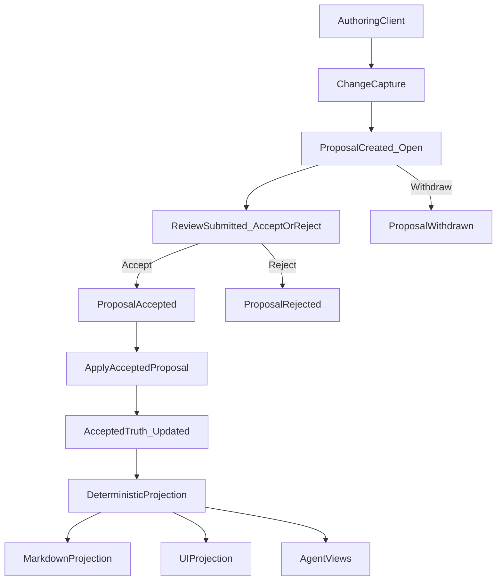
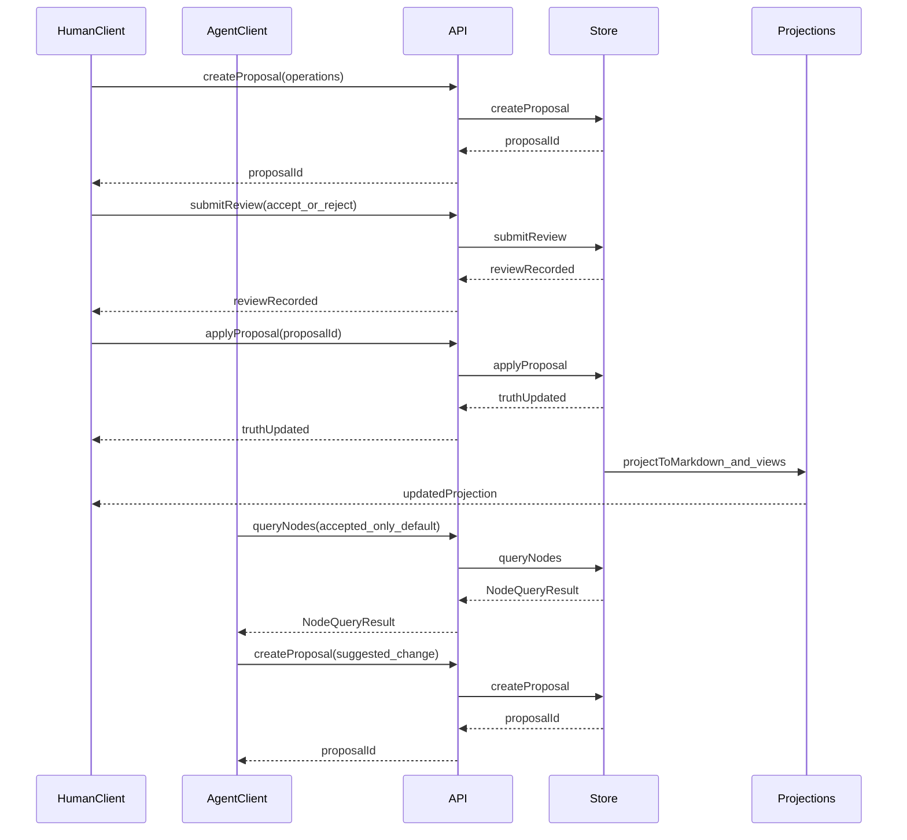

# Context-First Docs
## A Whitepaper on Review-Mode Context Graphs for Agentic Software Development

**Version**: v1 (target-state)  
**Audience**: engineering leadership, security, and builders (mixed)  

---

## Summary (one page)

Software teams do not have a stable substrate for **durable context**:

- **Why** decisions were made (and what was rejected) is scattered across Slack/Teams, PR comments, wikis, and tickets.
- **Truth status** is ambiguous: drafts, proposals, outdated decisions, and open questions are often indistinguishable.
- As AI agents become participants in development, this ambiguity becomes operational risk: agents can **hallucinate** or apply outdated context because the system cannot reliably distinguish **accepted truth** from **suggestions**.

**Context-First Docs** proposes a different primitive: a **review-mode context store** that behaves like Google Docs “Suggesting” mode, but with explicit structure and agent-safe semantics.

In the final architecture:

- The canonical source of truth is a **typed context graph**, not unstructured documents.
- The system enforces a core invariant: **no direct edits to accepted context**. All changes are captured as **proposals** and move into truth only via **review** (accept/reject) and **apply**.
- Markdown is an **optional projection** and authoring surface (e.g., via lightweight `ctx` blocks), never the authoritative store.
- Agents (and humans) read a **queryable API** that defaults to accepted truth for safety, and they write only by creating proposals.
- Storage is self-hosted by design, with a **file-based backend** (Git-friendly) and a **database backend** (MongoDB) behind the same `ContextStore` interface.

This paper explains what distinguishes this approach from “hodgepodge” workflows and from existing tools (Git+Markdown, wikis, issue trackers, knowledge graphs, RAG/vector stores, and agent memory tools).

---

## 1. The problem: context collapse and truth ambiguity

Teams already “document.” The problem is that context:

- is **distributed** (chat threads, PRs, wikis, tickets, calendar meetings),
- is **time-sensitive** (truth changes as the code and constraints change),
- is **reviewed inconsistently** (some changes are code-reviewed, others are not),
- and is **not machine-verifiable** as truth.

### 1.1 Why this becomes critical with AI agents

Agents can execute work at high speed, but they need a reliable contract:

- what is **accepted truth**,
- what is **proposed/suggested**,
- what is **rejected** (and why),
- what is **open** (unresolved questions, risks, pending decisions),
- and how context relates (goal → decision → task → risk).

Without explicit truth semantics, agents will:

- treat drafts as truth,
- resurrect rejected alternatives,
- miss constraints,
- or conflate unrelated decisions.

### 1.2 Why existing “tracked changes” systems do not solve this

Google Docs / Word solve human review ergonomics, but they are:

- opaque to agents (no stable semantic graph),
- not deterministic (hard to generate stable projections),
- often cloud-bound (problematic for sensitive repos),
- and not integrated as a first-class layer in engineering workflows.

---

## 2. Target-state solution overview

Context-First Docs is not “a better document editor.”

It is a **semantic context layer** with:

- a canonical **context store** (graph),
- a proposal and review workflow (review mode),
- deterministic projections into human-friendly formats (Markdown),
- and agent-safe consumption via an explicit query API.

### 2.1 Core invariant: review mode (Google Docs-style)

The final solution enforces:

- **No direct edits to accepted context.**
- All writes are captured as **proposals**.
- Only **reviews** can accept/reject proposals into truth.
- Accepted proposals become truth only when they are **applied**.

This yields a strong contract: if a node is accepted, it is accepted because an explicit review accepted a proposal and that proposal was applied.

### 2.2 Canonical model: a typed context graph

Context is modeled as nodes and relationships, not pages and paragraphs.

Nodes represent semantic concepts such as:

- goals
- decisions (including rationale and alternatives)
- constraints
- tasks and plans
- risks and mitigations
- questions and answers

Relationships are typed (e.g., `implements`, `depends-on`, `blocks`, `references`, `parent-child`) so the system can support robust traversal and reasoning chains.

### 2.3 Markdown is a projection, not truth

Markdown is treated as a **projection format**:

- convenient for humans,
- compatible with existing repo habits,
- and easy to review in tooling that understands it.

But Markdown is not the canonical store. In the final system:

- Markdown edits are treated as **suggestions** and converted to proposals (when `ctx` blocks are used).
- Accepted truth is projected back into Markdown deterministically (only updating system-owned blocks).

---

## 3. Conceptual architecture (target-state)

### 3.1 Components

- **ContextStore (canonical truth)**: stores nodes, proposals, reviews, issues, and relationships.
- **Clients**: VS Code/Cursor extension, web UI, CLI, agents. Clients capture changes and submit proposals.
- **API layer**: optional HTTP/GraphQL endpoints that expose ContextStore operations.
- **Projection layer**: deterministic projection to Markdown (and other views).
- **Reconciliation layer**: conflict detection, staleness checks, and merging strategies for parallel work.

### 3.2 End-to-end lifecycle (proposal → review → apply → projection)

### 3.2 Data model: node text fields (human-authored vs derived)

To support both human authoring and agent-safe retrieval, nodes separate:

- `title` (optional): short label for display/search.
- `description` (optional): canonical long-form **Markdown** body.
- `content` (required): deterministic derived **plain-text index** for search/similarity/snippets.

In the target state:

- storage backends persist `title` and `description`,
- `content` is derived deterministically from `description` plus key typed fields (e.g., decision rationale, alternatives, risk mitigation).

This prevents silent drift and reduces the chance that a search index becomes treated as truth.

---

## 4. Differentiating primitive: proposals and reviews (not diffs)

Traditional systems treat change as a text diff.
Context-First Docs treats change as a **proposal** with explicit operations:

- create node
- update fields (`title`, `description`, typed fields, relationships)
- status-change (node status)
- insert/delete text operations (optional fine-grained edits)
- move nodes in hierarchical projections

### 4.1 Why proposals beat diffs for durable context

Proposals preserve intent:

- why the change is proposed (rationale),
- who proposed it,
- what was reviewed,
- what was accepted,
- what was rejected (and why),
- and how changes relate to issues and code.

This is fundamentally different from “a patch applied to a file.”

### 4.2 Proposals enable policy

Because the system has a structured notion of change, it can enforce:

- role-based permissions (who can propose, who can approve),
- required approvals for specific node types (e.g., architecture decisions),
- staleness checks (optimistic locking),
- conflict detection and resolution workflows,
- and auditability across the entire context layer.

---

## 5. Deterministic projections (views), not canonical documents

The system can generate one or more projections:

- Markdown projections (e.g., `DECISIONS.md`, `PLAN.md`)
- UI projections (review panels, diff overlays, graph visualizations)
- agent-oriented projections (context chains, summaries, risk dashboards)
- codebase projections (PR/branch/patch/plan artifacts tied to implementation work)

### 5.1 Why determinism matters

Deterministic projection means:

- same context state → same projection output,
- stable diffs when projections are stored in Git,
- reproducible context generation in CI,
- and reduced agent ambiguity.

Determinism is an operational requirement, not a cosmetic preference.

---

## 6. Safe concurrency: reconciliation without “text merge wars”

Parallel work is normal. The target system supports concurrency without reverting to line-level merges as the primary mechanism.

### 6.1 Conflict detection and classification

Conflicts are detected at the proposal level:

- node-level conflicts (e.g., delete/move/status-change)
- field-level conflicts (two proposals changing the same field)
- non-conflicting parallel edits (mergeable)

### 6.2 Staleness and optimistic locking

Proposals can include base versions of the nodes they modify.

When applying a proposal:

- if the node has changed since the proposal was authored, the proposal is stale,
- and must be rebased/merged through an explicit workflow.

### 6.3 Field-level merging

Where safe, non-overlapping changes are merged:

- Proposal A changes `description`
- Proposal B changes a typed field (e.g., `risk.mitigation`)
- Both can be merged without conflict

In the normalized model, `description` is the primary textual field; `content` is derived and should not be treated as the merge target.

---

## 7. Agent-safe consumption (and why “RAG alone” is insufficient)

### 7.1 The safety contract

Agents consume:

- accepted truth (default),
- optionally open proposals (explicit opt-in),
- and explicit node metadata (creator, timestamps, versions, status).

Agents produce:

- proposals (never direct edits to accepted truth).

### 7.2 Why vector search / RAG is not a truth system

Vector search excels at “find semantically similar text.”
It does not provide:

- explicit acceptance status,
- deterministic reasoning chains,
- provenance of rejected ideas,
- or policy enforcement for writes.

RAG can be a discovery layer, but the canonical truth layer needs explicit semantics and review mode.

---

## 8. Comparative analysis: distinguishing elements vs alternatives

This section is intentionally explicit. The goal is not to claim “everything else is bad,” but to clarify what is distinct.

### 8.1 “Hodgepodge” workflows (Slack + PR comments + wiki + tickets)

**Strengths**:
- low friction
- familiar tools

**Failure modes**:
- no single source of truth
- status ambiguity (draft vs accepted)
- context drifts and forks
- key rationale trapped in chat threads
- agents must scrape and guess

**Distinguishing elements**:
- a single canonical context layer with explicit truth semantics
- review mode as an invariant, not a convention
- structured relationships enabling reasoning chains

### 8.2 Git + Markdown docs/ADRs

**Strengths**:
- Git-native review and history
- low tooling overhead

**Failure modes**:
- Markdown pages mix drafts and truth
- semantics are conventions, not enforced contracts
- relationships are implicit
- agents must parse unstructured prose

**Distinguishing elements**:
- Markdown as projection, not canonical truth
- explicit accepted/proposed/rejected statuses
- structured query API

### 8.3 Notion/Confluence/wiki systems

**Strengths**:
- easy collaboration and browsing
- rich editing experience

**Failure modes**:
- page-centric, not graph-centric
- truth status often implicit
- difficult to make agent-safe without heavy conventions
- may be cloud-hosted, increasing IP risk

**Distinguishing elements**:
- graph-native model with typed relationships
- review-mode invariant for accepted truth
- self-hosted-first architecture and integration with code workflows

### 8.4 Issue trackers (Jira/GitHub Issues/Linear) as “truth”

**Strengths**:
- execution management, workflows, assignment, reporting

**Failure modes**:
- tickets close; rationale becomes historical and hard to retrieve
- decisions and constraints are buried in comments
- relationships are shallow and mostly manual

**Distinguishing elements**:
- durable “why” graph (goals, decisions, constraints, risks)
- explicit proposal/review provenance
- issues as downstream artifacts created from accepted proposals, not the canonical context itself

### 8.5 Generic knowledge graphs (Neo4j/RDF/ontology tools)

**Strengths**:
- powerful graph queries
- flexible modeling

**Failure modes**:
- often lack review-mode semantics out of the box
- often lack a familiar Markdown projection workflow
- often require specialized expertise to adopt

**Distinguishing elements**:
- review-mode proposals are first-class primitives
- Markdown projection is a core workflow (not an add-on)
- explicit node lifecycle designed for human + agent collaboration

### 8.6 Vector DB / RAG knowledge bases

**Strengths**:
- great discovery and retrieval of relevant text

**Failure modes**:
- similarity ≠ truth
- no explicit acceptance lifecycle
- limited provenance and rejection history

**Distinguishing elements**:
- deterministic truth semantics + review workflow
- reasoning chains grounded in relationships, not embeddings
- RAG can complement discovery; it should not replace a canonical truth layer

### 8.7 Agent memory tools

**Strengths**:
- fast local recall for agents

**Failure modes**:
- per-agent drift and inconsistency
- limited auditability
- can diverge from team truth

**Distinguishing elements**:
- shared, reviewable, organization-owned context substrate
- durable provenance and explicit policy for writes

### 8.8 Comparison matrix (structural differences)

| Axis | Hodgepodge | Git+Markdown | Wiki/Notion | IssueTracker | KnowledgeGraph | RAG_VectorDB | AgentMemory | ContextFirstDocs_TargetState |
|---|---|---|---|---|---|---|---|---|
| Canonical_truth | No | Yes_untyped_docs | Yes_pages | Yes_tickets | Yes_graph | No_similarity | No_per_agent | Yes_typed_graph |
| Truth_status | Implicit | Convention | Implicit | Partial | Depends | None | Per_agent | Explicit_status_model |
| Write_policy | Adhoc | PR_conventions | Adhoc | Workflow | Depends | None | None | Proposal_review_apply_invariant |
| Provenance | Fragmented | Partial | Partial | Partial | Depends | None | Partial | Preserved_rejected_and_accepted |
| Agent_safety | Low | Medium | Medium | Low | Medium | Medium | Low | High_by_contract |
| Deterministic_projection | No | N_A | N_A | N_A | N_A | No | No | Yes_required |
| Self_hosting | Mixed | Yes | Mixed | Mixed | Mixed | Mixed | Mixed | Designed_for_self_hosted |

---

## 9. Storage and deployment (target-state)

The final system supports multiple storage backends behind a single abstraction:

### 9.1 File-based backend (Git-friendly)

Goal:
- keep canonical store data self-contained in a repo (`.context/`), reviewable, and portable

Use cases:
- small teams
- early adoption
- air-gapped environments

### 9.2 Database backend (MongoDB, self-hosted)

Goal:
- concurrency, scalability, and transactional apply of accepted proposals

Use cases:
- larger teams
- higher write volume
- multi-client deployments (extension + web + agents)

### 9.3 API layer

The target architecture includes an API surface (GraphQL/HTTP) that:

- enforces review-mode invariants server-side,
- exposes agent-safe query defaults,
- and supports multiple clients concurrently.

### 9.4 Multi-client interaction (humans + agents)

---

## 10. Distinguishing elements (explicitly)

This is the “why this is not a hodgepodge” section, stated directly.

1. **Review-mode invariant**: accepted context cannot be directly edited; all change is proposals + review + apply.
2. **Structured truth, not documents**: the canonical model is a typed graph of nodes and relationships.
3. **Explicit truth status**: accepted/proposed/rejected/superseded are first-class, queryable semantics.
4. **Separation of authoring from indexing**: humans author Markdown in `description`; `content` is a deterministic derived index.
5. **Deterministic projections**: reproducible Markdown/UI/agent views, safe to store in Git and safe for agents to consume.
6. **Concurrency semantics above line merges**: detect conflicts and staleness at the proposal level; merge fields where safe.
7. **Agent-safe defaults**: accepted-only queries by default; explicit opt-in for proposals and drafts.
8. **Codebase projections as traceability artifacts**: PR/branch/patch/plan artifacts attach to issues created from approved proposals.
9. **Deployment flexibility without semantic drift**: file-based and MongoDB backends behind one `ContextStore` contract.
10. **Governance is part of the model**: roles, approvers, and required approvals enable enforceable policy.

---

## 11. Implementation plan (path to the target-state)

This paper describes the end state. A pragmatic delivery path is:

- **Phase A (foundation)**: provider-agnostic core logic + reference store; lock behavior with tests.
- **Phase B (storage abstraction + configuration)**: select backends at runtime and provide lifecycle hooks.
- **Phase C (file-based backend)**: Git-friendly persistence for small teams and repos.
- **Phase D (MongoDB backend)**: concurrency and transactional apply for production.
- **Phase E (API layer)**: GraphQL/HTTP for multi-client operation and centralized policy.
- **Phase F (clients)**: extension/web/CLI flows for suggesting, reviewing, and applying.
- **Phase G (integrations)**: Git check-in semantics, snapshots, and optional issue-tracker integration.

---

## 12. Limitations and honest caveats (even in the target state)

- **Policy does not remove judgment**: acceptance and conflict resolution still require human decisions.
- **Determinism requires discipline**: projection ordering and normalization must be treated as part of the contract.
- **File-based persistence is inherently limited**: concurrency and transactional guarantees are weaker than a DB backend.
- **RAG remains complementary**: discovery is valuable, but must not be conflated with canonical truth.

---

## 13. Governance, security, and auditability (target-state)

The final solution is designed so organizations can:

- keep context and IP within their own infrastructure,
- enforce roles and approvals on sensitive node types,
- and audit how context evolved (including rejected proposals).

Key governance capabilities:

- role-based permissions (contributors vs approvers vs admins)
- designated approvers per node type
- multi-approval workflows
- policy constraints on who can apply accepted proposals

---

## 14. What is intentionally not solved

Context-First Docs is not trying to replace:

- code review (PRs remain the canonical review for code changes)
- execution systems (issue trackers remain excellent for delivery workflow)
- freeform note-taking or wiki browsing for ephemeral content

It is an opinionated layer for **durable, reviewable, agent-safe context**.

---

## 15. Objections (and how the architecture answers them)

### “Isn’t this just documentation?”
No. The distinguishing element is **truth semantics** (review mode) plus a **structured graph** and an **agent-safe API**.

### “Why not just do this in GitHub PR comments?”
PR comments are tied to code diffs and timelines. The context layer needs durable identity, explicit status, and traversal relationships independent of a specific PR.

### “Why not just use RAG/vector search?”
Discovery is not truth. RAG does not provide acceptance/rejection semantics, provenance, or enforceable write policy.

### “Is review mode too slow?”
Review mode is a safety invariant. The system supports concurrency via proposals, conflict detection, and field-level merging; it decouples authoring from acceptance.

### “Do we have to give up Git and Markdown?”
No. Markdown remains a first-class *projection* and authoring surface. Git remains valuable for code review and (optionally) for storing projections and/or a file-based canonical backend.

### “Is this a wiki/Notion replacement?”
Not primarily. Wikis are excellent for broad, page-centric knowledge. This system targets **durable engineering truth** (goals, decisions, constraints, risks) with explicit status and review semantics. Many orgs will keep both: a wiki for narrative knowledge, and a context store for agent-safe truth.

### “How does this integrate with Jira/GitHub Issues?”
In the target state, issues are downstream execution artifacts. Approved proposals can create issues (and attach codebase projections like PR links), while Jira/Issues remains the execution workflow layer.

### “What about regulated environments and audit?”
The model is designed for auditability: explicit acceptance/rejection, preserved history (including rejected alternatives), and clear provenance. Self-hosted deployment supports organizations with strict data control requirements.

---

## 16. Terms (Glossary)

- **Agent**: an AI system that reads context and proposes changes; it should not directly mutate accepted truth.
- **Agent-safe defaults**: defaults that reduce accidental misuse (e.g., queries return accepted truth unless proposals are explicitly requested).
- **Air-gapped**: an environment without internet access (or with strict network isolation).
- **Apply**: the act of applying an accepted proposal’s operations to update accepted truth.
- **Approval / approver**: a governance concept where certain users/roles can accept or reject proposals (often with additional policy like multi-approval).
- **Canonical**: the authoritative source of truth (in this system, the context store/graph, not Markdown).
- **Change capture**: turning an edit intent (UI edits, API calls, Markdown changes) into a proposal.
- **Client**: any interface that interacts with the context store (editor extension, web UI, CLI, agents).
- **Codebase projection**: a derived artifact representing expected/actual code changes for an approved proposal (e.g., PR link, branch ref, patch, implementation plan).
- **Conflict**: an overlap between proposals that cannot be safely auto-merged (e.g., two proposals editing the same field, or hard node-level operations).
- **Context**: durable project truth used to guide humans and agents (goals, decisions, constraints, risks, tasks, etc.), distinct from ephemeral discussion.
- **Context graph**: the typed graph of nodes and relationships that represents canonical context.
- **Context store**: the system that persists and serves the context graph plus proposals/reviews/issues; exposed behind a `ContextStore` API/contract.
- **ctx block**: a fenced Markdown block that identifies a semantic node (type/id/status/title) and its canonical Markdown body (`description`).
- **Derived field**: a field computed deterministically from canonical fields (e.g., `content` derived from `description` and typed fields).
- **Deterministic projection**: a projection that is reproducible: the same context state yields the same output (useful for Git diffs and agent safety).
- **Embedding**: a numeric vector representation of text used for similarity search (commonly used in RAG).
- **Field-level merge**: combining non-overlapping changes from multiple proposals (e.g., one proposal edits `description`, another edits a typed field).
- **Hodgepodge workflow**: a fragmented approach where context lives across chat, PR comments, wiki pages, tickets, and documents without consistent truth semantics.
- **Issue**: an execution artifact created from approved context changes (optionally carrying links/projections back to proposals and code).
- **Knowledge graph**: a graph representation of knowledge; may or may not include review-mode semantics and deterministic projections.
- **Markdown projection**: a human-friendly view generated from accepted truth (Markdown is treated as a projection, not the canonical store).
- **Node**: a typed semantic entity in the graph (goal, decision, constraint, task, risk, question, plan, note).
- **Operation**: an atomic action inside a proposal (create, update fields, status-change, insert/delete text, move).
- **Optimistic locking / base versions**: a concurrency strategy where proposals reference expected node versions; stale proposals are detected if the underlying node changed.
- **Policy**: organizational rules applied to context changes (who can propose/review/apply; required approvals; protected node types).
- **Projection**: any derived view of canonical context (Markdown, UI diff overlays, summaries, dashboards, exports).
- **Proposal**: a suggested change represented as structured operations, not a line diff; proposals are reviewed and then accepted/rejected.
- **Provenance**: traceable history of how/why context evolved (including rejected alternatives and review decisions).
- **RAG (Retrieval-Augmented Generation)**: a pattern where an AI retrieves relevant documents/snippets (often via embeddings/vector search) and then generates an answer grounded in that retrieved context.
- **Review**: the act of accepting/rejecting proposals (and optionally commenting); the only path by which proposals become accepted/rejected.
- **Review mode**: the invariant that accepted truth cannot be directly edited; all changes must flow through proposals + review + apply.
- **Status (node)**: an explicit lifecycle state such as accepted/proposed/rejected/superseded.
- **Status (proposal)**: an explicit lifecycle state such as open/accepted/rejected/withdrawn.
- **Superseded**: a lifecycle state indicating something was replaced by a newer accepted truth (useful for decisions and proposals).
- **Vector database**: a system for storing and querying embeddings for similarity search (commonly used in RAG).

---

## Appendix A: Scope note

This whitepaper is written as a **target-state** architecture. A reference implementation may exist to validate behavior early, but the distinguishing elements described here are the end-state design goals: review-mode invariants, typed graph truth, deterministic projections, self-hosted storage options, and an agent-safe API.
