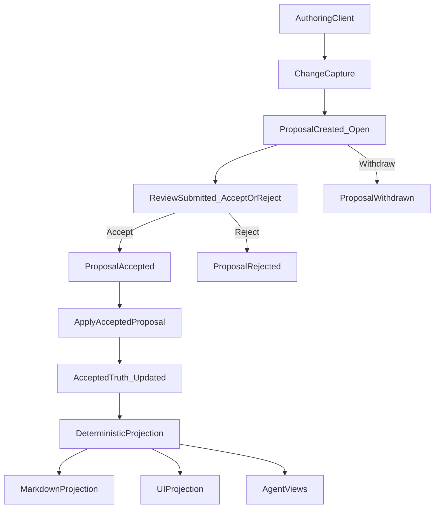
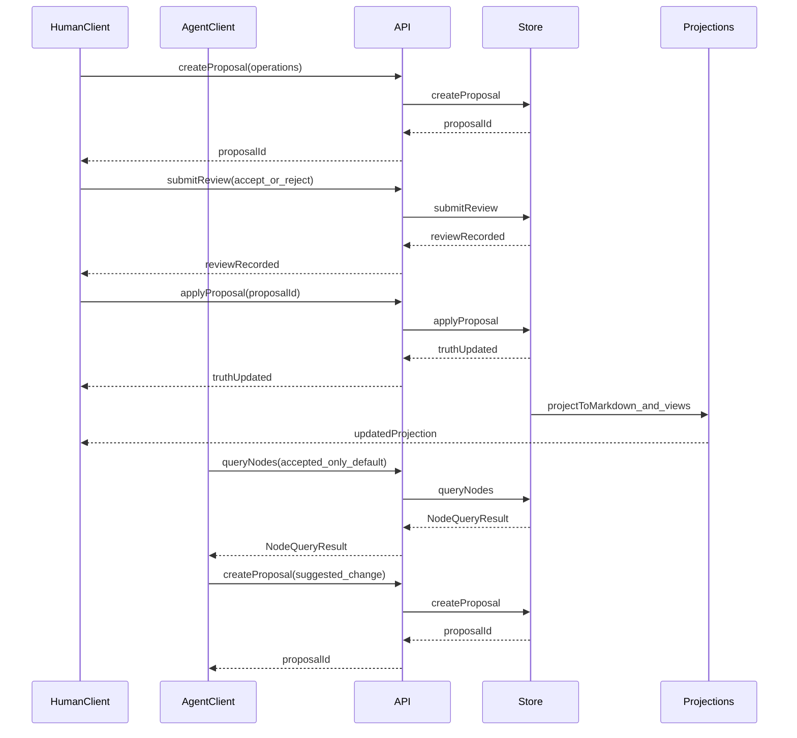

# Context-First Docs
## Agentic Collaboration Approval Layer (ACAL): review‑mode solution modeling for human + agent collaboration

**Version**: v1 (target-state)  
**Audience**: leadership, security/compliance, and builders across domains (mixed)  

---

## Summary (one page)

Organizations do not have a stable substrate for **durable, reviewable solution modeling**:

- **Why** decisions were made (and what was rejected) is scattered across chat, docs, tickets, meeting notes, email, and review threads.
- **Truth status** is ambiguous: drafts, proposals, outdated decisions, and open questions are often indistinguishable.
- As AI agents become participants in knowledge work, this ambiguity becomes operational risk: agents can **hallucinate** or apply outdated context because the system cannot reliably distinguish **accepted truth** from **suggestions**.

**Context-First Docs** proposes a different primitive: an **Agentic Collaboration Approval Layer (ACAL)** — a review‑mode store that behaves like Google Docs “Suggesting” mode, but with explicit structure and agent‑safe semantics.

In the final architecture:

- The canonical source of truth is a **typed solution graph**, not unstructured documents.
- The system enforces a core invariant: **no direct edits to accepted context**. All changes are captured as **proposals** and move into truth only via **review** (accept/reject) and **apply**.
- Markdown is an **optional projection** and authoring surface (e.g., via lightweight `ctx` blocks), never the authoritative store.
- Agents (and humans) read a **queryable API** that defaults to accepted truth for safety, and they write only by creating proposals.
- Storage is self-hosted by design, with a **file-based backend** (Git-friendly) and a **database backend** (MongoDB) behind the same `ContextStore` interface.

This paper explains what distinguishes this approach from “hodgepodge” workflows and from existing tools (Git+Markdown, wikis, issue trackers, knowledge graphs, RAG/vector stores, and agent memory tools).

---

## 1. The problem: context collapse and truth ambiguity

Teams already “document.” The problem is that context:

- is **distributed** (chat threads, PRs, wikis, tickets, calendar meetings),
- is **time-sensitive** (truth changes as the code and constraints change),
- is **reviewed inconsistently** (some changes are code-reviewed, others are not),
- and is **not machine-verifiable** as truth.

### 1.1 Why this becomes critical with AI agents

Agents can execute work at high speed, but they need a reliable contract:

- what is **accepted truth**,
- what is **proposed/suggested**,
- what is **rejected** (and why),
- what is **open** (unresolved questions, risks, pending decisions),
- and how context relates (goal → decision → task → risk).

Without explicit truth semantics, agents will:

- treat drafts as truth,
- resurrect rejected alternatives,
- miss constraints,
- or conflate unrelated decisions.

### 1.2 Why existing “tracked changes” systems do not solve this

Google Docs / Word solve human review ergonomics, but they are:

- opaque to agents (no stable semantic graph),
- not deterministic (hard to generate stable projections),
- often cloud-bound (problematic for sensitive repos),
- and not integrated as a first-class layer in domain workflows (engineering, policy, operations, procurement, etc.).

---

## 2. Target-state solution overview

Context-First Docs is not “a better document editor.”

It is an **Agentic Collaboration Approval Layer (ACAL)** with:

- a canonical **solution model store** (typed graph),
- a proposal and review workflow (review mode),
- deterministic projections into human-friendly formats (Markdown),
- and agent-safe consumption via an explicit query API.

### 2.1 Core invariant: review mode (Google Docs-style)

The final solution enforces:

- **No direct edits to accepted context.**
- All writes are captured as **proposals**.
- Only **reviews** can accept/reject proposals into truth.
- Accepted proposals become truth only when they are **applied**.

This yields a strong contract: if a node is accepted, it is accepted because an explicit review accepted a proposal and that proposal was applied.

### 2.2 Canonical model: a typed context graph

Context is modeled as nodes and relationships, not pages and paragraphs.

Nodes represent semantic concepts such as:

- goals
- decisions (including rationale and alternatives)
- constraints
- tasks and plans
- risks and mitigations
- questions and answers

Relationships are typed (e.g., `implements`, `depends-on`, `blocks`, `references`, `parent-child`) so the system can support robust traversal and reasoning chains.

### 2.3 Markdown is a projection, not truth

Markdown is treated as a **projection format**:

- convenient for humans,
- compatible with existing repo habits,
- and easy to review in tooling that understands it.

But Markdown is not the canonical store. In the final system:

- Markdown edits are treated as **suggestions** and converted to proposals (when `ctx` blocks are used).
- Accepted truth is projected back into Markdown deterministically (only updating system-owned blocks).

---

## 3. Conceptual architecture (target-state)

### 3.1 Components

- **ContextStore (canonical truth)**: stores nodes, proposals, reviews, issues, and relationships.
- **Clients**: VS Code/Cursor extension, web UI, CLI, agents. Clients capture changes and submit proposals.
- **API layer**: optional HTTP/GraphQL endpoints that expose ContextStore operations.
- **Projection layer**: deterministic projection to Markdown (and other views).
- **Reconciliation layer**: conflict detection, staleness checks, and merging strategies for parallel work.

### 3.2 End-to-end lifecycle (proposal → review → apply → projection)



### 3.2 Data model: node text fields (human-authored vs derived)

To support both human authoring and agent-safe retrieval, nodes separate:

- `title` (optional): short label for display/search.
- `description` (optional): canonical long-form **Markdown** body.
- `content` (required): deterministic derived **plain-text index** for search/similarity/snippets.

In the target state:

- storage backends persist `title` and `description`,
- `content` is derived deterministically from `description` plus key typed fields (e.g., decision rationale, alternatives, risk mitigation).

This prevents silent drift and reduces the chance that a search index becomes treated as truth.

---

## 4. Differentiating primitive: proposals and reviews (not diffs)

Traditional systems treat change as a text diff.
Context-First Docs treats change as a **proposal** with explicit operations:

- create node
- update fields (`title`, `description`, typed fields, relationships)
- status-change (node status)
- insert/delete text operations (optional fine-grained edits)
- move nodes in hierarchical projections

### 4.1 Why proposals beat diffs for durable context

Proposals preserve intent:

- why the change is proposed (rationale),
- who proposed it,
- what was reviewed,
- what was accepted,
- what was rejected (and why),
- and how changes relate to issues and code.

This is fundamentally different from “a patch applied to a file.”

### 4.2 Proposals enable policy

Because the system has a structured notion of change, it can enforce:

- role-based permissions (who can propose, who can approve),
- required approvals for specific node types (e.g., architecture decisions),
- staleness checks (optimistic locking),
- conflict detection and resolution workflows,
- and auditability across the entire context layer.

### 4.3 Reviewer comments are anchored to nodes (Docs-style)

In the target state, review does not rely on “line comments” tied to file positions.
Reviewer feedback is modeled as **comments anchored to semantic nodes**, much like Google Docs:

- comments attach to a specific **node id** and a specific **field** (e.g., `description`, `title`, or a typed field like `decision.rationale`)
- for long-form text fields, comments can optionally include a **text range** anchor (character offsets) inside `description`
- comment threads remain stable as projections change (Markdown can be regenerated without “losing” review discussion)

This makes reviewer recommendations first-class context: they can be queried, triaged, and linked to the exact place in the semantic model they refer to.

---

## 5. Deterministic projections (views), not canonical documents

The system can generate one or more projections:

- Markdown projections (e.g., `DECISIONS.md`, `PLAN.md`)
- UI projections (review panels, diff overlays, graph visualizations)
- agent-oriented projections (context chains, summaries, risk dashboards)
- codebase projections (PR/branch/patch/plan artifacts tied to implementation work)

### 5.1 Why determinism matters

Deterministic projection means:

- same context state → same projection output,
- stable diffs when projections are stored in Git,
- reproducible context generation in CI,
- and reduced agent ambiguity.

Determinism is an operational requirement, not a cosmetic preference.

---

## 6. Safe concurrency: reconciliation without “text merge wars”

Parallel work is normal. The target system supports concurrency without reverting to line-level merges as the primary mechanism.

### 6.1 Conflict detection and classification

Conflicts are detected at the proposal level:

- node-level conflicts (e.g., delete/move/status-change)
- field-level conflicts (two proposals changing the same field)
- non-conflicting parallel edits (mergeable)

### 6.2 Staleness and optimistic locking

Proposals can include base versions of the nodes they modify.

When applying a proposal:

- if the node has changed since the proposal was authored, the proposal is stale,
- and must be rebased/merged through an explicit workflow.

### 6.3 Field-level merging

Where safe, non-overlapping changes are merged:

- Proposal A changes `description`
- Proposal B changes a typed field (e.g., `risk.mitigation`)
- Both can be merged without conflict

In the normalized model, `description` is the primary textual field; `content` is derived and should not be treated as the merge target.

---

## 7. Agent-safe consumption (and why “RAG alone” is insufficient)

### 7.1 The safety contract

Agents consume:

- accepted truth (default),
- optionally open proposals (explicit opt-in),
- and explicit node metadata (creator, timestamps, versions, status).

Agents produce:

- proposals (never direct edits to accepted truth).

### 7.2 Why vector search / RAG is not a truth system

Vector search excels at “find semantically similar text.”
It does not provide:

- explicit acceptance status,
- deterministic reasoning chains,
- provenance of rejected ideas,
- or policy enforcement for writes.

RAG can be a discovery layer, but the canonical truth layer needs explicit semantics and review mode.

### 7.3 Typical agentic flow: prompts → proposals → linked context

This section describes a **target-state** workflow where an agent helps authors create context *by producing proposals*, and also auto-creates supporting nodes (questions, risks, tasks, plans) and links them together.

At a high level, the agent runs a loop:

1. **Read** accepted truth (and optionally open proposals) via the query API.
2. **Propose** changes as structured proposal operations (create/update/link).
3. **Generate** supporting context nodes (questions/risks/tasks) as additional proposals.
4. **Link** everything with typed relationships so reviewers and agents can traverse: goal → decision → task → risk/question/constraint.
5. Humans **review** and accept/reject; accepted proposals are applied; projections update.

#### 7.3.1 Example scenario

Assume a team is about to implement **single sign-on (SSO)**. The agent’s job is to translate intent into reviewable context changes.

#### 7.3.2 Example agent prompts (authoring)

The workflows below show the **literal prompts** you would send to an agent. Copy/paste them as-is; the only “variables” are placeholders like `<project>`.

Prompt A — discover current accepted context:

```text
SYSTEM:
You are a context-first assistant operating under review-mode semantics.

Non-negotiable rules:
- Treat accepted nodes as truth.
- Do not directly edit accepted truth.
- When writing, produce proposals only (structured operations).
- If context is missing or uncertain, prefer creating question nodes rather than inventing facts.
- Link created nodes using typed relationships so reviewers can traverse goal -> decision -> task -> risk/question/constraint.

Output requirements (when asked to write):
- Prefer small, reviewable proposals (avoid giant dumps).
- Use stable ids (kebab-case).
- Put human-authored Markdown in description; treat content as derived.

USER:
You are helping with SSO planning for <project>.

Query accepted context for anything related to:
- authentication, identity, SSO, user sessions
- compliance constraints

Return:
- relevant accepted goals/decisions/constraints/risks/questions
- a list of missing context that should be proposed next (questions/risks/decisions/tasks)
Do not propose changes yet; discovery only.
```

Prompt B — draft a proposal set (decision + supporting nodes):

```text
SYSTEM:
You are a context-first assistant operating under review-mode semantics.

Non-negotiable rules:
- Treat accepted nodes as truth.
- Do not directly edit accepted truth.
- Produce proposals only (structured operations).
- If context is missing or uncertain, create question nodes.
- Link nodes using typed relationships so the chain goal -> decision -> task -> risk/question is traversable.

USER:
Create proposals to introduce SSO safely for <project>.

Requirements:
- Create or update a goal describing the business objective.
- Create a decision for the chosen SSO approach (include rationale and alternatives).
- Create questions that must be answered before implementation.
- Create risks with mitigations.
- Create implementation tasks and a plan outline.
- Link nodes using typed relationships so the chain goal→decision→task→risk/question is traversable.

Output must be structured as proposal operations (create/update/status-change/relationships).
Do not apply changes; proposals only.
```

#### 7.3.3 What the agent produces (structured proposal operations)

In the target-state system, an agent can emit one proposal containing multiple operations, or several smaller proposals (often preferred for review granularity). A representative output looks like:

```json
{
  "proposalId": "proposal-sso-bootstrap",
  "status": "open",
  "metadata": {
    "createdBy": "agent",
    "rationale": "Introduce SSO with clear decision provenance, risks, and open questions before implementation."
  },
  "operations": [
    {
      "type": "create",
      "node": {
        "id": { "id": "goal-sso" },
        "type": "goal",
        "status": "proposed",
        "title": "Enable SSO for enterprise customers",
        "description": "Provide SSO to reduce onboarding friction and meet enterprise security requirements.",
        "relationships": []
      }
    },
    {
      "type": "create",
      "node": {
        "id": { "id": "decision-sso-protocol" },
        "type": "decision",
        "status": "proposed",
        "title": "Adopt OIDC as the SSO protocol",
        "description": "Decision: Use OpenID Connect (OIDC) for SSO.\n\nRationale: widely supported; good fit with modern identity providers.\n\nAlternatives: SAML; vendor-specific auth.",
        "relationships": [
          { "type": "references", "target": { "id": "goal-sso" } }
        ]
      }
    },
    {
      "type": "create",
      "node": {
        "id": { "id": "question-sso-idp-matrix" },
        "type": "question",
        "status": "proposed",
        "title": "Which IdPs must be supported in v1?",
        "description": "List required identity providers (Okta, Azure AD, Google Workspace, etc.) and any enterprise constraints.",
        "relationships": [
          { "type": "references", "target": { "id": "decision-sso-protocol" } }
        ]
      }
    },
    {
      "type": "create",
      "node": {
        "id": { "id": "risk-sso-account-takeover" },
        "type": "risk",
        "status": "proposed",
        "title": "Account takeover via misconfigured SSO",
        "description": "SSO misconfiguration or weak linking could allow unintended account access.",
        "relationships": [
          { "type": "blocks", "target": { "id": "task-sso-implementation" } }
        ]
      }
    },
    {
      "type": "create",
      "node": {
        "id": { "id": "task-sso-implementation" },
        "type": "task",
        "status": "proposed",
        "title": "Implement OIDC SSO login flow",
        "description": "Build login initiation, callback handling, token validation, and account linking.\n\nInclude logging, metrics, and rollback plan.",
        "relationships": [
          { "type": "implements", "target": { "id": "decision-sso-protocol" } },
          { "type": "depends-on", "target": { "id": "question-sso-idp-matrix" } }
        ]
      }
    }
  ]
}
```

Notes on the structure:

- The agent **does not edit accepted truth**; it emits `status: open` proposals with nodes marked `status: proposed` until reviewed.
- The nodes are **linked** immediately so reviewers can evaluate the full chain of reasoning (goal → decision → task, plus blocking risks and open questions).
- Additional proposals can be generated automatically as new information arrives (e.g., after a reviewer rejects an alternative or requests more detail).

#### 7.3.4 Auto-generating follow-on context (questions, risks, constraints)

In the target-state system, agents can also generate “supporting context” proposals automatically:

- **Questions** when required inputs are missing (IdPs, compliance constraints, rollout strategy).
- **Risks** when changes touch sensitive domains (auth, data handling, permissions).
- **Constraints** when requirements are non-negotiable (e.g., “must support offline mode”, “must pass SOC2 controls”).
- **Plans** when there is a multi-step implementation requiring coordination and sequencing.

This turns what is usually implicit (and trapped in chat threads) into explicit, reviewable, linkable context.

#### 7.3.5 Keeping proposals reviewable

To avoid “agent spam,” the target workflow typically uses:

- small proposals (one decision, one risk cluster, one question set),
- explicit linking so reviewers see why a node exists,
- and reviewer feedback loops (“add a mitigation” / “split this decision” / “reject this alternative”).

### 7.4 Typical agentic flow: ship a feature or fix a bug in an existing codebase

This section describes a common target-state workflow where the agent is asked to **implement** (or help implement) a feature/bugfix in an existing codebase, while keeping context clean and reviewable.

The key idea is that “work in the codebase” and “work in context” are linked but distinct:

- The agent proposes **context changes** (decisions, tasks, risks, questions) via proposals.
- The agent proposes or produces **codebase changes** as a *codebase projection* (PR/branch/patch/plan).
- Reviewers can accept/reject context proposals and independently review the code changes via normal code review workflows.

#### 7.4.1 Example scenario

“Add a feature flag to enable SSO only for specific tenants,” or “Fix a bug where token refresh intermittently fails.”

#### 7.4.2 Example agent prompt (implementation request)

```text
SYSTEM:
You are a context-first assistant working against an existing codebase.
You must use review-mode semantics for context:
- Do not directly edit accepted truth.
- Propose changes as proposals only.
- Treat accepted context as truth; treat code inference as hypotheses.

USER:
Goal: implement <feature_or_fix>.

Constraints:
- Do not directly edit accepted context; create proposals only.
- Before writing code, propose the necessary context: a task plan, risks, and any open questions.
- Link new context to existing decisions/goals where relevant.
- Produce a codebase projection describing expected code changes (PR/branch/patch/plan).
```

#### 7.4.3 The agent’s “proposal-first” workflow

1. **Discover context**: query accepted decisions/constraints related to the area (auth, sessions, data handling).
2. **Discover code signals**: identify likely impacted modules (without treating code diffs as the context truth).
3. **Draft proposals**:
   - Create/update a task node that describes the work.
   - Create risks (security, data integrity, rollout) with mitigations.
   - Create questions for missing requirements (edge cases, compatibility).
   - Optionally create or update a decision if a new architectural choice is required.
4. **Attach a codebase projection**:
   - `pull_request` (preferred when the agent can open a PR), or
   - `branch`, `patch`, or a step-by-step `plan`.
5. **Review loop**:
   - reviewers accept/reject context proposals,
   - reviewers review code changes via standard code review,
   - accepted proposals are applied and projections update.

#### 7.4.4 What the agent produces (linked context + codebase projection)

The target-state output commonly includes:

- A **task** node linked to the relevant decision(s).
- A small set of **risks** that block the task until mitigations are agreed.
- A set of **questions** that capture missing inputs.
- A **codebase projection** that makes the implementation concrete for reviewers.

##### 7.4.4.1 Prompt sequence that produces the output

Below is a typical sequence of prompts that would yield the representative proposal payload shown next. In practice these prompts may be executed by a single agent in a loop, but the **separation of steps** is intentional: it produces smaller, more reviewable artifacts and ensures the agent doesn’t silently jump from “bug report” to “code change” without capturing context.

System prompt used for Prompts 1–5:

```text
SYSTEM:
You are a context-first assistant operating under review-mode semantics.

Hard rules:
- Accepted nodes are truth; open proposals are suggestions.
- Do not directly edit accepted truth; create proposals only.
- When context is missing or inferred from code, label it as inferred and convert unknowns into explicit question nodes.
- Link nodes so reviewers can traverse decision -> task -> risk/question and goal -> decision -> task.
- Keep proposals small and reviewable.
```

Prompt 1 — gather context (store-first, but can bootstrap from legacy code):

```text
USER:
First, try to query accepted context (if a context store exists) for anything relevant to:
- authentication, sessions, refresh tokens, retries, timeouts, clock skew
- existing decisions that constrain the approach

If the context store is empty or incomplete (e.g., this codebase predates captured context), bootstrap from the existing codebase instead:
- infer likely auth/session mechanisms from the codebase (treat as hypotheses, not truth)
- extract “proto-context” from code comments, configs, and historical artifacts (PRs/commits) if available
- convert unknowns into explicit question nodes to be reviewed

Return:
- relevant accepted decisions/constraints/risks/questions (if present)
- inferred context hypotheses from the codebase (clearly labeled as inferred)
- missing context that should be proposed next (questions/risks/tasks/decisions)

Rules:
- Treat accepted nodes as truth.
- Do not propose changes yet; this step is read-only discovery.
```

Prompt 2 — gather codebase signals (diagnostic, not “truth”):

```text
USER:
Given the symptom "intermittent token refresh failures", identify likely code hotspots and failure modes.

Return:
- suspected modules/files/components involved (refresh scheduling, retry/backoff, token validation, clock/time handling)
- top 3 plausible root causes
- minimal instrumentation/metrics needed to confirm

Rules:
- Do not write code yet.
- Do not treat code guesses as accepted truth; capture uncertainties as questions.
```

Prompt 3 — propose the context package (task + risks + questions):

```text
USER:
Create a proposal (status: open) with operations to create:
- a task node: "Fix intermittent token refresh failures"
- a risk node that blocks the task until mitigations are agreed
- a question node asking for the SLO/acceptable failure rate

Linking requirements:
- task references the relevant decision (if one exists; otherwise reference the nearest auth decision placeholder)
- risk blocks the task
- question references the task

Text requirements:
- task.description includes acceptance criteria and observability notes
- risk.description explains the failure amplification concern
- question.description requests an explicit SLO and alert thresholds
```

Prompt 4 — produce the codebase projection (plan/patch/PR metadata):

```text
USER:
Attach a codebase projection to the proposal metadata.

Prefer kind: plan with:
- summary: 1–2 sentences
- steps: 4–8 concrete implementation steps

The plan must cover:
- bounded jittered retry/backoff
- explicit handling for clock skew/expired refresh tokens
- metrics/logging
- regression tests
```

Prompt 5 — consistency check before submission:

```text
USER:
Validate the proposal package for internal consistency.

Checklist:
- all created nodes have stable ids
- links form a navigable chain (decision -> task -> risk/question)
- proposal is reviewable (no giant dump; clear acceptance criteria)
- no direct edits to accepted truth

Return the final proposal JSON.
```

Representative structure:

```json
{
  "proposalId": "proposal-fix-refresh",
  "status": "open",
  "metadata": {
    "createdBy": "agent",
    "rationale": "Fix token refresh reliability while capturing risks/questions and producing a reviewable implementation artifact.",
    "codeProjection": {
      "kind": "plan",
      "summary": "Token refresh fix: add jittered backoff, handle clock skew, add metrics, and update tests.",
      "steps": [
        "Locate refresh scheduling and retry logic",
        "Add bounded jittered retry/backoff to avoid thundering herd",
        "Add explicit handling for clock skew and expired refresh tokens",
        "Add metrics/logging for refresh failures and retries",
        "Add regression tests for intermittent failure mode"
      ],
      "generatedAt": "2026-01-01T00:00:00Z"
    }
  },
  "operations": [
    {
      "type": "create",
      "node": {
        "id": { "id": "task-fix-token-refresh" },
        "type": "task",
        "status": "proposed",
        "title": "Fix intermittent token refresh failures",
        "description": "Improve reliability of token refresh by addressing retry behavior, timing edge cases, and observability.\n\nAcceptance criteria: no observed intermittent failures in load tests; metrics show stable refresh success rate.",
        "relationships": [
          { "type": "references", "target": { "id": "decision-auth-approach" } }
        ]
      }
    },
    {
      "type": "create",
      "node": {
        "id": { "id": "risk-refresh-lockout" },
        "type": "risk",
        "status": "proposed",
        "title": "Users may get locked out if refresh retries amplify failures",
        "description": "Retry logic could worsen outages if implemented incorrectly.",
        "relationships": [
          { "type": "blocks", "target": { "id": "task-fix-token-refresh" } }
        ]
      }
    },
    {
      "type": "create",
      "node": {
        "id": { "id": "question-refresh-slo" },
        "type": "question",
        "status": "proposed",
        "title": "What is the acceptable refresh failure rate (SLO)?",
        "description": "Define SLO and alert thresholds to validate the fix and prevent regressions.",
        "relationships": [
          { "type": "references", "target": { "id": "task-fix-token-refresh" } }
        ]
      }
    }
  ]
}
```

Notes:

- The “implementation artifact” is captured as a **codebase projection** (plan/patch/PR), so reviewers can see concrete expected changes.
- The task/risk/question nodes are linked so the context remains navigable.
- If an architectural choice is required (e.g., switching token libraries), the agent proposes a decision node rather than silently changing behavior in code.

##### 7.4.4.2 Reviewer prompt sequence (validate, request changes, approve/reject)

In the target-state workflow, reviewers can also use an agent to **evaluate** proposals. The important constraint remains: reviewers do not “edit truth” directly; they accept/reject proposals, and if changes are needed they request revisions (often by asking the agent to generate an updated proposal or a follow-up proposal).

System prompt used for Reviewer Prompts 1–6:

```text
SYSTEM:
You are a reviewer-assistant for an Agentic Collaboration Approval Layer (ACAL).

Hard rules:
- Treat accepted nodes as truth.
- Treat open proposals as suggestions.
- Do not apply proposals; reviewers accept/reject, and the system applies accepted proposals.
- If something is missing or uncertain, recommend creating question/risk/constraint nodes rather than guessing.
- Prefer reviewable outcomes: either (a) approve, (b) reject with rationale, or (c) request specific changes as follow-up proposals.

Output format:
- Use concise bullet points.
- Provide reviewer feedback as **anchored comment suggestions** tied to nodes:
  - nodeId: {id, namespace?}
  - field: title | description | relationships | <typed-field>
  - range: optional {start, end} character offsets for description comments
  - kind: question | risk | change_request | approval_note
  - comment: the text
- When recommending changes, also list exact node ids/fields/relationships to change or create.
```

Reviewer Prompt 1 — sanity-check the proposal package:

```text
USER:
Review proposal <proposalId>.

Return:
- a 1-paragraph summary of what it changes
- whether it is internally consistent
- any missing required context (questions/risks/constraints)
- any unsafe assumptions or invented facts

Also return:
- anchored comment suggestions for the exact nodes/fields where changes are needed
```

Reviewer Prompt 2 — validate linkage and traversal:

```text
USER:
Validate that proposal <proposalId> creates a traversable chain:
- decision -> task -> risk/question
- goal -> decision -> task (if a goal exists)

Return:
- the chain as a list of node ids
- missing links to add (relationship type + from + to)

Also return:
- anchored comment suggestions on the task/decision nodes indicating missing links
```

Reviewer Prompt 3 — validate risks and mitigations:

```text
USER:
For proposal <proposalId>, evaluate risk coverage.

Return:
- missing risks for a token refresh reliability fix (e.g., outage amplification, security regressions, observability gaps)
- proposed mitigations (as text) and whether they should become new/updated nodes

Also return:
- anchored comment suggestions on the task node describing the missing risks/mitigations
```

Reviewer Prompt 4 — validate the codebase projection quality:

```text
USER:
Evaluate the codebase projection attached to proposal <proposalId>.

Return:
- whether it is specific enough to review
- which steps are missing (tests, metrics, rollback, compatibility)
- whether the projection should be upgraded to a PR/patch/branch artifact before approval

Also return:
- anchored comment suggestions on the proposal metadata/codebase projection (or on the task node) requesting missing detail
```

Reviewer Prompt 5 — request changes (as explicit follow-up proposals):

```text
USER:
Generate a follow-up proposal that addresses the gaps you found in proposal <proposalId>.

Requirements:
- keep changes small and reviewable
- only add/update the minimum necessary nodes/fields/relationships
- include rationale in metadata

Return the follow-up proposal JSON.
```

Reviewer Prompt 6 — final decision recommendation:

```text
USER:
Given proposal <proposalId> and any follow-up proposals you created, recommend one:
- ACCEPT (and why),
- REJECT (and why), or
- DEFER (and what must change first).

Return the recommendation and a checklist for the human reviewer.
```

#### 7.4.5 Closing the loop (issue creation and traceability)

In the target state, once a proposal is accepted, the system can create downstream **issues** (execution artifacts) that inherit:

- links back to the proposal,
- the codebase projection (PR/branch/patch/plan),
- and relationships to the decision/goal chain.

This keeps the execution system (Jira/GitHub Issues) aligned with durable context without making it the source of truth.

---

## 8. Comparative analysis: distinguishing elements vs alternatives

This section is intentionally explicit. The goal is not to claim “everything else is bad,” but to clarify what is distinct.

### 8.1 “Hodgepodge” workflows (Slack + PR comments + wiki + tickets)

**Strengths**:
- low friction
- familiar tools

**Failure modes**:
- no single source of truth
- status ambiguity (draft vs accepted)
- context drifts and forks
- key rationale trapped in chat threads
- agents must scrape and guess

**Distinguishing elements**:
- a single canonical context layer with explicit truth semantics
- review mode as an invariant, not a convention
- structured relationships enabling reasoning chains

### 8.2 Git + Markdown docs/ADRs

**Strengths**:
- Git-native review and history
- low tooling overhead

**Failure modes**:
- Markdown pages mix drafts and truth
- semantics are conventions, not enforced contracts
- relationships are implicit
- agents must parse unstructured prose

**Distinguishing elements**:
- Markdown as projection, not canonical truth
- explicit accepted/proposed/rejected statuses
- structured query API

### 8.3 Notion/Confluence/wiki systems

**Strengths**:
- easy collaboration and browsing
- rich editing experience

**Failure modes**:
- page-centric, not graph-centric
- truth status often implicit
- difficult to make agent-safe without heavy conventions
- may be cloud-hosted, increasing IP risk

**Distinguishing elements**:
- graph-native model with typed relationships
- review-mode invariant for accepted truth
- self-hosted-first architecture and integration with code workflows

### 8.4 Issue trackers (Jira/GitHub Issues/Linear) as “truth”

**Strengths**:
- execution management, workflows, assignment, reporting

**Failure modes**:
- tickets close; rationale becomes historical and hard to retrieve
- decisions and constraints are buried in comments
- relationships are shallow and mostly manual

**Distinguishing elements**:
- durable “why” graph (goals, decisions, constraints, risks)
- explicit proposal/review provenance
- issues as downstream artifacts created from accepted proposals, not the canonical context itself

### 8.5 Generic knowledge graphs (Neo4j/RDF/ontology tools)

**Strengths**:
- powerful graph queries
- flexible modeling

**Failure modes**:
- often lack review-mode semantics out of the box
- often lack a familiar Markdown projection workflow
- often require specialized expertise to adopt

**Distinguishing elements**:
- review-mode proposals are first-class primitives
- Markdown projection is a core workflow (not an add-on)
- explicit node lifecycle designed for human + agent collaboration

### 8.6 Vector DB / RAG knowledge bases

**Strengths**:
- great discovery and retrieval of relevant text

**Failure modes**:
- similarity ≠ truth
- no explicit acceptance lifecycle
- limited provenance and rejection history

**Distinguishing elements**:
- deterministic truth semantics + review workflow
- reasoning chains grounded in relationships, not embeddings
- RAG can complement discovery; it should not replace a canonical truth layer

### 8.7 Agent memory tools

**Strengths**:
- fast local recall for agents

**Failure modes**:
- per-agent drift and inconsistency
- limited auditability
- can diverge from team truth

**Distinguishing elements**:
- shared, reviewable, organization-owned context substrate
- durable provenance and explicit policy for writes

### 8.8 Comparison matrix (structural differences)

| Axis | Hodgepodge | Git+Markdown | Wiki/Notion | IssueTracker | KnowledgeGraph | RAG_VectorDB | AgentMemory | ContextFirstDocs_TargetState |
|---|---|---|---|---|---|---|---|---|
| Canonical_truth | No | Yes_untyped_docs | Yes_pages | Yes_tickets | Yes_graph | No_similarity | No_per_agent | Yes_typed_graph |
| Truth_status | Implicit | Convention | Implicit | Partial | Depends | None | Per_agent | Explicit_status_model |
| Write_policy | Adhoc | PR_conventions | Adhoc | Workflow | Depends | None | None | Proposal_review_apply_invariant |
| Provenance | Fragmented | Partial | Partial | Partial | Depends | None | Partial | Preserved_rejected_and_accepted |
| Agent_safety | Low | Medium | Medium | Low | Medium | Medium | Low | High_by_contract |
| Deterministic_projection | No | N_A | N_A | N_A | N_A | No | No | Yes_required |
| Self_hosting | Mixed | Yes | Mixed | Mixed | Mixed | Mixed | Mixed | Designed_for_self_hosted |

---

## 9. Storage and deployment (target-state)

The final system supports multiple storage backends behind a single abstraction:

### 9.1 File-based backend (Git-friendly)

Goal:
- keep canonical store data self-contained in a repo (`.context/`), reviewable, and portable

Use cases:
- small teams
- early adoption
- air-gapped environments

### 9.2 Database backend (MongoDB, self-hosted)

Goal:
- concurrency, scalability, and transactional apply of accepted proposals

Use cases:
- larger teams
- higher write volume
- multi-client deployments (extension + web + agents)

### 9.3 API layer

The target architecture includes an API surface (GraphQL/HTTP) that:

- enforces review-mode invariants server-side,
- exposes agent-safe query defaults,
- and supports multiple clients concurrently.

### 9.4 Multi-client interaction (humans + agents)



---

## 10. Distinguishing elements (explicitly)

This is the “why this is not a hodgepodge” section, stated directly.

1. **Review-mode invariant**: accepted context cannot be directly edited; all change is proposals + review + apply.
2. **Structured truth, not documents**: the canonical model is a typed graph of nodes and relationships.
3. **Explicit truth status**: accepted/proposed/rejected/superseded are first-class, queryable semantics.
4. **Separation of authoring from indexing**: humans author Markdown in `description`; `content` is a deterministic derived index.
5. **Deterministic projections**: reproducible Markdown/UI/agent views, safe to store in Git and safe for agents to consume.
6. **Concurrency semantics above line merges**: detect conflicts and staleness at the proposal level; merge fields where safe.
7. **Agent-safe defaults**: accepted-only queries by default; explicit opt-in for proposals and drafts.
8. **Codebase projections as traceability artifacts**: PR/branch/patch/plan artifacts attach to issues created from approved proposals.
9. **Deployment flexibility without semantic drift**: file-based and MongoDB backends behind one `ContextStore` contract.
10. **Governance is part of the model**: roles, approvers, and required approvals enable enforceable policy.

---

## 11. Implementation plan (path to the target-state)

This paper describes the end state. A pragmatic delivery path is:

- **Phase A (foundation)**: provider-agnostic core logic + reference store; lock behavior with tests.
- **Phase B (storage abstraction + configuration)**: select backends at runtime and provide lifecycle hooks.
- **Phase C (file-based backend)**: Git-friendly persistence for small teams and repos.
- **Phase D (MongoDB backend)**: concurrency and transactional apply for production.
- **Phase E (API layer)**: GraphQL/HTTP for multi-client operation and centralized policy.
- **Phase F (clients)**: extension/web/CLI flows for suggesting, reviewing, and applying.
- **Phase G (integrations)**: Git check-in semantics, snapshots, and optional issue-tracker integration.

---

## 12. Limitations and honest caveats (even in the target state)

- **Policy does not remove judgment**: acceptance and conflict resolution still require human decisions.
- **Determinism requires discipline**: projection ordering and normalization must be treated as part of the contract.
- **File-based persistence is inherently limited**: concurrency and transactional guarantees are weaker than a DB backend.
- **RAG remains complementary**: discovery is valuable, but must not be conflated with canonical truth.

---

## 13. Governance, security, and auditability (target-state)

The final solution is designed so organizations can:

- keep context and IP within their own infrastructure,
- enforce roles and approvals on sensitive node types,
- and audit how context evolved (including rejected proposals).

Key governance capabilities:

- role-based permissions (contributors vs approvers vs admins)
- designated approvers per node type
- multi-approval workflows
- policy constraints on who can apply accepted proposals

### 13.1 Enterprise approval policies (roadmap)

In enterprise settings, “who can approve what, when, and with what evidence” is itself part of the solution. ACAL is designed to support policy as a first-class concept.

Future capabilities:

- **Policy-as-code**: evaluate proposals against versioned approval policies (e.g., by node type, tags, severity/likelihood, namespace).
- **Quorum / multi-approval**: require \(N\)-of-\(M\) approvals for specific changes (e.g., “high-risk”).
- **Separation of duties**: prevent self-approval; enforce two-person rules for sensitive changes.
- **Conditional gates**: require additional reviewers when proposals touch protected concepts (e.g., compliance constraints, high-severity risks).
- **Attestations / evidence**: require structured evidence attachments (e.g., DPIA/threat model/test results) before approval.
- **Escalation + SLAs**: time-based escalation if required approvals are not obtained.
- **Identity integration**: SSO (OIDC/SAML) and group sync to map “approver sets” to org structure.
- **Audit exports**: exportable, append-only event logs for regulated environments.

---

## 14. What is intentionally not solved

Context-First Docs is not trying to replace:

- code review (PRs remain the canonical review for code changes)
- execution systems (issue trackers remain excellent for delivery workflow)
- freeform note-taking or wiki browsing for ephemeral content

It is an opinionated layer for **durable, reviewable, agent-safe solution modeling + approval**.

---

## 15. Objections (and how the architecture answers them)

### “Isn’t this just documentation?”
No. The distinguishing element is **approval semantics** (review mode) plus a **structured solution graph** and an **agent-safe API**.

### “Why not just do this in GitHub PR comments?”
PR comments are tied to code diffs and timelines. The context layer needs durable identity, explicit status, and traversal relationships independent of a specific PR.

### “Why not just use RAG/vector search?”
Discovery is not truth. RAG does not provide acceptance/rejection semantics, provenance, or enforceable write policy.

### “Is review mode too slow?”
Review mode is a safety invariant. The system supports concurrency via proposals, conflict detection, and field-level merging; it decouples authoring from acceptance.

### “Do we have to give up Git and Markdown?”
No. Markdown remains a first-class *projection* and authoring surface. Git remains valuable for code review and (optionally) for storing projections and/or a file-based canonical backend.

### “Is this a wiki/Notion replacement?”
Not primarily. Wikis are excellent for broad, page-centric knowledge. This system targets **durable organizational truth about a solution** (goals, decisions, constraints, risks, open questions) with explicit status and review semantics. Many orgs will keep both: a wiki for narrative knowledge, and an approval layer for agent-safe, reviewable truth.

### “How does this integrate with Jira/GitHub Issues?”
In the target state, issues are downstream execution artifacts. Approved proposals can create issues (and attach codebase projections like PR links), while Jira/Issues remains the execution workflow layer.

### “What about regulated environments and audit?”
The model is designed for auditability: explicit acceptance/rejection, preserved history (including rejected alternatives), and clear provenance. Self-hosted deployment supports organizations with strict data control requirements.

---

## 16. Terms (Glossary)

- **Agent**: an AI system that reads context and proposes changes; it should not directly mutate accepted truth.
- **Agent-safe defaults**: defaults that reduce accidental misuse (e.g., queries return accepted truth unless proposals are explicitly requested).
- **Air-gapped**: an environment without internet access (or with strict network isolation).
- **Apply**: the act of applying an accepted proposal’s operations to update accepted truth.
- **Approval / approver**: a governance concept where certain users/roles can accept or reject proposals (often with additional policy like multi-approval).
- **Canonical**: the authoritative source of truth (in this system, the context store/graph, not Markdown).
- **Change capture**: turning an edit intent (UI edits, API calls, Markdown changes) into a proposal.
- **Client**: any interface that interacts with the context store (editor extension, web UI, CLI, agents).
- **Codebase projection**: a derived artifact representing expected/actual code changes for an approved proposal (e.g., PR link, branch ref, patch, implementation plan).
- **Conflict**: an overlap between proposals that cannot be safely auto-merged (e.g., two proposals editing the same field, or hard node-level operations).
- **Context**: durable project truth used to guide humans and agents (goals, decisions, constraints, risks, tasks, etc.), distinct from ephemeral discussion.
- **Context graph**: the typed graph of nodes and relationships that represents canonical context.
- **Context store**: the system that persists and serves the context graph plus proposals/reviews/issues; exposed behind a `ContextStore` API/contract.
- **ctx block**: a fenced Markdown block that identifies a semantic node (type/id/status/title) and its canonical Markdown body (`description`).
- **Derived field**: a field computed deterministically from canonical fields (e.g., `content` derived from `description` and typed fields).
- **Deterministic projection**: a projection that is reproducible: the same context state yields the same output (useful for Git diffs and agent safety).
- **Embedding**: a numeric vector representation of text used for similarity search (commonly used in RAG).
- **Field-level merge**: combining non-overlapping changes from multiple proposals (e.g., one proposal edits `description`, another edits a typed field).
- **Hodgepodge workflow**: a fragmented approach where context lives across chat, PR comments, wiki pages, tickets, and documents without consistent truth semantics.
- **Issue**: an execution artifact created from approved context changes (optionally carrying links/projections back to proposals and code).
- **Knowledge graph**: a graph representation of knowledge; may or may not include review-mode semantics and deterministic projections.
- **Markdown projection**: a human-friendly view generated from accepted truth (Markdown is treated as a projection, not the canonical store).
- **Node**: a typed semantic entity in the graph (goal, decision, constraint, task, risk, question, plan, note).
- **Operation**: an atomic action inside a proposal (create, update fields, status-change, insert/delete text, move).
- **Optimistic locking / base versions**: a concurrency strategy where proposals reference expected node versions; stale proposals are detected if the underlying node changed.
- **Policy**: organizational rules applied to context changes (who can propose/review/apply; required approvals; protected node types).
- **Projection**: any derived view of canonical context (Markdown, UI diff overlays, summaries, dashboards, exports).
- **Proposal**: a suggested change represented as structured operations, not a line diff; proposals are reviewed and then accepted/rejected.
- **Provenance**: traceable history of how/why context evolved (including rejected alternatives and review decisions).
- **RAG (Retrieval-Augmented Generation)**: a pattern where an AI retrieves relevant documents/snippets (often via embeddings/vector search) and then generates an answer grounded in that retrieved context.
- **Review**: the act of accepting/rejecting proposals (and optionally commenting); the only path by which proposals become accepted/rejected.
- **Review mode**: the invariant that accepted truth cannot be directly edited; all changes must flow through proposals + review + apply.
- **Status (node)**: an explicit lifecycle state such as accepted/proposed/rejected/superseded.
- **Status (proposal)**: an explicit lifecycle state such as open/accepted/rejected/withdrawn.
- **Superseded**: a lifecycle state indicating something was replaced by a newer accepted truth (useful for decisions and proposals).
- **Vector database**: a system for storing and querying embeddings for similarity search (commonly used in RAG).

---

## Appendix A: Scope note

This whitepaper is written as a **target-state** architecture. A reference implementation may exist to validate behavior early, but the distinguishing elements described here are the end-state design goals: review-mode invariants, typed graph truth, deterministic projections, self-hosted storage options, and an agent-safe API.
