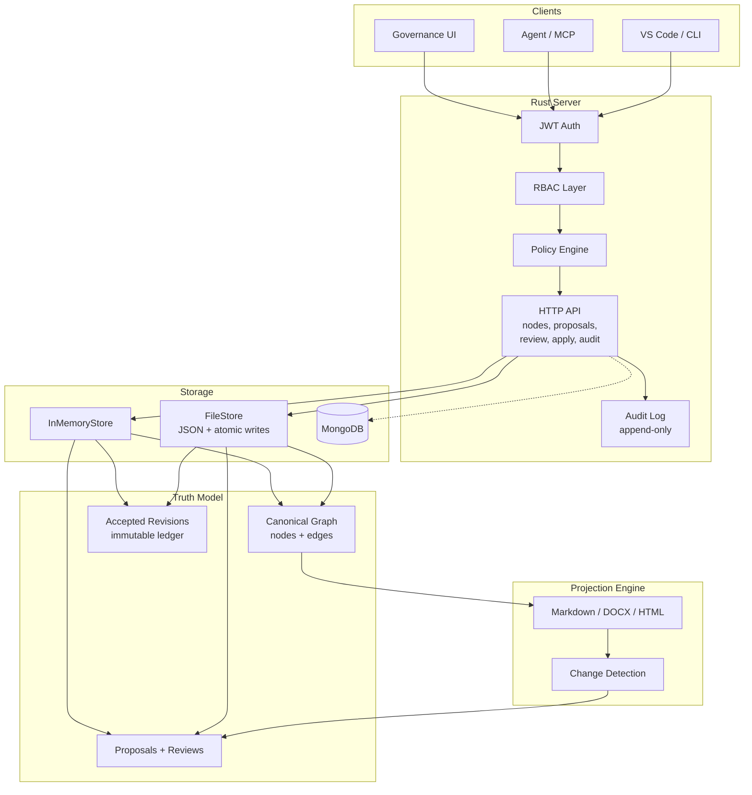
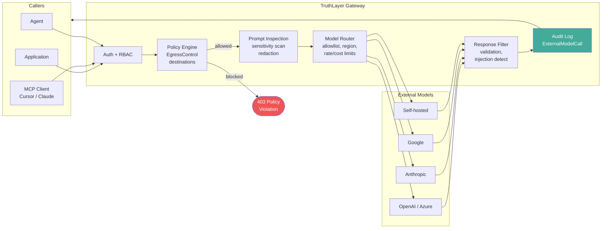
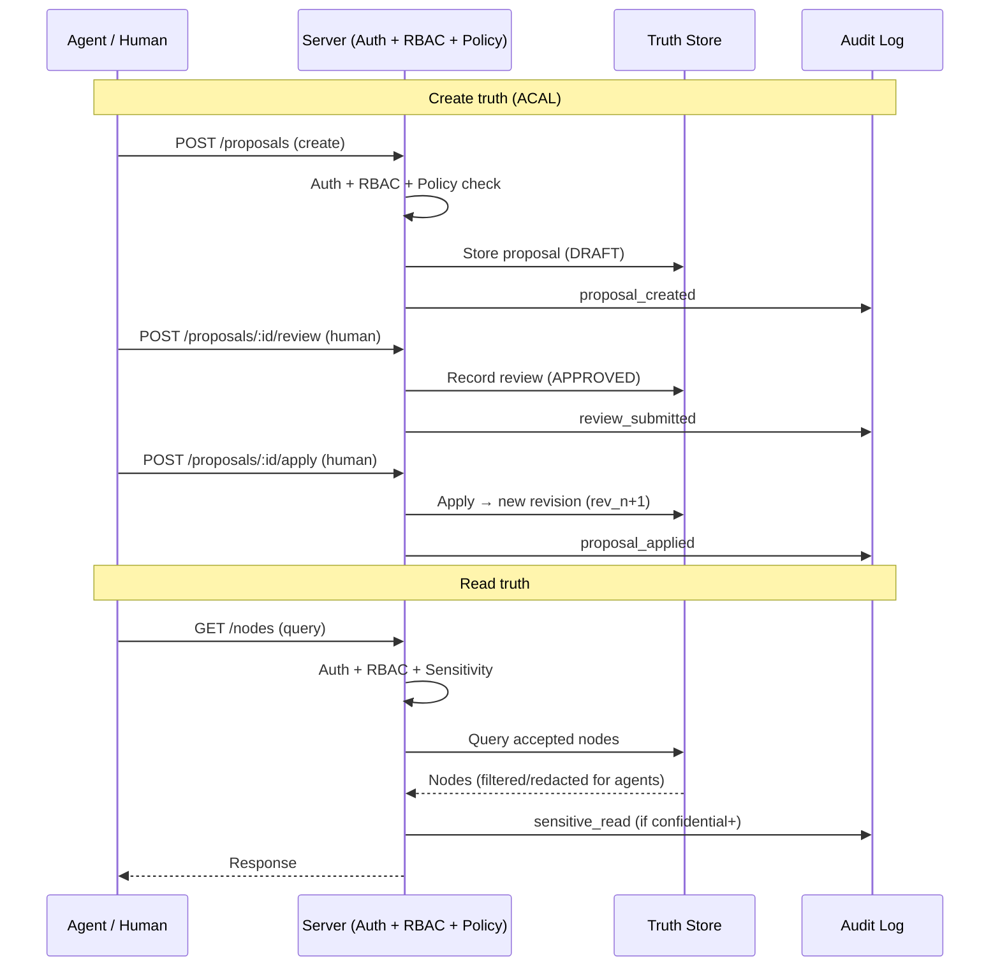

# Architecture

## System overview

## Components

1. **Truth Store**
   - **Canonical graph**: typed nodes (goal, decision, constraint, task, risk, question, etc.) and edges (depends-on, references, mitigates, implements, etc.).
   - **Accepted revisions ledger**: immutable snapshots; each apply produces a new revision (e.g. rev_1 → apply → rev_2).
   - **Proposals, reviews, comments**: proposals hold ordered operations (create/update/delete/move/status-change); reviews immutable once closed.
   - **Store interface**: ContextStore exposes queryNodes, getNode, getProposal, createProposal, submitReview, applyProposal; optional traverseReasoningChain, detectConflicts, mergeProposals, isProposalStale. **Current implementation**: the **Rust server** (server/) implements ContextStore with two backends: in-memory (default) and file-based (`TRUTHTLAYER_STORAGE=file`); HTTP API with JWT auth, RBAC, policy engine, audit logging, and sensitivity controls. TypeScript client in `src/api-client.ts` (RustServerClient). Playground and scenarios use the server; TS retains apply-proposal and graph helpers for preview. **Implementation status** (what’s implemented vs designed): see [Server README](../../server/README.md#implementation-status). See [Agent API](AGENT_API.md), [Data Model Reference](../reference/DATA_MODEL_REFERENCE.md).

2. **Policy & Governance**
   - **RBAC (enforced)**: JWT authentication (HS256) with role-based access control on all routes. Roles: Reader, Contributor, Reviewer, Applier, Admin (hierarchical). Agents (`actor_type=AGENT`) are hard-blocked from review and apply. Auth configurable via `AUTH_SECRET` / `AUTH_DISABLED` env vars.
   - **Policy engine (enforced)**: Configurable rules loaded from `policies.json`: `min_approvals`, `required_reviewer_role`, `change_window`, `agent_restriction`, `agent_proposal_limit`, `egress_control`. Evaluated at proposal create, review, and apply time; returns 422 with violation details.
   - **Sensitivity labels (enforced)**: Nodes carry `sensitivity` (public/internal/confidential/restricted). Agents are redacted from nodes above their allowed level (via `egress_control` policy). Content fingerprinting (SHA-256 `content_hash`) computed on apply.
   - **Audit logging (enforced)**: Immutable append-only audit log. Every state-changing action and agent-sensitive reads recorded. Queryable via `GET /audit`; exportable as JSON/CSV. Survives store reset. See [Security & Governance](../reference/SECURITY_GOVERNANCE.md).

3. **Projection Engine**
   - generates Markdown/DOCX/HTML views
   - **Anchor maps**: projection spans to node/field anchors for comments and change detection.
   - supports “readme-style” exports

4. **Change Detection**
   - **Inputs**: projection output, anchor map, edited content. **Outputs**: proposal operations (CREATE_NODE, UPDATE_NODE, etc.); policy findings optional.
   - **Strategy**: parse sections, resolve edits to anchors, validate, emit proposal. See [Change Detection](../appendix/CHANGE_DETECTION.md).

5. **Clients**
   - **Minimal Governance UI (required)**: list proposals, semantic diff, comments, accept/reject, apply, audit. See [UI Specification](UI_SPEC.md).
   - **Optional**: VS Code extension, web app, CLI, Office add-in. See [Optional Integrations](../appendix/OPTIONAL_INTEGRATIONS.md).

6. **Agent** (we build it)
   - The product includes an **agent** that uses the agent-safe API: **Read** (queryNodes, getNode, default status: accepted); **Write** (createProposal, updateProposal only); never submitReview or applyProposal.
   - **Traversal**: traverseReasoningChain, buildContextChain, followDecisionReasoning, queryWithReasoning for provenance chains. See [Agent API](AGENT_API.md), [Contextualized AI Model](../appendix/CONTEXTUALIZED_AI_MODEL.md).
   - Deployment can be in-process or via API; thin clients (chat, Slack, etc.) talk to the agent. One minimal governance UI is required for humans to review/apply.

7. **MCP server** (we provide it)
   - TruthLayer **exposes an MCP (Model Context Protocol) server** so AI assistants (Cursor, Claude Desktop, etc.) can use it as a native tool. MCP tools map to the agent-safe API: query accepted truth, create proposals, traverse reasoning chains; no review/apply. Optional MCP resources expose read-only context (e.g. nodes, proposals list). This makes TruthLayer the guardrail layer that AI calls from the IDE and other MCP clients. See [Agent API](AGENT_API.md#mcp-exposure), [Optional Integrations](../appendix/OPTIONAL_INTEGRATIONS.md).

8. **AI Compliance Gateway**
   - TruthLayer extends from governing internal truth operations to acting as a **compliance front-end for frontier and external AI models**. The same policy engine, sensitivity labels, RBAC, and audit log that govern internal operations are extended to intercept, inspect, and control all external model interactions.

**Gateway pipeline**: (1) authenticate and check RBAC, (2) evaluate EgressControl policy (sensitivity gate + destination allowlist), (3) inspect prompt — scan against sensitivity labels, redact content above egress threshold, (4) route to allowed model per workspace config, (5) filter response — detect policy violations, hallucinated permissions, injection, (6) log the full interaction in the audit log (`ExternalModelCall` event).

**MCP gateway mode**: MCP clients call TruthLayer MCP tools that transparently route to external models through the compliance layer. The client never needs direct model access — TruthLayer mediates all interactions.

The gateway builds on the existing auth, RBAC, policy engine (with `EgressControl` including the `destinations` field), sensitivity labels, and audit log — extending them to outbound model calls.

See [Security & Governance](../reference/SECURITY_GOVERNANCE.md), [Privacy and Data Protection](../reference/PRIVACY_AND_DATA_PROTECTION.md), [WHITEPAPER](../WHITEPAPER.md).

9. **Server-Side Agent Loop** (Cursor-pattern architecture)
   - The `truthlayer.agent` extension is a **thin chat client**; the **Rust server runs the full agent loop** with compliance gateway interception (decision-034).
   - **Flow**: extension sends user message + conversation context to `POST /agent/chat` (SSE stream) → server retrieves relevant context from ContextStore → builds prompt with system context and tool definitions → calls configured frontier model **through the compliance gateway** (§8) → executes tool calls in-process (`query_nodes`, `create_proposal`, `get_provenance`, `query_audit`) → feeds tool results back to model → streams conversation as SSE events (tokens, tool calls, citations, confirmations) → extension renders the stream.
   - **Compliance by design**: every model call passes through the same policy engine, sensitivity labels, RBAC, and audit log. No bypass path.
   - **Model configuration**: admin configures allowed models, API keys, rate limits, cost caps server-side (model routing config). Extensions never hold LLM credentials.
   - **Agent identity**: acts on behalf of authenticated user with agent-type restrictions (cannot review/apply). All interactions audit-logged.
   - **Workflow templates**: pre-built templates (Draft Proposal, Risk Assessment, Impact Analysis, etc.) execute server-side, selected by template name in request body.
   - **Truth anchoring**: the agent loop performs **post-response grounding analysis** — every model response segment is classified against the retrieved accepted truth: **grounded** (directly supported by a cited accepted node), **derived** (logically inferred from multiple accepted nodes), **ungrounded** (not supported by any retrieved context), or **contradicted** (conflicts with an accepted node). Citations are verified server-side before reaching the client. The UI renders grounding tiers as visual indicators so the user always knows how well-anchored a model claim is. See decision-037.
   - **Epistemological model**: model output is **never truth**. It is either informational commentary (ephemeral, graded by grounding tier) or a proposed truth change (enters the ACAL pipeline as a draft proposal, requires human review and apply to become accepted truth). The agent does not determine truth; the ACAL process does.
   - This is the convergence point of the **Contextualize module** (retrieval, prompt building), the **AI Compliance Gateway** (interception, policy, audit), and the **Truth Anchoring Pipeline** (grounding classification, citation verification). See [Contextualized AI Model](../appendix/CONTEXTUALIZED_AI_MODEL.md), [Agent API](AGENT_API.md), task-112.

10. **TruthLayer IDE** (VS Code fork with extension layering)
    - A standalone IDE built as a VS Code fork (Code OSS) with a **layered extension strategy** (decision-035).
    - **Extension layer** (portable — works in VS Code, Cursor, AND TruthLayer IDE): 6 standard VS Code extensions — `truthlayer.governance` (proposal list, detail, review, apply, status bar), `truthlayer.ctx-language` (syntax highlighting, validation, completion for ctx blocks), `truthlayer.ctx-preview` (enhanced Markdown preview), `truthlayer.audit` (audit log, provenance viewer, DSAR), `truthlayer.config` (policy builder, retention, sensitivity, role matrix), `truthlayer.agent` (thin chat client for server-side agent loop).
    - **Fork layer** (TruthLayer IDE only): semantic inline diffs, anchored review comments, proposal mode overlay, agent inline editing — features requiring editor internals beyond the extension API.
    - See [UI Engineering Plan](../engineering/ui/UI_ENGINEERING_PLAN.md), [Extension Architecture](../engineering/ui/EXTENSION_ARCHITECTURE.md), [Server API Requirements](../engineering/ui/SERVER_API_REQUIREMENTS.md), PLAN.md Phase 9.

## Core data flows

### Create truth

Accepted Revision (rev_n) -> Proposal (baseRevisionId, operations[]) -> Review (approve/reject) -> Apply -> New Accepted Revision (rev_n+1). AppliedMetadata stamped on proposal.

### Read truth

Client/Agent -> queryNodes({ status: ["accepted"], ... }) or getNode(id) -> use in work -> optionally createProposal with deltas.

### Edit projections

Projection (Markdown/DOCX) → user edits → change detection → proposal operations → review/apply.

### Conflict handling

Concurrent proposals → detectConflicts(proposalId) → mergeable vs needsResolution; optional mergeProposals(ids); isProposalStale(proposalId) for optimistic locking. To be extended in the Rust server; design in [Reconciliation Strategies](../appendix/RECONCILIATION_STRATEGIES.md).

## Tenancy

Every object is scoped by **workspaceId**. Workspace = unit of access control, audit boundary, retention, optional Git repo mapping.

## Server and configuration

Deployments run a **server** (local or remote). All runtime configuration—storage backend and paths, RBAC provider, and other runtime settings—lives in a **predefined location relative to the server** (config root). No repo-scattered runtime config. See QUESTIONS.md question-038 (storage/workspace), question-007 (RBAC provider).

**Transport**: The server uses **HTTP/3 (QUIC) only**. No HTTP/2 fallback — we control every client (VS Code fork, extensions, CLI tools). HTTP/3 via `quinn`/`h3` crates provides multiplexed streams without head-of-line blocking, 0-RTT reconnection, and connection migration. All streaming (agent loop SSE, extension notification SSE) and REST API run over the same HTTP/3 connection. No WebSocket — all patterns are server-push (SSE) with client actions via standard HTTP requests. Enterprise deployments must allow UDP on the server port (documented deployment prerequisite).

## Storage backends

- **File-backed**: Git-friendly; JSON/YAML; paths under server config root (e.g. `data/workspaces/{workspaceId}/`); atomic writes and locking per workspace.
- **Database-backed**: MongoDB recommended for v1; connection/config from server config root; indexes on workspaceId + nodeId, revisionId, proposal status; apply as transaction.

**Current implementation:** The Rust server implements both `InMemoryStore` (default) and `FileStore` (`TRUTHTLAYER_STORAGE=file`). The file store persists nodes, proposals, reviews, and audit log as JSON files under the config root with atomic writes (write to temp file, then rename).

See: [Storage Architecture](../engineering/storage/STORAGE_ARCHITECTURE.md), [Storage Implementation Plan](../engineering/storage/STORAGE_IMPLEMENTATION_PLAN.md).
