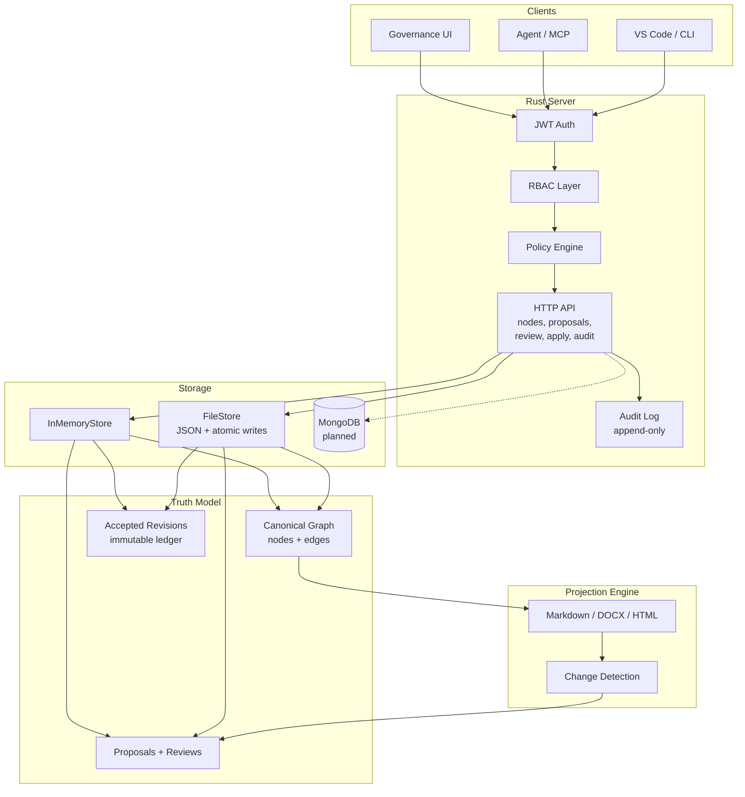
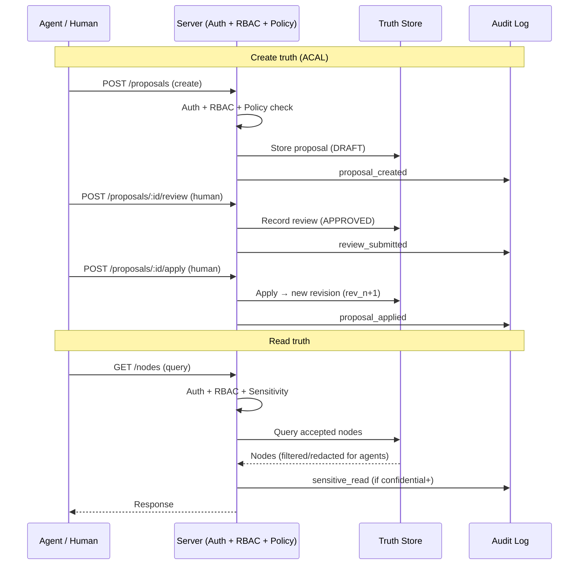

# Architecture

## System overview

## Components

1. **Truth Store**
   - **Canonical graph**: typed nodes (goal, decision, constraint, task, risk, question, etc.) and edges (depends-on, references, mitigates, implements, etc.).
   - **Accepted revisions ledger**: immutable snapshots; each apply produces a new revision (e.g. rev_1 → apply → rev_2).
   - **Proposals, reviews, comments**: proposals hold ordered operations (create/update/delete/move/status-change); reviews immutable once closed.
   - **Store interface**: ContextStore exposes queryNodes, getNode, getProposal, createProposal, submitReview, applyProposal; optional traverseReasoningChain, detectConflicts, mergeProposals, isProposalStale. **Current implementation**: the **Rust server** (server/) implements ContextStore with two backends: in-memory (default) and file-based (`TRUTHTLAYER_STORAGE=file`); HTTP API with JWT auth, RBAC, policy engine, audit logging, and sensitivity controls. TypeScript client in `src/api-client.ts` (RustServerClient). Playground and scenarios use the server; TS retains apply-proposal and graph helpers for preview. **Implementation status** (what’s implemented vs designed): see [Server README](../../server/README.md#implementation-status). See [Agent API](AGENT_API.md), [Data Model Reference](../reference/DATA_MODEL_REFERENCE.md).

2. **Policy & Governance**
   - **RBAC (enforced)**: JWT authentication (HS256) with role-based access control on all routes. Roles: Reader, Contributor, Reviewer, Applier, Admin (hierarchical). Agents (`actor_type=AGENT`) are hard-blocked from review and apply. Auth configurable via `AUTH_SECRET` / `AUTH_DISABLED` env vars.
   - **Policy engine (enforced)**: Configurable rules loaded from `policies.json`: `min_approvals`, `required_reviewer_role`, `change_window`, `agent_restriction`, `agent_proposal_limit`, `egress_control`. Evaluated at proposal create, review, and apply time; returns 422 with violation details.
   - **Sensitivity labels (enforced)**: Nodes carry `sensitivity` (public/internal/confidential/restricted). Agents are redacted from nodes above their allowed level (via `egress_control` policy). Content fingerprinting (SHA-256 `content_hash`) computed on apply.
   - **Audit logging (enforced)**: Immutable append-only audit log. Every state-changing action and agent-sensitive reads recorded. Queryable via `GET /audit`; exportable as JSON/CSV. Survives store reset. See [Security & Governance](../reference/SECURITY_GOVERNANCE.md).

3. **Projection Engine**
   - generates Markdown/DOCX/HTML views
   - **Anchor maps**: projection spans to node/field anchors for comments and change detection.
   - supports “readme-style” exports

4. **Change Detection**
   - **Inputs**: projection output, anchor map, edited content. **Outputs**: proposal operations (CREATE_NODE, UPDATE_NODE, etc.); policy findings optional.
   - **Strategy**: parse sections, resolve edits to anchors, validate, emit proposal. See [Change Detection](../appendix/CHANGE_DETECTION.md).

5. **Clients**
   - **Minimal Governance UI (required)**: list proposals, semantic diff, comments, accept/reject, apply, audit. See [UI Specification](UI_SPEC.md).
   - **Optional**: VS Code extension, web app, CLI, Office add-in. See [Optional Integrations](../appendix/OPTIONAL_INTEGRATIONS.md).

6. **Agent** (we build it)
   - The product includes an **agent** that uses the agent-safe API: **Read** (queryNodes, getNode, default status: accepted); **Write** (createProposal, updateProposal only); never submitReview or applyProposal.
   - **Traversal**: traverseReasoningChain, buildContextChain, followDecisionReasoning, queryWithReasoning for provenance chains. See [Agent API](AGENT_API.md), [Contextualized AI Model](../appendix/CONTEXTUALIZED_AI_MODEL.md).
   - Deployment can be in-process or via API; thin clients (chat, Slack, etc.) talk to the agent. One minimal governance UI is required for humans to review/apply.

7. **MCP server** (we provide it)
   - TruthLayer **exposes an MCP (Model Context Protocol) server** so AI assistants (Cursor, Claude Desktop, etc.) can use it as a native tool. MCP tools map to the agent-safe API: query accepted truth, create proposals, traverse reasoning chains; no review/apply. Optional MCP resources expose read-only context (e.g. nodes, proposals list). This makes TruthLayer the guardrail layer that AI calls from the IDE and other MCP clients. See [Agent API](AGENT_API.md#mcp-exposure), [Optional Integrations](../appendix/OPTIONAL_INTEGRATIONS.md).

## Core data flows

### Create truth

Accepted Revision (rev_n) -> Proposal (baseRevisionId, operations[]) -> Review (approve/reject) -> Apply -> New Accepted Revision (rev_n+1). AppliedMetadata stamped on proposal.

### Read truth

Client/Agent -> queryNodes({ status: ["accepted"], ... }) or getNode(id) -> use in work -> optionally createProposal with deltas.

### Edit projections

Projection (Markdown/DOCX) → user edits → change detection → proposal operations → review/apply.

### Conflict handling

Concurrent proposals → detectConflicts(proposalId) → mergeable vs needsResolution; optional mergeProposals(ids); isProposalStale(proposalId) for optimistic locking. To be extended in the Rust server; design in [Reconciliation Strategies](../appendix/RECONCILIATION_STRATEGIES.md).

## Tenancy

Every object is scoped by **workspaceId**. Workspace = unit of access control, audit boundary, retention, optional Git repo mapping.

## Server and configuration

Deployments run a **server** (local or remote). All runtime configuration—storage backend and paths, RBAC provider, and other runtime settings—lives in a **predefined location relative to the server** (config root). No repo-scattered runtime config. See QUESTIONS.md question-038 (storage/workspace), question-007 (RBAC provider).

## Storage backends

- **File-backed**: Git-friendly; JSON/YAML; paths under server config root (e.g. `data/workspaces/{workspaceId}/`); atomic writes and locking per workspace.
- **Database-backed**: MongoDB recommended for v1; connection/config from server config root; indexes on workspaceId + nodeId, revisionId, proposal status; apply as transaction.

**Current implementation:** The Rust server implements both `InMemoryStore` (default) and `FileStore` (`TRUTHTLAYER_STORAGE=file`). The file store persists nodes, proposals, reviews, and audit log as JSON files under the config root with atomic writes (write to temp file, then rename).

See: [Storage Architecture](../engineering/storage/STORAGE_ARCHITECTURE.md), [Storage Implementation Plan](../engineering/storage/STORAGE_IMPLEMENTATION_PLAN.md).
