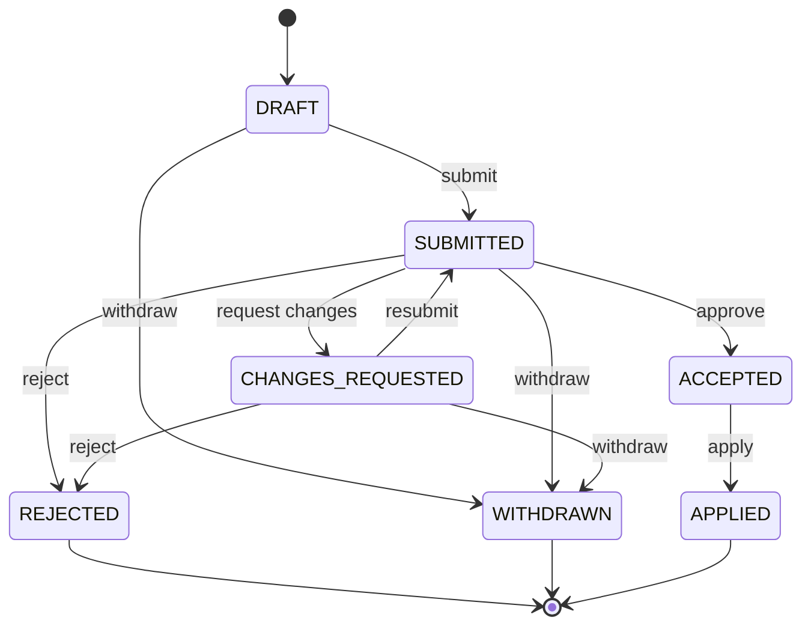

# Review Mode (ACAL) — the invariant

TruthLayer enforces an approval workflow that makes truth governable.

## States

Truth exists as **Accepted Revisions** in a ledger.

Changes exist as **Proposals** with their own lifecycle.

### Proposal status

- `DRAFT` — created but not submitted for review
- `SUBMITTED` — awaiting review
- `CHANGES_REQUESTED` — reviewer feedback requires edits
- `ACCEPTED` — approved, ready to apply
- `REJECTED` — rejected; preserved for audit (terminal)
- `WITHDRAWN` — withdrawn by author; preserved for audit (terminal)
- `APPLIED` — applied into accepted truth (terminal)

### Review status

- `OPEN`
- `APPROVED`
- `REJECTED`

### Proposal status transitions

- **DRAFT** → SUBMITTED (submit for review) or WITHDRAWN (author withdraws)
- **SUBMITTED** → CHANGES_REQUESTED (reviewer requests changes) or ACCEPTED (approved) or REJECTED (rejected) or WITHDRAWN (author withdraws)
- **CHANGES_REQUESTED** → SUBMITTED (author resubmits) or REJECTED or WITHDRAWN (author withdraws)
- **ACCEPTED** → APPLIED (human runs apply; terminal)
- **REJECTED**, **WITHDRAWN**, **APPLIED** — terminal (no transitions out)

(Implementation may use equivalent statuses: e.g. open → accepted/rejected → applied. Same semantics: draft → submit → review → accept/reject/withdraw → apply.)

### Withdraw and reopen

- **Withdraw:** The **author** (creator) may withdraw their own proposal from **DRAFT**, **SUBMITTED**, or **CHANGES_REQUESTED**. Withdraw is an explicit action; the proposal moves to **WITHDRAWN** and is preserved for audit. Permission: same as proposal ownership (author or delegate); no reviewer approval required to withdraw.
- **Reopen:** There is **no reopen**. **REJECTED** and **WITHDRAWN** are terminal. To iterate after rejection or withdrawal, create a **new proposal** (optionally referencing or copying from the old one). This keeps the state machine simple and the audit trail clear.
- **Editability:** Proposals are editable only in **DRAFT** and in **CHANGES_REQUESTED** (until the author resubmits or withdraws). After SUBMITTED (and before CHANGES_REQUESTED), implementations may allow or disallow edits depending on policy; once REJECTED, WITHDRAWN, or APPLIED, the proposal is immutable except for comments.

### Operation types (proposal operations)

Proposals contain an ordered list of **operations** that, when applied, mutate the graph. Supported types:

| Operation       | Description                                         | Payload                                         |
| --------------- | --------------------------------------------------- | ----------------------------------------------- |
| `create`        | Create a new node                                   | `node: AnyNode`                                 |
| `update`        | Update an existing node (field-level)               | `nodeId`, `changes: { content?, status?, ... }` |
| `delete`        | Delete a node (and optionally edges)                | `nodeId`                                        |
| `move`          | Move node in hierarchy or change relationships      | `nodeId`, target refs                           |
| `status-change` | Change node status only                             | `nodeId`, `status`                              |
| `insert`        | Insert content into a node (e.g. description block) | `sourceNodeId`, content/range                   |
| (edge ops)      | Create/delete edges between nodes                   | `fromNodeId`, `toNodeId`, `type`                |

Operations are validated against schema and policy before submit. See [Data Model Reference](../reference/DATA_MODEL_REFERENCE.md) for Operation schema.

## Actions and permissions

- **Create Proposal**: human or agent (permission: `propose`)
- **Submit Review**: human only (permission: `review`)
- **Accept/Reject**: reviewers only (permission: `review`)
- **Withdraw**: author (or delegate) only; from DRAFT, SUBMITTED, or CHANGES_REQUESTED (permission: `propose` or ownership)
- **Apply**: release manager / policy gate (permission: `apply`)

Agents must never be granted `review` or `apply`.

## “Applied” metadata (required)

Every applied proposal must record:

- `appliedAt` (timestamp)
- `appliedBy` (actor id)
- `appliedFromReviewId`
- `appliedFromProposalId`
- `appliedToRevisionId` (new accepted revision)
- `previousRevisionId`

This metadata is mandatory for auditability, idempotency, and governance.

**Current status:** Implemented in the reference server: proposal status → APPLIED, AppliedMetadata stored, idempotent apply (re-apply returns 200 without mutating). See [Agent API](AGENT_API.md) § Applied state and idempotent apply; PLAN task-061 (resolved).

## Idempotency

- Applying the same proposal twice must be a no-op (or error) based on `appliedFromProposalId`.
- Reviews are immutable once closed.

## Multi-approval

When a proposal **requires multiple approvals** (e.g. policy requires two reviewers):

- **Rejection wins.** The proposal is **not applied** if any required reviewer rejects. Approval requires **all** required reviewers to approve. There is no tie-breaking or majority rule.
- **Proposal as unit.** The **whole proposal** is approved or rejected. There is no partial approval of individual operations. To accept only part of a proposal, a reviewer rejects and the author (or someone) creates a **new proposal** with the desired subset.
- **Visibility.** By default, reviewers **see existing reviews and comments** before submitting their own, so the second reviewer has full context. Optional "blind" mode (reviews hidden until all have submitted) may be supported later if required by policy.
- **Audit.** Every review (approve/reject) is recorded with actor and timestamp; rejection reason is captured in comments or the review payload.

See QUESTIONS.md question-008 (resolved).

## Policy hooks (implemented)

The server enforces configurable policy rules loaded from `policies.json`. Rules are evaluated at proposal create, review, and apply time; violations return 422 with details.

**Implemented rule types:**

| Rule                     | Description                                                                |
| ------------------------ | -------------------------------------------------------------------------- |
| `min_approvals`          | Minimum number of approvals before apply (optionally scoped to node types) |
| `required_reviewer_role` | At least one reviewer must hold a specific role (e.g. InfoSec)             |
| `change_window`          | Restrict applies to specific time windows (CAB-style)                      |
| `agent_restriction`      | Block agents from specific operations (e.g. review, apply)                 |
| `agent_proposal_limit`   | Limit agent proposal size (max operations, max content length)             |
| `egress_control`         | Cap the sensitivity level agents can read (default: internal)              |

Examples:

- POLICY nodes require 2 reviewers (`min_approvals`).
- SECURITY policy changes require an InfoSec reviewer (`required_reviewer_role`).
- High-risk updates require a CAB window (`change_window`).

See: [Security & Governance](../reference/SECURITY_GOVERNANCE.md)
