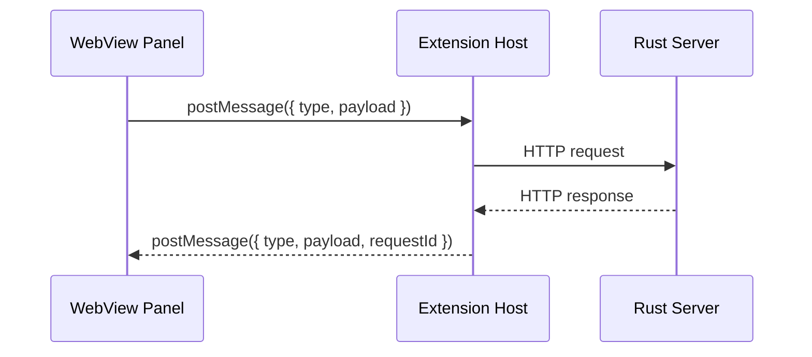
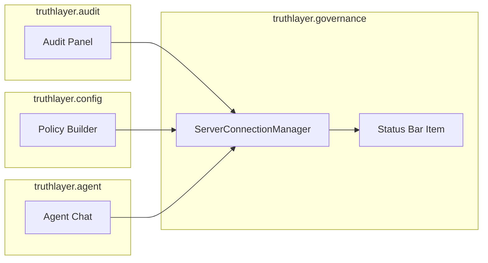
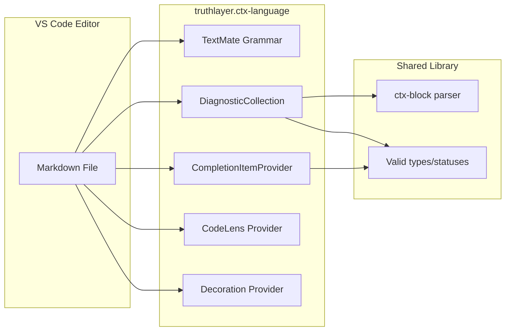
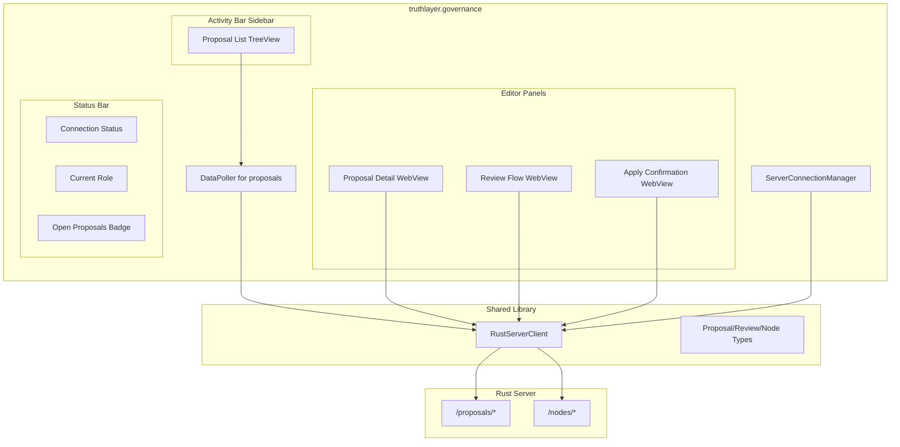
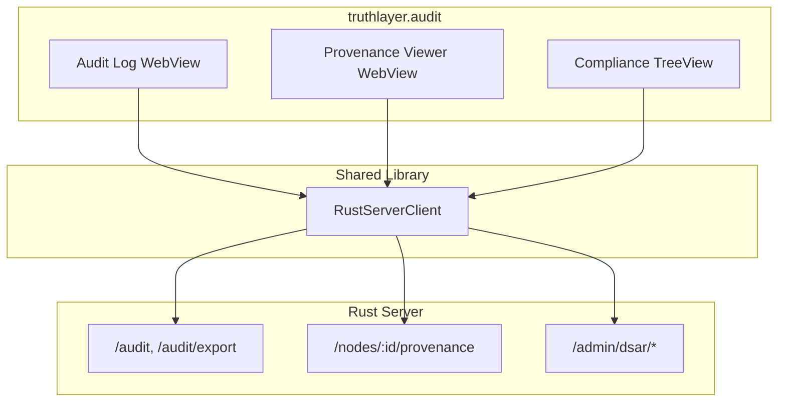
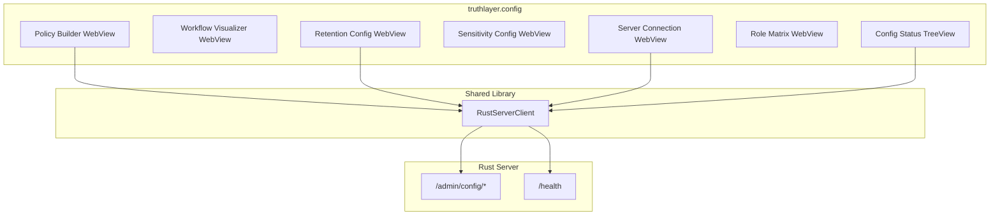
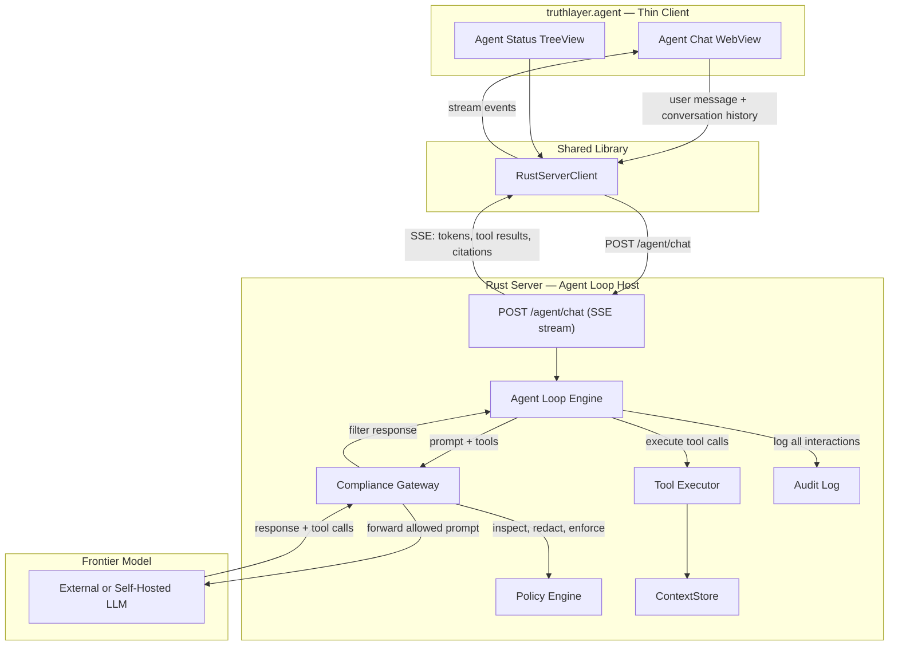

# TruthLayer Extension Architecture

Technical architecture for the TruthLayer VS Code extension layer. Covers shared patterns, per-extension data flows, inter-extension communication, and testing strategy.

For the master engineering plan and dependency ordering, see `docs/engineering/ui/UI_ENGINEERING_PLAN.md`.
For server API gaps and required changes, see `docs/engineering/ui/SERVER_API_REQUIREMENTS.md`.

---

## 1. Shared Patterns

All six extensions share these architectural patterns to ensure consistency and reduce code duplication.

### 1.1 WebView Message Protocol

All WebView panels communicate with their host extension via a typed message protocol.



**Message format**:

```typescript
// Extension host -> WebView
interface WebViewMessage {
  type: string;          // e.g. "proposals.loaded", "review.submitted", "error"
  payload: unknown;      // type-specific data
  requestId?: string;    // correlates to a request from the WebView
}

// WebView -> Extension host
interface WebViewRequest {
  type: string;          // e.g. "proposals.load", "review.submit"
  payload: unknown;
  requestId: string;     // unique ID for response correlation
}
```

**Error handling**: All server errors are caught in the extension host and forwarded to the WebView as `{ type: "error", payload: { message, code, requestId } }`. The WebView renders errors inline, not as VS Code notifications (which are disruptive).

### 1.2 Theme Injection

WebView panels must respect VS Code's current theme (light, dark, high contrast).

**Pattern**: Inject VS Code's CSS custom properties into the WebView's HTML at creation time. The WebView's CSS references these variables exclusively -- no hardcoded colors.

```typescript
function getWebViewHtml(webview: vscode.Webview, extensionUri: vscode.Uri): string {
  // VS Code provides these CSS variables automatically when using
  // the webview's cspSource and proper meta tags
  return `<!DOCTYPE html>
<html>
<head>
  <meta charset="UTF-8">
  <meta name="viewport" content="width=device-width, initial-scale=1.0">
  <style>
    body {
      color: var(--vscode-foreground);
      background-color: var(--vscode-editor-background);
      font-family: var(--vscode-font-family);
      font-size: var(--vscode-font-size);
    }
    .card {
      background: var(--vscode-editorWidget-background);
      border: 1px solid var(--vscode-editorWidget-border);
      border-radius: 4px;
    }
    .badge-accepted { background: var(--vscode-testing-iconPassed); }
    .badge-rejected { background: var(--vscode-testing-iconFailed); }
    .badge-open { background: var(--vscode-editorInfo-foreground); }
    /* ... etc */
  </style>
</head>
<body>...</body>
</html>`;
}
```

**Rule**: Never use hex/rgb colors directly. Always reference `var(--vscode-*)` tokens.

### 1.3 State Persistence

WebView panels lose DOM state when the tab is hidden and restored. All panels must persist and restore state.

**Pattern**: Use VS Code's `webview.getState()` / `webview.setState()` API (client-side in WebView JavaScript) and `WebviewPanel.webview.options.retainContextWhenHidden` (extension-side, use sparingly as it keeps the WebView in memory).

```typescript
// In WebView JavaScript
const vscode = acquireVsCodeApi();

// Save state on every meaningful change
function saveState(state) {
  vscode.setState(state);
}

// Restore state on load
function restoreState() {
  const previous = vscode.getState();
  if (previous) {
    // Re-render from saved state
    renderFromState(previous);
  } else {
    // First load -- request data from extension host
    vscode.postMessage({ type: 'init', requestId: generateId() });
  }
}

window.addEventListener('load', restoreState);
```

**What to persist**: Current filter selections, scroll position, expanded/collapsed sections, active tab. **What NOT to persist**: Server data (always re-fetch on restore to avoid stale data).

### 1.4 Server Connection Management

A shared `ServerConnectionManager` handles authentication, health checking, and connection state. It is owned by the `truthlayer.governance` extension and exposed to other extensions via the VS Code extension API.



**Responsibilities**:
- Holds the `RustServerClient` instance with auth token
- Monitors server health (`GET /health` every 60s)
- Emits events: `onConnectionChanged`, `onAuthChanged`, `onServerError`
- Manages token refresh and re-authentication
- Exposes `getClient(): RustServerClient` for other extensions

**Extension API export**:

```typescript
// In truthlayer.governance's activate()
export function activate(context: vscode.ExtensionContext) {
  const manager = new ServerConnectionManager(context);
  return {
    getClient: () => manager.getClient(),
    onConnectionChanged: manager.onConnectionChanged,
    isConnected: () => manager.isConnected(),
  };
}
```

**Consumer usage**:

```typescript
// In truthlayer.audit's activate()
const governance = vscode.extensions.getExtension('truthlayer.governance');
const api = governance?.exports;
if (api?.isConnected()) {
  const client = api.getClient();
  // Use client for audit queries
}
```

### 1.5 Polling and Subscription Pattern

Until real-time push is available (task-098), extensions poll for updates.

**Pattern**: A `DataPoller<T>` class handles interval-based polling with deduplication.

```typescript
class DataPoller<T> {
  private timer: NodeJS.Timeout | undefined;
  private lastHash: string = '';
  private readonly _onDataChanged = new vscode.EventEmitter<T>();
  readonly onDataChanged = this._onDataChanged.event;

  constructor(
    private fetchFn: () => Promise<T>,
    private hashFn: (data: T) => string,
    private intervalMs: number,
  ) {}

  start() {
    this.poll();
    this.timer = setInterval(() => this.poll(), this.intervalMs);
  }

  stop() { clearInterval(this.timer); }

  private async poll() {
    const data = await this.fetchFn();
    const hash = this.hashFn(data);
    if (hash !== this.lastHash) {
      this.lastHash = hash;
      this._onDataChanged.fire(data);
    }
  }
}
```

**Configuration**: `truthlayer.autoRefresh` setting controls the interval (default 30s). Setting to 0 disables polling.

**Transport**: SSE over HTTP/3 only. No HTTP/2 fallback — we control every client. The server provides `GET /events?workspace={id}` SSE endpoint for real-time notifications (proposal_updated, review_submitted, config_changed, audit_event). The `DataPoller` class wraps `EventSource` (SSE) as the primary transport, with automatic reconnection and JWT auth. Extensions subscribe to workspace-scoped event streams; the `onDataChanged` event interface remains the same regardless of transport internals. The agent loop already requires SSE infrastructure (`POST /agent/chat`), so extension notifications reuse the same SSE stack.

### 1.6 Error Handling and Offline Behavior

All server-calling extensions must handle connection failures gracefully.

**Pattern**:

1. **On request failure**: Show inline error in the relevant panel (not a VS Code notification). Cache the last successful response and show it with a "Stale data" indicator.
2. **On connection loss**: Status bar shows "Disconnected". Panels show cached data (if any) with a banner: "Server unavailable. Showing data from [timestamp]."
3. **On reconnection**: Automatically re-fetch data and clear stale indicators.
4. **Offline-capable features**: `truthlayer.ctx-language` and `truthlayer.ctx-preview` work entirely offline (local file parsing). All other extensions require the server for write operations but can display cached data for reads.

---

## 2. Per-Extension Architecture

### 2.1 `truthlayer.ctx-language`



**Data flow**:
1. User opens a Markdown file
2. TextMate grammar provides syntax highlighting for ctx blocks
3. DiagnosticCollection validates: required fields (`type`, `id`, `status`), valid enum values, duplicate IDs
4. CompletionItemProvider triggers inside ctx block metadata: suggests types, statuses, existing node IDs
5. CodeLens appears above each ctx block: "View Proposals" (if server connected), "Sensitivity: X"
6. Decorations: gutter icons for sensitivity level, background tint for proposed blocks

**No server calls** for core features. Optional CodeLens enhancement requires governance extension API for proposal data.

### 2.2 `truthlayer.ctx-preview`

**Data flow**:
1. User opens Markdown preview
2. Markdown-it plugin (from shared library) transforms ctx fenced blocks into styled HTML
3. Metadata rendered as a colored caption bar (type, id, status, sensitivity)
4. Body rendered as Markdown within the block
5. Relationship links rendered as clickable badges

**Migration from `vscode-ctx-markdown/`**: Replace the hand-copied `extension.js` with an import from `@truthlayer/client/markdown`. The `ctxRenderPlugin` function is already exported from the shared library.

### 2.3 `truthlayer.governance`



**Proposal List TreeView**:
- Groups proposals by status (Open, Accepted, Applied, Rejected, Withdrawn)
- Each item shows: title (or first operation summary), author, date, badge count of operations
- Inline actions: Open Detail, Quick Approve (if reviewer), Withdraw (if author)
- Refreshed by `DataPoller` at configurable interval

**Proposal Detail WebView**:
- Semantic diff: each operation rendered as a card (node type icon, field-level before/after)
- Diff computation: client-side from `proposal.operations` + `getNode()` for current state
- Policy findings: displayed as warning cards (from policy evaluation at create/review time)
- Comments thread: anchored to operations or proposal-level
- Review history timeline: chronological list of reviews with actor, action, timestamp

**Review Flow WebView**:
- Action buttons: Approve, Reject, Request Changes (enabled based on role)
- Comment input with Markdown support
- Multi-reviewer progress: shows who has reviewed, who is pending
- Policy check: shows which rules pass/fail before submission

**Apply Confirmation WebView**:
- Policy check summary (all rules must pass)
- Change window status (if ChangeWindow policy active)
- Affected nodes list
- Confirm / Cancel buttons
- Shows "Already Applied" if proposal status is `applied`

### 2.4 `truthlayer.audit`



**Audit Log WebView**:
- Timeline visualization of audit events
- Filters: actor (dropdown), action type (multi-select), resource ID (search), date range (picker), outcome (dropdown)
- Pagination: load more on scroll
- Export: CSV or JSON download button
- Click event: expand details (full event JSON, related proposal/node links)

**Provenance Viewer WebView**:
- For a selected node: full timeline of all audit events referencing that node
- Grouped by: proposals that affected the node, reviews, applies
- Actor attribution at each step
- Links to open proposal detail in governance extension

**Compliance TreeView**:
- DSAR tools: Export Data (by subject), Erase Data (by subject)
- Policy configuration viewer (read-only summary from config extension)
- Retention policy status (current rules and next scheduled run)

### 2.5 `truthlayer.config`



**Policy Builder WebView** (detailed in IDE plan):
- Card-based rule type picker (MinApprovals, RequiredReviewerRole, ChangeWindow, AgentRestriction, AgentProposalLimit, EgressControl)
- Per-rule configuration forms with validation
- Rule list with drag-to-reorder, enable/disable, duplicate, delete
- Real-time validation with clear error messages
- "Test Policy" dry-run simulation
- Diff preview before saving

**Data flow for config write**:
1. User edits policy rules in WebView form
2. WebView sends `{ type: "policies.save", payload: PolicyRule[] }` to extension host
3. Extension host calls `client.updateConfigPolicies(rules)`
4. Server validates, applies, records audit event
5. Extension host sends `{ type: "policies.saved", payload: PolicyRule[] }` back to WebView
6. On error: extension host sends `{ type: "error", payload: { message, validationErrors } }`

### 2.6 `truthlayer.agent`

The agent extension follows the same architectural pattern as Cursor: the extension is a **thin chat client** that renders the conversation, and the **server runs the agent loop** with full compliance interception. The extension never calls frontier models directly. All model interaction, tool execution, prompt inspection, response filtering, and audit logging happen server-side.



**Why server-side agent loop (Cursor-pattern architecture)**:
- **Compliance by design**: Every model call passes through the same policy engine, sensitivity labels, RBAC, and audit log that govern all other TruthLayer operations. No bypass path.
- **Tool execution is server-local**: The agent's tools (`query_nodes`, `create_proposal`, `get_provenance`, `query_audit`) operate directly against the ContextStore in-process — no HTTP round-trips for tool calls.
- **Model configuration is centralized**: Admin configures allowed models, API keys, rate limits, and cost caps server-side (Phase 8 model routing config, task-091). Extensions don't hold LLM credentials.
- **Consistent with Cursor's proven pattern**: IDE is the display layer; intelligence lives server-side.
- **Simplifies the extension**: No MCP client, no workflow engine, no LLM provider integration in the extension. Just a WebView that renders streamed events.

**Agent Chat WebView** (thin client):
- Streaming text rendering (SSE event-by-event display)
- Node citations: `[node:decision-042]` rendered as clickable links (open in editor or proposal detail). Verified citations (server-confirmed) show a checkmark; failed citations show a warning icon.
- **Grounding tier indicators** (decision-037): each response segment is annotated with its truth anchoring classification:
  - **Grounded** (green solid indicator): claim is directly supported by a verified accepted node. Citation link included.
  - **Derived** (amber indicator): claim is inferred from multiple accepted nodes. Citation links + "Inferred from..." label.
  - **Ungrounded** (dotted underline, muted): claim has no supporting accepted truth. Warning: "Not anchored to accepted truth."
  - **Contradicted** (red flag): claim conflicts with accepted truth. Warning: "Contradicts [node:X]" with link to the conflicting node.
- **Grounding summary bar**: at the end of each turn, a compact bar shows aggregate grounding: e.g. "5 grounded, 2 derived, 1 ungrounded" with overall confidence score.
- Context indicator: shows current workspace, open file, selected ctx block
- Conversation history persisted per workspace via `globalState`
- Sends user messages and conversation context to server via `POST /agent/chat`
- Receives SSE stream of events: `token` (incremental text), `tool_call` (tool invocation display), `tool_result` (tool output display), `citation` (verified node reference), `grounding` (truth anchoring tier per segment), `grounding_summary` (aggregate), `error`, `done`
- User confirmation: when the agent proposes creating a proposal, the confirmation dialog shows the proposal preview **with grounding metadata** — the user sees which parts of the proposed change are grounded vs ungrounded before confirming

**Workflow Templates** (server-side):
- Pre-built templates for each workflow (Draft Proposal, Risk Assessment, Impact Analysis, etc.)
- Each template defines: system prompt, required context (nodes to fetch), tool definitions, output format
- Templates execute entirely server-side: fetch context → build prompt → call LLM (through compliance gateway) → execute tool calls → feed results back to LLM → stream response to client
- The extension selects a workflow template via the `POST /agent/chat` request body (e.g. `{ template: "draft_proposal", context: { nodeIds: [...] } }`)
- User reviews output in the WebView before any truth-changing action

**Server-Side Agent Loop** (runs in Rust server):
- Receives user message + conversation history + optional workflow template from the extension
- Builds the prompt with system context (retrieved nodes, workspace state, guardrails)
- Calls the configured frontier model **through the compliance gateway** (Phase 8): prompt inspection, sensitivity label enforcement, EgressControl policy, destination allowlist
- LLM response is **filtered through the compliance gateway**: response validation, policy check
- Tool calls from the LLM (e.g. `query_nodes({ type: "decision" })`) are executed in-process against the ContextStore
- Tool results are fed back to the LLM for the next turn
- All interactions (prompt, response, tool calls, tool results) are **audit logged** with the user's identity and agent session ID
- Agent identity: the agent acts on behalf of the authenticated user, but with agent-type restrictions (cannot review/apply — enforced server-side per question-035)
- Streams the full conversation back to the extension as SSE events

---

## 3. Inter-Extension Communication

Extensions communicate through two mechanisms:

### 3.1 Extension API Exports

The `truthlayer.governance` extension exports a typed API that other extensions consume.

```typescript
// Exported by truthlayer.governance
interface GovernanceAPI {
  getClient(): RustServerClient;
  isConnected(): boolean;
  onConnectionChanged: vscode.Event<boolean>;
  onProposalChanged: vscode.Event<Proposal>;
  onProposalApplied: vscode.Event<Proposal>;
  openProposalDetail(proposalId: string): void;
  getActiveProposal(): Proposal | undefined;
}
```

### 3.2 VS Code Commands

Extensions invoke each other via commands registered in the command palette.

| Command | Registered By | Used By |
| --- | --- | --- |
| `truthlayer.openProposalDetail` | governance | audit (click provenance event), agent (after proposal creation) |
| `truthlayer.showProvenance` | audit | governance (from proposal detail), ctx-language (from CodeLens) |
| `truthlayer.openPolicyBuilder` | config | governance (from policy violation card) |
| `truthlayer.askAgent` | agent | governance (from "Draft proposal with AI" button — sends template + context to server-side agent loop) |
| `truthlayer.connectToServer` | governance | all (first-run onboarding) |

---

## 4. Shared UI Component Library

If a WebView framework is chosen (question-058), these components should be shared across all extensions:

| Component | Used By | Description |
| --- | --- | --- |
| `ProposalCard` | governance, agent | Compact proposal summary (title, status badge, author, date, operation count) |
| `StatusBadge` | governance, audit | Colored badge for proposal/node status (open=blue, accepted=green, rejected=red, applied=purple) |
| `DiffViewer` | governance | Field-level semantic diff (before/after cards per operation) |
| `Timeline` | audit, governance | Chronological event list with actor avatars and timestamps |
| `CommentThread` | governance | Nested comment thread with Markdown rendering and anchor indicator |
| `FilterBar` | governance, audit | Horizontal bar of filter controls (dropdowns, date pickers, search input) |
| `FormField` | config | Validated form input (text, number, dropdown, checkbox, slider) with error display |
| `RuleCard` | config | Policy rule card with type icon, summary, enable/disable toggle |
| `LoadingSpinner` | all | Skeleton loading state for panels |
| `ErrorBanner` | all | Inline error/warning banner with retry action |
| `StaleBanner` | all | "Data may be outdated" banner with last-updated timestamp |

These components are styled exclusively with `var(--vscode-*)` CSS variables for automatic theme compatibility.

---

## 5. Testing Strategy

### 5.1 Unit Tests

| Target | Tool | Scope |
| --- | --- | --- |
| TreeView data providers | Mocha/Jest | Verify tree structure, grouping, filtering, sorting |
| WebView message handlers | Mocha/Jest | Verify request/response mapping, error handling |
| Shared library (ctx parser, types) | Mocha/Jest | Existing test suite + new extension-specific tests |
| Completion/validation providers | Mocha/Jest | Verify diagnostics, completions, CodeLens |

### 5.2 Integration Tests (Mock Server)

Each extension has integration tests that run against a mock HTTP server:

- Mock server returns canned responses for all endpoints
- Tests verify: correct HTTP method/path/params, correct response parsing, error handling
- Use `nock` or `msw` for HTTP mocking in Node.js
- Tests run in CI without a real Rust server

### 5.3 E2E Tests (VS Code)

Use `@vscode/test-electron` to run extensions in a real VS Code instance:

- Open a sample workspace with Markdown files containing ctx blocks
- Verify: syntax highlighting applied, diagnostics shown, CodeLens rendered
- Verify: proposal list populated (mock server), proposal detail opens, review flow works
- Verify: status bar shows connection state

### 5.4 Visual Tests

WebView panels require visual verification:

- Snapshot tests for rendered HTML (compare against baseline)
- Theme tests: verify panels render correctly in light, dark, and high-contrast themes
- Responsive tests: verify panels work at different viewport widths

### 5.5 Server Integration Tests

Run against a real Rust server (in CI via Docker):

- Full workflow: create proposal -> review -> apply -> verify audit
- Config API: read/write policies, retention, reload
- Auth: verify role enforcement, agent rejection
- Error cases: invalid input, missing permissions, server unavailable
- **Agent loop tests**: `POST /agent/chat` with mock LLM provider → verify SSE event stream, tool call execution, audit logging, user confirmation flow for truth-changing actions
- **Agent compliance tests**: verify that agent loop routes all model calls through compliance gateway, sensitivity-based redaction works, EgressControl blocks disallowed providers
- **Truth anchoring tests**: verify grounding classification — mock LLM returns response with valid citations (expect `grounded`), invalid citations (expect `ungrounded`), claims contradicting accepted nodes (expect `contradicted`); verify `grounding_summary` event at end of turn; verify proposal metadata inherits grounding tier when `create_proposal` tool is called

---

## 6. Build and Packaging

### Per-Extension Build

Each extension has its own `package.json`, build script, and output:

```
extensions/
  governance/
    package.json          # VS Code extension manifest
    tsconfig.json         # TypeScript config
    webpack.config.js     # Bundle for production
    src/                  # Extension source
    out/                  # Compiled output
    media/                # Icons, images
    test/                 # Tests
  ctx-language/
    ...
  ctx-preview/
    ...
  audit/
    ...
  config/
    ...
  agent/
    ...
```

### WebView Bundling

WebView panels are bundled separately from the extension host code:

- Extension host: TypeScript compiled to CommonJS, bundled with webpack/esbuild
- WebView panels: HTML + CSS + JS (or framework output), bundled separately
- WebView assets served via `webview.asWebviewUri()` for CSP compliance

### Extension Pack

The extension pack is a `package.json`-only package that lists all 6 extensions as dependencies:

```json
{
  "name": "truthlayer",
  "displayName": "TruthLayer",
  "extensionPack": [
    "truthlayer.governance",
    "truthlayer.ctx-language",
    "truthlayer.ctx-preview",
    "truthlayer.audit",
    "truthlayer.config",
    "truthlayer.agent"
  ]
}
```

---

## 7. Cross-References

| Document | Relevance |
| --- | --- |
| `docs/engineering/ui/UI_ENGINEERING_PLAN.md` | Master plan, dependency gates, type alignment |
| `docs/engineering/ui/SERVER_API_REQUIREMENTS.md` | Server API gaps and required changes |
| `.cursor/plans/truthlayer_ide_analysis_4f3e7459.plan.md` | High-level feature descriptions, fork architecture |
| `docs/core/UI_SPEC.md` | Required governance UI specification |
| `docs/core/REVIEW_MODE.md` | Proposal/review state machine |
| `vscode-ctx-markdown/` | Existing extension to evolve into `truthlayer.ctx-preview` |
