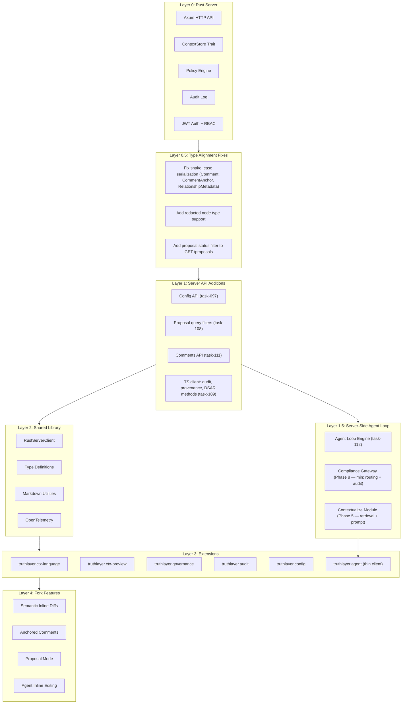
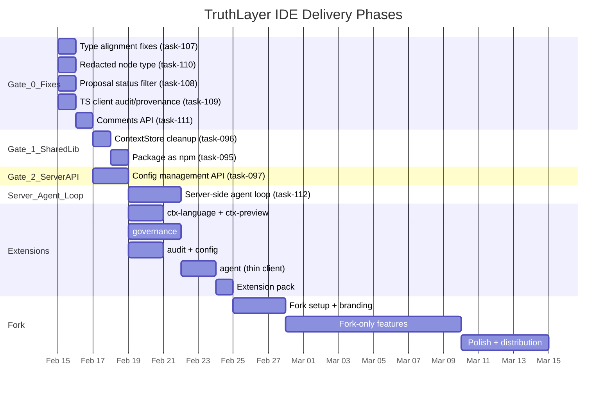

# TruthLayer IDE — UI Engineering Plan

This is the master engineering document for the TruthLayer IDE initiative (PLAN.md Phase 9). It covers the full dependency chain from server through TypeScript client to extensions and fork features, with prerequisite ordering, type alignment, and per-extension technical specifications.

For the high-level architecture and feature descriptions, see `.cursor/plans/truthlayer_ide_analysis_4f3e7459.plan.md`.

---

## 1. Scope

The TruthLayer IDE initiative delivers:

| Deliverable | Description |
| --- | --- |
| **Shared library** (`@truthlayer/client`) | npm package: API client, types, markdown utilities, telemetry |
| **6 VS Code extensions** | `truthlayer.governance`, `truthlayer.ctx-language`, `truthlayer.ctx-preview`, `truthlayer.audit`, `truthlayer.config`, `truthlayer.agent` |
| **Extension pack** | Single installable bundle of all 6 extensions for VS Code Marketplace and Open VSX |
| **TruthLayer IDE** | Forked VS Code (Code OSS) with branding, pre-installed extensions, and fork-only features |
| **Fork-only features** | Semantic inline diffs, anchored review comments, proposal mode overlay, agent inline editing |

---

## 2. Dependency Chain

The system has a strict dependency chain. Each layer depends on the one below it being correct and complete.

---

## 3. Prerequisite Resolution Order

Work must proceed in this order. Each gate must be met before the next phase starts.

### Gate 0: Type Alignment and Bug Fixes (Before any UI work)

These are bugs that will cause silent data loss or incorrect behavior in extensions:

| Fix | Task | Details |
| --- | --- | --- |
| snake_case to camelCase serialization | task-107 | Add `#[serde(rename_all = "camelCase")]` to `Comment`, `CommentAnchor`, `RelationshipMetadata` in Rust server |
| Redacted node type | task-110 | Add `redacted?: boolean` and `reason?: string` to TS `AnyNode` type |
| Proposal status filter | task-108 | `GET /proposals` must accept `status` parameter and return proposals of any status |
| TS client audit/provenance methods | task-109 | Add `queryAudit()`, `exportAudit()`, `getProvenance()`, `dsarExport()`, `dsarErase()` to `RustServerClient` |

### Gate 1: Shared Library Packaging (Before extension development)

| Prerequisite | Task | Details |
| --- | --- | --- |
| ContextStore interface cleanup | task-096 | Trim unimplemented stubs |
| Package as npm module | task-095 | `@truthlayer/client` with proper exports |
| Package boundary decision | question-064 | Single package or split? |

### Gate 2: Server API Additions (Before governance/config/audit extensions)

| Prerequisite | Task | Required By |
| --- | --- | --- |
| Config management API | task-097 | `truthlayer.config` |
| Proposal query enhancement | task-108 | `truthlayer.governance` |
| Dedicated comments API | task-111 | `truthlayer.governance` |
| WebView framework decision | question-058 | All extensions |
| Repository structure decision | question-059 | All extensions |

### Gate 3: Extension Development (Can proceed in parallel after Gates 0-2)

| Extension | Dependencies Met |
| --- | --- |
| `truthlayer.ctx-language` | Gate 1 only (no server calls) |
| `truthlayer.ctx-preview` | Gate 1 only (no server calls) |
| `truthlayer.governance` | Gates 0 + 1 + 2 (proposal query, comments, type fixes) |
| `truthlayer.audit` | Gates 0 + 1 (audit/provenance client methods) |
| `truthlayer.config` | Gates 0 + 1 + 2 (config API) |
| `truthlayer.agent` | Gates 0 + 1 + server-side agent loop (task-112, depends on Phase 5 Contextualize + Phase 8 gateway) |

### Gate 4: Fork (After extensions are working)

| Prerequisite | Details |
| --- | --- |
| All 6 extensions functional | Extensions must work in VS Code before fork integration |
| Fork setup complete | task-104 |
| VS Code source understanding | AI must read and understand editor internals |

---

## 4. Type Alignment Table

Every Rust type that flows through the HTTP API, its TypeScript equivalent, and known mismatches.

### Correctly Aligned Types

| Rust Type | TS Type | Serialization | Status |
| --- | --- | --- | --- |
| `ContextNode` | `AnyNode` | `#[serde(rename_all = "camelCase")]` | OK |
| `NodeId` | `NodeId` | Direct map | OK |
| `NodeStatus` | `NodeStatus` | String enum | OK |
| `NodeType` | `NodeType` | String enum | OK |
| `NodeMetadata` | `NodeMetadata` | `#[serde(rename_all = "camelCase")]` | OK |
| `Proposal` | `Proposal` | `#[serde(rename_all = "camelCase")]` | OK |
| `ProposalStatus` | `ProposalStatus` | String enum | OK |
| `Operation` | `Operation` | Tagged union | OK |
| `ReviewAction` | `ReviewAction` | String enum | OK |
| `AuditEvent` | `AuditEvent` | `#[serde(rename_all = "camelCase")]` | OK |
| `AuditAction` | `AuditAction` | String enum | OK |
| `AuditOutcome` | `AuditOutcome` | String enum | OK |
| `PolicyRule` | `PolicyRule` | Mapped | OK |

### Misaligned Types (Bugs)

| Rust Type | TS Type | Issue | Fix |
| --- | --- | --- | --- |
| `Comment` | `Comment` | Missing `#[serde(rename_all = "camelCase")]` -- `created_at`, `resolved_at`, `resolved_by`, `operation_id` sent as snake_case | Add serde rename to Rust struct |
| `CommentAnchor` | `CommentAnchor` | Missing serde rename -- `node_id` sent as snake_case | Add serde rename to Rust struct |
| `RelationshipMetadata` | `RelationshipMetadata` | Missing serde rename -- `created_at`, `created_by` sent as snake_case | Add serde rename to Rust struct |
| `RedactedNode` (inline) | `AnyNode` | Server sends `{ redacted: true, reason: "..." }` but TS type has no `redacted` or `reason` fields | Add optional fields to TS type |
| N/A | `getRejectedProposals()` | Server `GET /proposals` only returns open proposals; client-side filter always yields `[]` | Add status param to server endpoint |

### Types Not Yet in TS Client

| Rust Type | Server Endpoint | TS Status |
| --- | --- | --- |
| `AuditQueryParams` | `GET /audit` | No client method |
| `ProvenanceResponse` | `GET /nodes/:id/provenance` | No client method |
| `DsarExportResponse` | `GET /admin/dsar/export` | No client method |

---

## 5. Server API Surface Required by Each Extension

Matrix showing which server endpoints each extension needs and their current status.

### Legend: Exists = implemented, Gap = not implemented, Partial = exists but incomplete

| Endpoint | governance | ctx-language | ctx-preview | audit | config | agent |
| --- | --- | --- | --- | --- | --- | --- |
| `GET /health` | Exists | - | - | - | Exists | - |
| `GET /nodes` | Exists (Partial) | - | - | - | - | Exists (Partial) |
| `GET /nodes/:id` | Exists | - | - | - | - | Exists |
| `GET /nodes/:id/provenance` | - | - | - | Exists | - | Exists |
| `GET /proposals` | Partial (no status filter) | - | - | - | - | - |
| `GET /proposals/:id` | Exists | - | - | - | - | Exists |
| `GET /proposals/:id/reviews` | Exists | - | - | Exists | - | - |
| `POST /proposals` | Exists | - | - | - | - | Exists |
| `PATCH /proposals/:id` | Exists | - | - | - | - | Exists |
| `POST /proposals/:id/review` | Exists | - | - | - | - | - |
| `POST /proposals/:id/apply` | Exists | - | - | - | - | - |
| `POST /proposals/:id/withdraw` | Exists | - | - | - | - | - |
| `GET /proposals/:id/comments` | **Gap** (task-111) | - | - | - | - | - |
| `POST /proposals/:id/comments` | **Gap** (task-111) | - | - | - | - | - |
| `GET /proposals/:id/conflicts` | **Gap** (task-074) | - | - | - | - | - |
| `POST /proposals/merge` | **Gap** (task-074) | - | - | - | - | - |
| `GET /audit` | - | - | - | Exists (no TS client) | - | Exists |
| `GET /audit/export` | - | - | - | Exists (no TS client) | - | - |
| `GET /admin/config/policies` | - | - | - | - | **Gap** (task-097) | - |
| `PUT /admin/config/policies` | - | - | - | - | **Gap** (task-097) | - |
| `GET /admin/config/retention` | - | - | - | - | **Gap** (task-097) | - |
| `PUT /admin/config/retention` | - | - | - | - | **Gap** (task-097) | - |
| `GET /admin/config/server` | - | - | - | - | **Gap** (task-097) | - |
| `POST /admin/config/reload` | - | - | - | - | **Gap** (task-097) | - |
| `GET /admin/dsar/export` | - | - | - | Exists (no TS client) | - | - |
| `POST /admin/dsar/erase` | - | - | - | Exists (no TS client) | - | - |
| `POST /agent/chat` (SSE stream) | - | - | - | - | - | **Gap** (task-112) |
| `GET /agent/templates` | - | - | - | - | - | **Gap** (task-112) |
| `GET /agent/sessions` | - | - | - | - | - | **Gap** (task-112) |
| SSE events (`GET /events`) | Needed | - | - | Needed | Needed | Needed |

### Extensions with No Server Dependencies

- **`truthlayer.ctx-language`**: Parses local Markdown files. Uses TextMate grammar and DiagnosticCollection. No server calls.
- **`truthlayer.ctx-preview`**: Extends Markdown preview. Evolves existing `vscode-ctx-markdown/`. No server calls.

These can start immediately after Gate 1 (shared library packaging).

---

## 6. Extension-by-Extension Technical Specification

### 6.1 `truthlayer.ctx-language` — Language Support

| Aspect | Details |
| --- | --- |
| **VS Code APIs** | TextMate Grammar, Language Configuration, CompletionItemProvider, DiagnosticCollection, CodeLens, DocumentSemanticTokensProvider, DecorationProvider |
| **Server endpoints** | None (local file parsing only) |
| **Shared library deps** | `src/markdown/ctx-block.ts` (ctx block parsing), `src/types/node.ts` (valid types/statuses) |
| **WebView panels** | None |
| **Commands** | None (contributes language features only) |
| **Settings** | `truthlayer.validation.enabled`, `truthlayer.validation.strictMode` |
| **Activation events** | `onLanguage:markdown` |
| **Test strategy** | Unit tests for grammar, validation rules, completion items. Integration tests with sample Markdown files. |

**CodeLens data flow**: When the server is available (via governance extension API), CodeLens can show "3 proposals affect this node" by querying proposals that reference the node ID found in the current ctx block. This is an optional enhancement; core language features work offline.

### 6.2 `truthlayer.ctx-preview` — Enhanced Markdown Preview

| Aspect | Details |
| --- | --- |
| **VS Code APIs** | Markdown Extension API (`markdown.markdownItPlugins`, `markdown.previewStyles`) |
| **Server endpoints** | None (extends Markdown rendering) |
| **Shared library deps** | `src/markdown/ctx-render-plugin.ts` (Markdown-it plugin) |
| **WebView panels** | None (extends built-in Markdown preview) |
| **Commands** | None |
| **Settings** | `truthlayer.preview.showSensitivity`, `truthlayer.preview.showRelationships` |
| **Activation events** | `onLanguage:markdown` |
| **Test strategy** | Snapshot tests for rendered HTML output from sample ctx blocks. Visual tests in VS Code Markdown preview. |

**Relationship to existing code**: Evolves `vscode-ctx-markdown/extension.js` which is currently a hand-copied version of `src/markdown/ctx-render-plugin.ts`. Migration path: replace hand-copied code with import from `@truthlayer/client/markdown`.

### 6.3 `truthlayer.governance` — Core Governance

| Aspect | Details |
| --- | --- |
| **VS Code APIs** | TreeView API, WebView API, Commands, StatusBarItem |
| **Server endpoints** | `GET /nodes`, `GET /proposals` (needs status filter), `GET /proposals/:id`, `GET /proposals/:id/reviews`, `POST /proposals`, `PATCH /proposals/:id`, `POST /proposals/:id/review`, `POST /proposals/:id/apply`, `POST /proposals/:id/withdraw`, `GET /proposals/:id/comments` (gap), `POST /proposals/:id/comments` (gap), `GET /proposals/:id/conflicts` (gap) |
| **Shared library deps** | `RustServerClient`, all node/proposal/review types, `CommentAnchor` |
| **WebView panels** | Proposal Detail, Review Flow, Apply Confirmation |
| **Commands** | `TruthLayer: Create Proposal`, `Submit Review`, `Apply Proposal`, `Withdraw Proposal`, `Connect to Server`, `Show Audit Log`, `Show Truth Graph` |
| **Settings** | `truthlayer.serverUrl`, `truthlayer.authToken`, `truthlayer.defaultNamespace`, `truthlayer.autoRefresh` |
| **Activation events** | `onStartupFinished` (for status bar), `onCommand:truthlayer.*` |
| **Test strategy** | Unit tests for TreeView data providers. Mock server integration tests for all API calls. WebView snapshot tests. E2E tests for full proposal workflow. |

**Semantic diff computation**: The extension computes field-level diffs client-side from `proposal.operations` vs current accepted nodes. Each operation (create, update, delete, status-change) is rendered as a card showing before/after for affected fields. No server-side diff endpoint is needed.

**Polling strategy**: The governance extension manages a `ServerConnectionManager` singleton that polls `GET /proposals` at a configurable interval (`truthlayer.autoRefresh`, default 30s). Other extensions can subscribe to change events via the VS Code extension API (`vscode.extensions.getExtension('truthlayer.governance').exports`).

### 6.4 `truthlayer.audit` — Audit and Compliance

| Aspect | Details |
| --- | --- |
| **VS Code APIs** | WebView API, TreeView API, Commands |
| **Server endpoints** | `GET /audit` (needs TS client method), `GET /audit/export` (needs TS client method), `GET /nodes/:id/provenance` (needs TS client method), `GET /admin/dsar/export` (needs TS client method), `POST /admin/dsar/erase` (needs TS client method) |
| **Shared library deps** | `RustServerClient` (after adding audit/provenance methods), `AuditEvent`, `ProvenanceResponse` types |
| **WebView panels** | Audit Log (timeline + filters), Provenance Viewer (node history) |
| **Commands** | `TruthLayer: Show Audit Log`, `TruthLayer: Show Provenance`, `TruthLayer: Export Audit`, `TruthLayer: DSAR Export`, `TruthLayer: DSAR Erase` |
| **Settings** | `truthlayer.audit.defaultTimeRange`, `truthlayer.audit.pageSize` |
| **Activation events** | `onCommand:truthlayer.showAuditLog`, `onCommand:truthlayer.showProvenance` |
| **Test strategy** | Mock server tests for audit query/export. WebView snapshot tests for timeline rendering. |

**Blocked by**: task-109 (add audit/provenance/DSAR methods to TS client). The server endpoints already exist; only the client methods are missing.

### 6.5 `truthlayer.config` — Policy Builder and Workflow Configuration

| Aspect | Details |
| --- | --- |
| **VS Code APIs** | WebView API, TreeView API, Commands, FileSystemWatcher |
| **Server endpoints** | `GET /admin/config/policies` (gap), `PUT /admin/config/policies` (gap), `GET /admin/config/retention` (gap), `PUT /admin/config/retention` (gap), `GET /admin/config/server` (gap), `POST /admin/config/reload` (gap) |
| **Shared library deps** | `RustServerClient` (after adding config methods), `PolicyRule`, `RetentionRule` types, `ServerConfig` type |
| **WebView panels** | Policy Builder, Workflow Pipeline Visualizer, Retention Configuration, Sensitivity Configuration, Server Connection, Role Matrix |
| **Commands** | `TruthLayer: Open Policy Builder`, `Open Retention Config`, `Open Workflow Visualizer`, `Configure Sensitivity Defaults`, `Test Policy`, `Export Configuration`, `Import Configuration` |
| **Settings** | None (configuration managed via WebView panels, not VS Code settings) |
| **Activation events** | `onCommand:truthlayer.openPolicyBuilder`, `onCommand:truthlayer.openRetentionConfig` |
| **Test strategy** | Mock server tests for config API. WebView tests for form validation. Dry-run tests for policy simulation. |

**Blocked by**: task-097 (server config management API). This is the most server-dependent extension.

### 6.6 `truthlayer.agent` — AI-Assisted Workflows (Server-Side Agent Loop)

The agent extension follows the **Cursor-pattern architecture**: the extension is a thin chat client that renders the conversation. The **Rust server runs the full agent loop** — receiving user messages, building prompts, calling frontier models through the compliance gateway, executing tool calls in-process, and streaming the conversation back as SSE events. The extension never calls frontier models directly. Model configuration, credentials, and routing are all server-side.

| Aspect | Details |
| --- | --- |
| **VS Code APIs** | WebView API, TreeView API, Commands |
| **Server endpoints** | `POST /agent/chat` (SSE stream — **new**, task-112), `GET /agent/templates` (list available workflow templates — **new**, task-112), `GET /agent/sessions` (active/recent agent sessions — **new**, task-112) |
| **Shared library deps** | `RustServerClient` (with agent chat streaming method), agent event types |
| **WebView panels** | Agent Chat (renders SSE stream from server) |
| **Commands** | `TruthLayer: Ask Agent`, `Draft Proposal with Agent`, `Explain This Node`, `Assess Risk`, `Agent Impact Analysis` |
| **Settings** | `truthlayer.agent.autoSuggest` (suggest agent workflows from CodeLens), `truthlayer.agent.showToolCalls` (display intermediate tool calls in chat), `truthlayer.agent.confirmProposals` (require confirmation before creating proposals, default true) |
| **Activation events** | `onCommand:truthlayer.askAgent`, `onCommand:truthlayer.draftProposal` |
| **Test strategy** | Mock server SSE stream tests. E2E tests for agent → proposal → review flow using mock server with canned streamed responses. WebView snapshot tests for streaming rendering. |

**Server-side agent loop** (task-112): The agent extension depends on a new server-side agent loop endpoint (`POST /agent/chat`) that: (1) receives user message + conversation history + optional workflow template, (2) retrieves relevant context from the ContextStore, (3) calls the configured frontier model through the compliance gateway (prompt inspection, sensitivity enforcement, EgressControl, audit), (4) executes tool calls in-process against the ContextStore, (5) feeds tool results back to the model, and (6) streams the full conversation as SSE events. This endpoint is the **convergence point** of the Contextualize module (Phase 5) and the AI Compliance Gateway (Phase 8), exposed as a streaming HTTP API for the extension. Advanced workflows (impact analysis, compliance check, explain decision) depend on full NodeQuery (task-073) and traversal APIs being available server-side.

---

## 7. Phased Delivery with Dependency Gates

### Summary Timeline

| Phase | Duration | Prerequisite Gate |
| --- | --- | --- |
| Gate 0: Bug fixes and type alignment | 1-2 days | None |
| Gate 1: Shared library packaging | 1-2 days | Gate 0 |
| Gate 2: Server API additions | 2 days (parallel with Gate 1) | Gate 0 |
| Extensions: ctx-language + ctx-preview | 2 days | Gate 1 |
| Extensions: governance | 3 days | Gates 1 + 2 |
| Extensions: audit + config | 2 days | Gates 1 + 2 |
| Server-side agent loop (task-112) | 3 days | Gates 0 + 2 (convergence of Phase 5 + Phase 8) |
| Extensions: agent (thin client) | 2 days | Server-side agent loop |
| Extension pack | 1 day | All extensions |
| Fork setup | 3 days | Extension pack |
| Fork-only features | 10 days | Fork setup |
| Polish and distribution | 5 days | Fork features |

**Total: ~30 working days** (consistent with IDE plan estimate).

---

## 8. Cross-References

| Document | Purpose |
| --- | --- |
| `.cursor/plans/truthlayer_ide_analysis_4f3e7459.plan.md` | High-level architecture, feature descriptions, risk assessment |
| `docs/engineering/ui/SERVER_API_REQUIREMENTS.md` | Server API gap analysis with endpoint signatures |
| `docs/engineering/ui/EXTENSION_ARCHITECTURE.md` | Shared patterns, per-extension architecture, testing strategy |
| `docs/core/UI_SPEC.md` | Required governance UI specification |
| `docs/core/REVIEW_MODE.md` | Proposal/review state machine and permissions |
| `docs/core/AGENT_API.md` | Agent API contract and safety model |
| `PLAN.md` Phase 9 | Task tracking and milestone definitions |
| `RISKS.md` risk-030 through risk-037 | IDE-specific risk register |
| `QUESTIONS.md` question-057 through question-066 | Open decisions blocking implementation |
