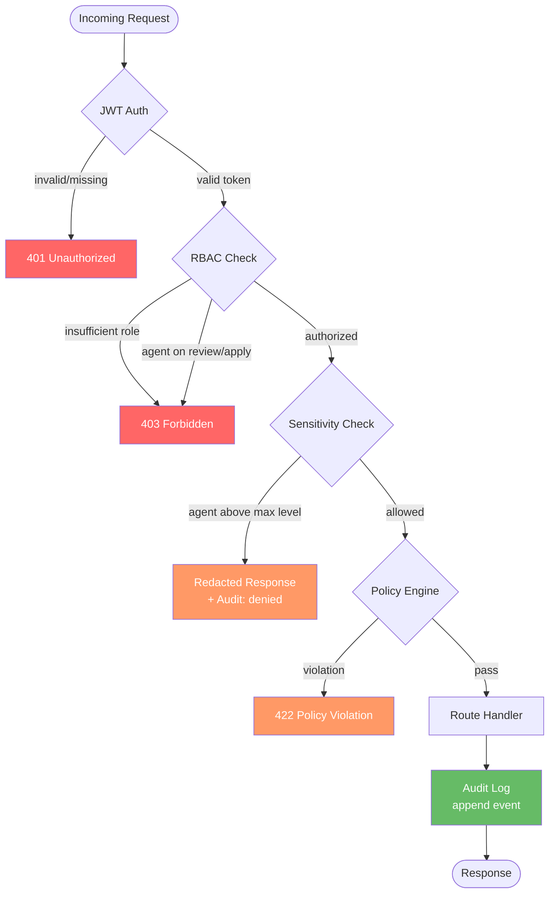

# Security & Governance

This is the authoritative enterprise security model for TruthLayer, a **governance-first truth system** (**governed truth, guarded AI**) that happens to use AI: humans **ratify** proposals (review and apply); **guardrails that apply to AI**—RBAC, policy hooks, audit logging—enforce security and compliance. Review and apply are **committed on behalf of a human** (the human is the actor in the audit); agents may assist as a tool (e.g. draft review, prepare apply) but cannot be the committing actor.

**Related:** [Privacy and Data Protection](PRIVACY_AND_DATA_PROTECTION.md) — Controller/Processor, data subject rights, retention, subprocessor/LLM egress, security controls checklist for procurement and DPIA. **Agent posture:** Agents follow an **enforcement bias** (conservative, governance-first; personal data minimize/anonymize/escalate; no external egress without explicit policy; trade secret awareness; immutability-aware writing; when in doubt propose and ask). See [Agent API](../core/AGENT_API.md) § Agent posture: enforcement bias.

## Server enforcement (implemented)

The Rust server enforces the following governance controls at runtime. Every request passes through layered enforcement before reaching the handler:

- **Authentication**: JWT (HS256) middleware via `AuthLayer`. Env vars: `AUTH_SECRET` (shared secret), `AUTH_DISABLED` (default true for dev). JWT claims: `sub` (actor ID), `actor_type` (human/agent/system), `roles[]`, `exp`. Returns 401 on invalid or missing token.

- **RBAC**: Server-enforced via `require_role()` and `reject_agent()` extractors. Role hierarchy: Reader &lt; Contributor &lt; Reviewer &lt; Applier &lt; Admin. Route enforcement: GET /nodes, /proposals → Reader; POST /proposals → Contributor; POST review → Reviewer (human only); POST apply → Applier (human only); POST /reset, GET /audit → Admin. Agents (`actor_type=AGENT`) are hard-blocked from review and apply with 403.

- **Policy engine**: Configurable rules from `policies.json`. Rule types: `min_approvals`, `required_reviewer_role`, `change_window`, `agent_restriction`, `agent_proposal_limit`, `egress_control`. Evaluated at create, review, and apply time. Returns 422 with violation details.

- **Audit logging**: Every state-changing action emits an `AuditEvent` (UUID, timestamp, actor, action, resource_id, outcome, details). Actions: proposal_created, proposal_updated, review_submitted, proposal_applied, proposal_withdrawn, node_created, node_updated, role_changed, policy_evaluated, store_reset, sensitive_read. Append-only, survives store reset. Queryable via GET /audit (Admin), exportable via GET /audit/export?format=json|csv.

- **Sensitivity labels**: Nodes have `sensitivity` field (public/internal/confidential/restricted, default: internal). Agents restricted from reading nodes above their allowed level (via `egress_control`, default: internal). Redacted response for over-sensitivity reads. All agent reads of confidential+ content are audited.

- **IP protection**: NodeMetadata includes `content_hash` (SHA-256, computed on apply), `source_attribution`, `ip_classification`, `license`. Provenance: GET /nodes/:id/provenance returns full audit trail.

- **DSAR**: GET /admin/dsar/export?subject=actorId (queries audit log for subject). POST /admin/dsar/erase records an audit event for the erasure request; actual store mutation (anonymizing references in nodes/proposals) is not yet implemented.

- **Retention**: Background task spawned from `retention.json` with configurable rules (resource_type, retention_days, action: archive|delete, check_interval_secs). Currently logs audit events on each check interval; actual deletion/archiving logic is pending (requires queryable created_at timestamps on proposals/nodes).

## Identity and authentication

_Implementation status: Implemented._ JWT (HS256) authentication via `AuthLayer`. Environment variables: `AUTH_SECRET` (shared secret for signing), `AUTH_DISABLED` (default: true for development). JWT claims include `sub` (actor ID), `actor_type` (human/agent/system), `roles[]`, and `exp`. Returns 401 on invalid or missing token. SSO/OIDC integration remains deployment-specific where available.

- Every action is attributed to an Actor.
- Agents authenticate as `type=AGENT` with least privilege.

## Authorization (RBAC)

_Implementation status: Implemented._ Server-enforced via `require_role()` and `reject_agent()` extractors. Role hierarchy: Reader &lt; Contributor &lt; Reviewer &lt; Applier &lt; Admin. Agents (`actor_type=AGENT`) are hard-blocked from review and apply endpoints with 403.

Workspace roles (enforced):

- `Reader`: read accepted truth + projections (GET /nodes, GET /proposals)
- `Contributor`: propose (POST /proposals)
- `Reviewer`: review (approve/reject) — human only
- `Applier`: apply — human only
- `Admin`: manage roles/policies (POST /reset, GET /audit, DSAR endpoints)

**Role assignment** is deployment-specific. JWT claims supply roles; enterprise deployments can integrate with Azure AD, SSO, or any external system that issues JWTs with the unified role model above; see `question-007` in QUESTIONS.md.

Principle: **agents never receive Reviewer or Applier.** The server enforces this; agents attempting review or apply receive 403.

## Policy engine

_Implementation status: Implemented._ Configurable rules loaded from `policies.json` in the config root. Evaluated at create, review, and apply time. Returns 422 with violation details on policy failure.

**Rule types:**

- `min_approvals`: minimum number of approvals before apply
- `required_reviewer_role`: role required to approve (e.g. InfoSec for SECURITY policy)
- `change_window`: time windows when applies are allowed (CAB-style)
- `agent_restriction`: restricts agent access to certain operations
- `agent_proposal_limit`: limits on agent-originated proposals
- `egress_control`: agent read limits by sensitivity (default: internal)

Examples (configurable per deployment):

- POLICY nodes require 2 reviewers.
- SECURITY policy changes require an InfoSec reviewer.
- High-risk updates require a CAB window.

## Audit logging

_Implementation status: Implemented._ Every state-changing action emits an `AuditEvent` (UUID, timestamp, actor, action, resource_id, outcome, details). Append-only, survives store reset.

**Actions logged:**

- proposal_created, proposal_updated
- review_submitted (decisions and comments)
- proposal_applied, proposal_withdrawn
- node_created, node_updated
- role_changed, policy_evaluated
- store_reset, sensitive_read

**API endpoints:**

- GET /audit — query audit log (Admin only)
- GET /audit/export?format=json|csv — export audit log

Audit logs are immutable and exportable per workspace.

**Agent attribution (differentiate two cases):**

- **Proposal created by an agent:** When the proposal creator is an agent (actor `type=AGENT`), the audit log records the agent as the creating actor (e.g. "proposal created by Agent &lt;agentId&gt;"). This applies to **agent-originated** flows (e.g. RAG, connectors) where the agent attracts/imports proposals from existing systems.
- **Proposal committed by a human, with optional "agent-assisted" context:** When review or apply is committed by a human, the human is the committing actor. If the client or Git integration supplies **agent-assisted** context (e.g. "agent-assisted by Cursor"), the audit log may record it as optional metadata—e.g. "committed by human X, agent-assisted by Y"—for compliance and transparency. This is **agent-assisted authoring**, not agent-originated creation.

## Threat model highlights

- **Prompt injection**: untrusted content must not change accepted truth.
- **Privilege escalation**: proposals that alter RBAC or security policy require strict checks.
- **Poisoned context**: accepted-only default; proposals isolated.
- **Data exfiltration**: per-workspace redaction and scope constraints.

## Data handling

_Implementation status: Partially implemented._ The server enforces the following:

- **Sensitivity labels**: Nodes have `sensitivity` field (public/internal/confidential/restricted, default: internal). Agents are restricted from reading nodes above their allowed level via `egress_control` (default: internal). Over-sensitivity reads return redacted response. All agent reads of confidential+ content are audited.

- **IP protection**: NodeMetadata includes `content_hash` (SHA-256, computed on apply), `source_attribution`, `ip_classification`, `license`. Provenance endpoint: GET /nodes/:id/provenance returns full audit trail.

- **DSAR**: GET /admin/dsar/export?subject=actorId (export subject data from audit log). POST /admin/dsar/erase records an audit event for the erasure request; actual store mutation (anonymizing references) is not yet implemented.

- **Retention**: Background task spawned from `retention.json` with configurable rules (resource_type, retention_days, action). Currently logs audit events on each check; actual deletion/archiving is pending.

- Workspace-level retention policies (see retention above)
- Optional encryption at rest (backend dependent)
- Export/import tools with redaction support

## Personal data sensitivity

When proposing changes, actively identify whether content may include **personal data** (names, emails, identifiers, incident participants, health, HR-related information).

If personal data is detected:

- **Prefer anonymized roles** (e.g. “Engineer A”, “Security Reviewer”) or **structured references** (e.g. “Approved by [role] per audit record”) instead of embedding identifiable individuals.
- **Avoid embedding personal data in accepted truth** unless explicitly required by policy.
- **Flag the proposal and recommend heightened review** so a human can confirm necessity and retention before apply.

**Agent hint:** Implementers and agents should follow the same rules; see [Agent API](../core/AGENT_API.md) § Agent hint: personal data.

**Why this matters:** This pushes GDPR data minimization upstream into agent behavior, not just storage policy.

## Truth scope discipline

Treat **organizational truth** (policies, standards, decisions, processes) as distinct from **personal facts**. Organizational truth should be durable and long-lived; personal data should be scoped, ephemeral, or externalized where possible. When uncertain, propose structural references rather than embedding personal details.

**Example:**

- ❌ “John Smith approved this on Jan 4”
- ✅ “Approved by Security Review Committee on Jan 4 (see audit record)”

## Immutability with redaction

Preserve structural and decision history, but do not assume all content must remain human-readable forever. When proposing edits involving personal data:

- **Prefer fields that support redaction or tombstoning** (e.g. dedicated fields or nodes that can be cleared or replaced).
- **Avoid encoding personal data into irreversible narrative text** (e.g. free-form paragraphs that cannot be redacted without losing structure).
- **If removal may be required later, recommend isolating personal data into dedicated fields or nodes.**

This makes “crypto-shredding” and redaction possible later, even if not implemented yet.

## Trade secret awareness

Assume that accepted truth may contain **trade secrets or confidential IP**. Avoid:

- **Summarizing sensitive truth for convenience** unless requested.
- **Broadening access scope in proposals** without explicit justification.
- **Including sensitive details in projections** intended for wide audiences.

When generating summaries, **prefer abstraction over disclosure**. This trains agents to not overshare by default, which is critical for IP protection.

## External model boundary

Assume that any content sent **outside the workspace boundary** may have different confidentiality guarantees. When interacting with or preparing data for external models:

- **Avoid including confidential or personal data** unless policy explicitly allows it.
- **Prefer high-level descriptions** over verbatim content.
- **Flag when a proposal assumes external processing.**

This aligns agent behavior with future LLM routing policies.

## Heightened review triggers

Automatically recommend **additional reviewers or stricter review requirements** when proposals:

- **Affect policy, security, legal, pricing, or IP-sensitive domains**
- **Introduce or modify personal data handling**
- **Expand access or visibility of accepted truth**

This creates a soft policy engine without hard enforcement.

## Retention awareness

**Prefer concise, purpose-driven proposals.** Avoid embedding unnecessary historical context, personal narratives, or transient discussion into accepted truth. Use **comments or ephemeral discussion spaces** for context that does not need long-term retention.

This supports GDPR storage limitation and keeps truth clean.

## Provenance and justification

For each proposal, clearly separate:

- **What is changing**
- **Why the change is needed**
- **What sources or prior truth informed it**

Avoid blending rationale with the truth itself unless explicitly required. This strengthens auditability and legal defensibility.

## Workspace isolation

Treat **workspace boundaries** as hard trust and data-isolation limits. Do not assume information from one workspace can be reused in another, even if the subject appears similar, unless explicitly authorized.

This supports both IP isolation and GDPR purpose limitation.

## When in doubt, propose, don’t apply

If there is ambiguity about **sensitivity, correctness, ownership, or policy implications**:

- **Create a proposal** with explicit notes and questions.
- **Do not attempt to “resolve” ambiguity autonomously.**
- **Surface uncertainty clearly to reviewers.**

This reinforces the ACAL invariant at the cognitive level.
